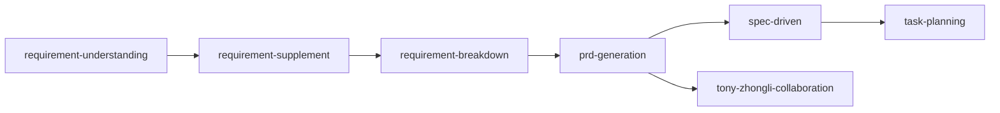

# 产品管理 Skills

> AI 驱动的产品管理技能模块，包含需求分析、拆解、PRD生成等技能。

---

## 元信息

| 项目 | 内容 |
|------|------|
| **创建时间** | 2026-04-24 |
| **更新时间** | 2026-04-24 |
| **维护者** | Tony Stark |
| **类型** | concept |
| **标签** | #skill #AI #自动化 |
| **分级** | 🟢公开 |
| **评审日期** | - |

---

## 概述

### 这是什么？

Skills 是基于 AI Agent 的产品管理技能模块，每个 Skill 负责特定的产品管理任务。

### 为什么重要？

- **自动化**：减少重复性工作
- **标准化**：统一的处理流程和输出格式
- **可追溯**：每个 Skill 的执行都有记录

### 适用场景？

- 需求分析与理解
- 需求拆解（Epic → Feature → Story → FP）
- PRD 文档生成
- 健康检查与数据同步

---

## Skill 列表

### 需求管理类

| Skill | 说明 | 依赖 |
|:---|:---|:---|
| requirement-understanding | 需求理解，填充 9 项信息 | - |
| requirement-supplement | 需求补充，补充用户场景 | requirement-understanding |
| requirement-breakdown | 需求拆解，Epic→Feature→Story | requirement-supplement |

### 文档生成类

| Skill | 说明 | 依赖 |
|:---|:---|:---|
| prd-generation | PRD 生成（v5.0 规范） | requirement-supplement |
| spec-driven | 规范驱动开发 | prd-generation |
| product-breakdown | 产品结构拆解 | - |

### 技术实现类

| Skill | 说明 | 依赖 |
|:---|:---|:---|
| tony-zhongli-collaboration | Tony-钟离协作 | prd-generation |
| task-planning | 任务规划 | spec-driven |

### 运维支持类

| Skill | 说明 | 依赖 |
|:---|:---|:---|
| health-check | 健康检查 | - |
| wiki-maintenance | Wiki 维护 | - |
| feishu-sync | 飞书同步 | health-check |
| code-review | Code Review | - |
| git-workflow | Git 工作流 | - |

### 数据修复类

| Skill | 说明 | 依赖 |
|:---|:---|:---|
| neo4j-product-domain-repair | Neo4j 产品域修复 | health-check |

---

## Skill 调用关系

---

## 相关资源

### 内部链接
- [SOP 总检查清单](../架构规范/SOP/SOP-Checklist-总检查清单.md) - 所有 SOP 的过程检查
- [PRD 模板](../架构规范/模板/06-PRD模板.md) - PRD v5.0 模板

---

## 更新日志

| 日期 | 更新内容 | 更新人 |
|------|----------|--------|
| 2026-04-24 | 初始创建 | Tony Stark |

---

*最后更新: 2026-04-24*
*维护者: Tony Stark*
