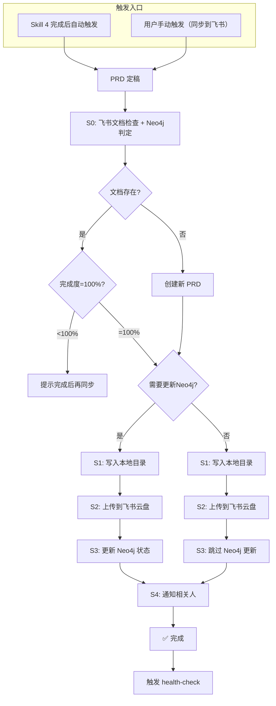

# Feishu Sync Skill

## 能做什么

PRD 定稿后，同步到飞书云盘指定目录，更新 Neo4j 状态（如需），通知相关人员。

## 核心能力

1. **飞书文档检查**：读取飞书记录，查看文档完成度
2. **Neo4j 更新判定**：判断是否需要更新 Neo4j 状态
3. **本地写入**：PRD 文档写入本地 Mac mini 指定目录
4. **飞书上传**：上传 PRD 到飞书云盘指定目录
5. **Neo4j 状态更新**：仅在需要时更新 Epic/Feature/Story 状态
6. **飞书通知**：通过飞书消息通知相关人员

## 激活条件

- **Skill 4 自动触发**：tony-zhongli-collaboration 完成后自动进入
- 用户明确要求同步（"同步到飞书"、"上传云盘"、"通知相关人"）

---

## 同步前检查

### S0: 飞书文档检查 + Neo4j 更新判定

**目的**：同步前检查飞书文档状态、确定是否需要 Neo4j 更新

**操作**：
1. **读取飞书记录**：从飞书云盘读取相关 PRD 文档列表
2. **查看完成度**：检查文档的完成状态（草稿/待评审/已定稿）
3. **判定 Neo4j 更新**：判断是否需要更新 Neo4j 状态

**飞书记录检查清单**：
| 检查项 | 说明 | 状态 |
|:---|:---|:---:|
| 文档存在性 | 检查 PRD 文档是否存在于飞书云盘 | 是/否 |
| 文档版本 | 当前版本 vs 最新版本 | 版本号 |
| 完成度 | 草稿(0%)/待评审(50%)/已定稿(100%) | 完成度% |
| 关联 Epic | 检查是否关联了正确的 Epic | 是/否 |
| 关联 Feature | 检查是否关联了正确的 Feature | 是/否 |

**Neo4j 更新判定规则**：
```
需要更新 Neo4j 的场景：
✅ PRD 已定稿（完成度=100%）
✅ Epic/Feature/Story 状态需要从 draft → approved
✅ 新的 PRD 首次同步

不需要更新 Neo4j 的场景：
❌ 完成度 < 100%（草稿、待评审）
❌ 只是更新文档内容，状态未变
❌ 仅同步到本地，不上传云盘
❌ 手动标注"不更新 Neo4j"
```

**检查完成后的决策**：
```
如果文档不存在 → 创建新 PRD → 判断是否更新 Neo4j
如果版本落后 → 提示更新 → 判断是否更新 Neo4j
如果完成度<100% → 提示完成后再同步 → 不更新 Neo4j
如果完成度=100% → 继续同步流程 → 需要更新 Neo4j
```

---

## 同步流程图（Mermaid）



---

## 每步操作详解

### S0: 飞书文档检查 + Neo4j 判定

**工具**：`feishu_drive` (list/info)

**Neo4j 更新判定**：
| 条件 | 结果 |
|:---|:---|
| 完成度 = 100% | 需要更新 Neo4j |
| 完成度 < 100% | 不更新 Neo4j |
| 用户标注"不更新 Neo4j" | 不更新 Neo4j |
| 状态已为 approved | 不重复更新 |

### S1: 写入本地目录

**目标路径**: `/Volumes/MOVESPEED/Data/个人核心/05_AgentOutput/agent_work/产品管理方案团队/`

**文件命名**: `PRD-{YYYYMMDD}-{序号}-{标题}-v{版本}.md`

### S2: 上传到飞书云盘

**目标目录**: `https://mcn2qsv100fk.feishu.cn/drive/folder/V8KEfpg1vlkCZldBYt0crynFnHf`

### S3: Neo4j 状态更新（条件触发）

**Neo4j 连接**: `bolt://localhost:7687` (neo4j/password123)

**更新条件**：
- `需要更新 Neo4j = true` 时执行
- 状态已为 approved 时跳过

**更新操作**：
```cypher
MATCH (e:Epic {uri: $epic_uri})
SET e.status = 'approved', e.approved_at = datetime()
RETURN e.uri, e.status
```

**更新的状态**：
| 实体 | 状态变更 |
|:---|:---|
| Epic | draft → approved |
| Feature | 待开发 → 待评审 |
| Story | 待开发 → 待评审 |

### S4: 通知相关人

---

## 关键路径

| 用途 | 路径 |
|:---|:---|
| 本地目录 | `/Volumes/MOVESPEED/Data/个人核心/05_AgentOutput/agent_work/产品管理方案团队/` |
| 飞书云盘 | `https://mcn2qsv100fk.feishu.cn/drive/folder/V8KEfpg1vlkCZldBYt0crynFnHf` |
| Neo4j | `bolt://localhost:7687` (neo4j/password123) |

---

## 依赖 Skill

| Skill | 关系 | 说明 |
| tony-zhongli-collaboration | 前置 | PRD 定稿后，进入飞书同步 |
| health-check | 后续 | 同步完成后，进行健康检查 |

---

*Version: 1.2 | For: Tony Stark*
