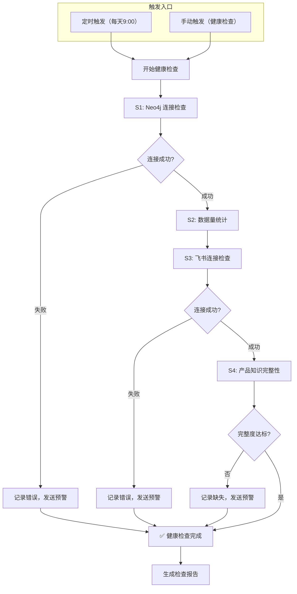

# Health Check Skill

## 能做什么

定期检查系统健康状态，包括 Neo4j 连接、飞书连接、产品知识完整性，发现问题及时预警。

## 核心能力

1. **Neo4j 健康检查**：检查图数据库连接和数据完整性
2. **飞书连接检查**：检查飞书 API 连通性
3. **产品知识完整性**：检查 Epic/Feature/Story 完整度
4. **预警通知**：发现问题时通知相关人员

## 激活条件

- **定时触发**：每天早上 9:00 自动执行
- **手动触发**：用户要求执行健康检查（"健康检查"、"检查系统"、"系统诊断"）

---

## 检查项目

### 1. Neo4j 连接检查

| 检查项 | 说明 | 阈值 |
|:---|:---|:---:|
| 连接状态 | 是否能连接到 Neo4j | 必须成功 |
| 数据库状态 | 数据库是否正常运行 | 必须正常 |
| 数据量统计 | Epic/Feature/Story 数量 | 与预期对比 |

### 2. 飞书连接检查

| 检查项 | 说明 | 阈值 |
|:---|:---|:---:|
| API 连通性 | 飞书 API 是否可访问 | 必须成功 |
| 云盘访问 | 云盘目录是否可访问 | 必须成功 |
| 文档同步 | 最近同步的文档状态 | 检查完成度 |

### 3. 产品知识完整性检查

| 检查项 | 说明 | 阈值 |
|:---|:---|:---:|
| Epic 完整度 | 6 个产品域 Epic 是否齐全 | 100% |
| Feature 完整度 | 每个 Epic 下的 Feature 数量 | > 0 |
| Story 完整度 | 每个 Feature 下的 Story 数量 | > 0 |
| 状态分布 | 各状态（draft/in-progress/approved）分布 | 合理 |

---

## 检查流程图（Mermaid）



---

## 健康检查报告模板

```markdown
# 系统健康检查报告

**检查时间**: {YYYY-MM-DD HH:mm}
**检查人**: Tony Stark

## 1. Neo4j 健康状态

| 检查项 | 状态 | 详情 |
|:---|:---:|:---|
| 连接状态 | ✅ 正常 | Neo4j 运行正常 |
| 数据库状态 | ✅ 正常 | 数据库可访问 |
| 数据量 | ✅ 正常 | Epic: {N}, Feature: {N}, Story: {N} |

## 2. 飞书连接状态

| 检查项 | 状态 | 详情 |
|:---|:---:|:---|
| API 连通性 | ✅ 正常 | API 可访问 |
| 云盘访问 | ✅ 正常 | 云盘可访问 |
| 文档同步 | ✅ 正常 | 最近同步: {时间} |

## 3. 产品知识完整性

| 产品域 | Epic 数量 | Feature 数量 | Story 数量 | 完整度 |
|:---|:---:|:---:|:---:|:---:|
| PD-DFD | {N} | {N} | {N} | {N}% |
| PD-MKT | {N} | {N} | {N} | {N}% |
| PD-RISK | {N} | {N} | {N} | {N}% |
| PD-COM | {N} | {N} | {N} | {N}% |
| PD-DEX | {N} | {N} | {N} | {N}% |
| PD-DMT | {N} | {N} | {N} | {N}% |

## 4. 预警信息

{如有预警，列出详细信息}

## 5. 总体结论

**健康状态**: [健康/异常]

{如异常，说明需要处理的问题}
```

---

## 预警规则

| 级别 | 条件 | 处理方式 |
|:---:|:---|:---|
| 严重 | Neo4j 无法连接 | 立即通知，停止相关流程 |
| 严重 | 飞书 API 无法访问 | 立即通知，暂停同步 |
| 警告 | Epic 完整度 < 100% | 次日工作日通知 |
| 警告 | Feature/Story 数量为 0 | 次日工作日通知 |
| 提示 | 完成度未达标 | 周报中汇总 |

---

## 错误处理原则

1. **Neo4j 连接失败** → 立即预警，停止依赖 Neo4j 的 Skill
2. **飞书连接失败** → 立即预警，暂停飞书相关操作
3. **数据不完整** → 记录缺失项，汇总到报告
4. **检查超时** → 重试 1 次，仍失败则标记"检查超时"

---

## 依赖 Skill

| Skill | 关系 | 说明 |
| feishu-sync | 前置 | 健康检查作为同步后的验证 |
| 其他 Skill | 监控 | 检查各 Skill 的运行状态 |

---

## 关键路径

| 用途 | 路径 |
|:---|:---|
| Neo4j | `bolt://localhost:7687` (neo4j/password123) |
| 飞书云盘 | `https://mcn2qsv100fk.feishu.cn/drive/folder/V8KEfpg1vlkCZldBYt0crynFnHf` |

---

*Version: 1.0 | For: Tony Stark*
