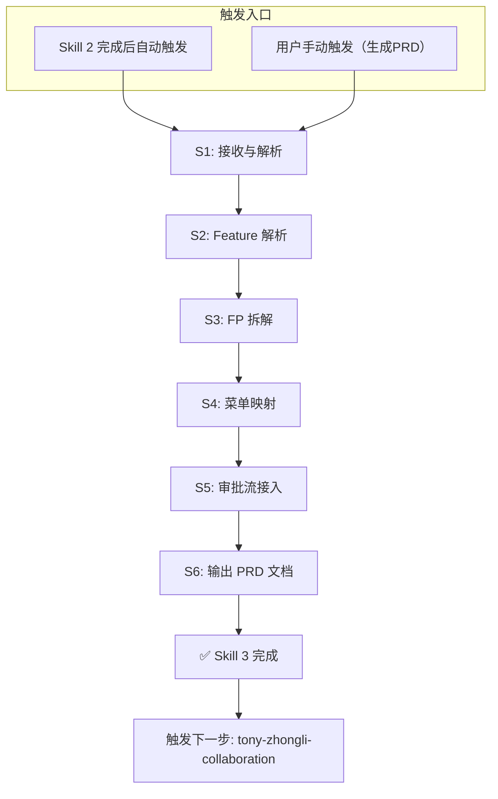

# PRD Generation Skill

## 能做什么

基于 requirement-supplement 输出的完整需求说明，自动生成符合 v5.0 规范的 PRD 文档，包含 Feature 清单、FP 清单、菜单映射表、审批流接入点。

## 核心能力

1. **Feature 解析**：从需求说明中提取 Feature 和关联的 FP
2. **FP 拆解**：将 Feature 拆解为具体的功能点
3. **菜单映射**：关联功能点到菜单路径
4. **审批流接入**：标注审批流接入点和审批节点
5. **PRD 输出**：生成符合 v5.0 规范的 PRD 文档

## 激活条件

- **Skill 2 自动触发**：requirement-supplement 完成后自动进入（无需用户再次触发）
- 收到包含 REQ-{YYYYMMDD}-{序号} 的需求ID
- 用户明确要求生成 PRD（"生成 PRD"、"输出需求文档"）

---

## PRD v5.0 文档结构

| # | 章节 | 说明 |
|:---:|:---|:---|
| 1 | **元数据头部** | 产品域、Epic、优先级、状态、负责人 |
| 2 | **结构速览** | Epic-Feature-FP 层级关系 |
| 3 | **Feature 清单** | 所有 Feature 及关联 FP |
| 4 | **功能点(FP)清单** | 所有 FP 的详细描述 |
| 5 | **菜单映射表** | 功能点到菜单路径的映射 |
| 6 | **审批流接入点** | 审批流节点和接入条件 |
| 7 | **版本历史** | PRD 变更记录 |

---

## 步骤定义与边界

| 步骤 | 名称 | 输入 | 输出 | 边界责任 |
| S1 | 接收与解析 | requirement-supplement 输出 | 结构化需求 JSON | 只接收解析，不生成 |
| S2 | Feature 解析 | 需求 JSON | Feature 列表 | 只解析，不拆解 FP |
| S3 | FP 拆解 | Feature 列表 | FP 清单 | 只拆解，不映射菜单 |
| S4 | 菜单映射 | FP 清单 | 菜单映射表 | 只映射，不生成审批流 |
| S5 | 审批流接入 | 菜单映射 | 审批流接入点 | 只标注，不写 PRD |
| S6 | 输出 PRD | 所有步骤结果 | PRD 文档 | 汇总，不做修改 |

---

## 步骤流程图（Mermaid）

---

## 每步校验机制

| 步骤 | 校验规则 | 校验失败处理 |
| S1 | 能解析出有效的 req_detail JSON | 无效 → 返回错误 |
| S2 | Feature 列表非空 | 为空 → 标注"无 Feature" |
| S3 | 每个 Feature 下有至少 1 个 FP | 无 FP → 自动生成默认 FP |
| S4 | 每个 FP 有对应的菜单路径 | 无路径 → 标注"待定" |
| S5 | 审批流接入点列表存在 | 为空 → 标注"无需审批" |

---

## 中间文档留存

| 步骤 | 中间文档路径 | 文件名格式 |
| S1 接收解析 | /tmp/prd/step1_received_{req_id}.json | 接收的原始 JSON |
| S2 Feature解析 | /tmp/prd/step2_features_{req_id}.json | Feature 列表 |
| S3 FP拆解 | /tmp/prd/step3_fps_{req_id}.json | FP 清单 |
| S4 菜单映射 | /tmp/prd/step4_menu_{req_id}.json | 菜单映射表 |
| S5 审批流 | /tmp/prd/step5_approval_{req_id}.json | 审批流接入点 |
| S6 最终输出 | /tmp/prd/PRD_{req_id}.md + .json | 最终 PRD |

---

## 重试机制

| 场景 | 最大重试次数 | 超过最大次数后 |
| S1 JSON 解析失败 | 1 | 直接返回错误 |
| S2 Feature 为空 | 1 | 输出空 PRD，标注缺失 |
| S3 FP 拆解失败 | 3 | 使用默认 FP 结构 |
| S4 菜单映射失败 | 1 | 标注"待定"继续 |
| S5 审批流失败 | 1 | 标注"无需审批" |

---

## PRD 模板引用

> ⚠️ **重要**：PRD 模板已迁移到外部文件，请勿在此处嵌入模板内容。

| 模板 | 文件路径 | 说明 |
|:---|:---|:---|
| PRD v5.0 完整模板 | `../../架构规范/模板/06-PRD模板.md` | PRD 文档完整模板 |
| EPIC 说明模板 | `../../架构规范/模板/03-EPIC说明文档模板.md` | EPIC 文档模板 |
| Feature 说明模板 | `../../架构规范/模板/04-Feature说明文档模板.md` | Feature 文档模板 |
| FP 清单模板 | `../../架构规范/模板/05-FeaturePoint清单模板.md` | FP 清单模板 |

### 模板结构速览

| # | 章节 | 对应模板 |
|:---:|:---|:---|
| 1 | **元数据头部** | PRD v5.0 模板 第一章 |
| 2 | **结构速览** | PRD v5.0 模板 第二章 |
| 3 | **Feature 清单** | PRD v5.0 模板 第三章 |
| 4 | **FP 清单** | PRD v5.0 模板 第四章 |
| 5 | **菜单映射表** | PRD v5.0 模板 第五章 |
| 6 | **审批流接入点** | PRD v5.0 模板 第六章 |
| 7 | **版本历史** | PRD v5.0 模板 第七章 |

---

## 错误处理原则

1. 错误在当前步骤内解决：不把错误传到下一步
2. 每步必须校验通过：校验失败 → 重试或标注
3. 中间文档可追溯：任何时候可查看中间文档
4. 重试有上限：超过最大重试次数后，输出错误提示，等待人工介入

---

## 依赖 Skill

| Skill | 关系 | 说明 |
| requirement-supplement | 前置 | 必须先完成需求补充 |
| tony-zhongli-collaboration | 后续 | PRD 生成完成后，进入 Tony-钟离协作 |

---

*Version: 1.0 | For: Tony Stark | Based: PRD v5.0 Template*
