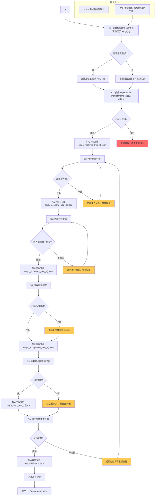
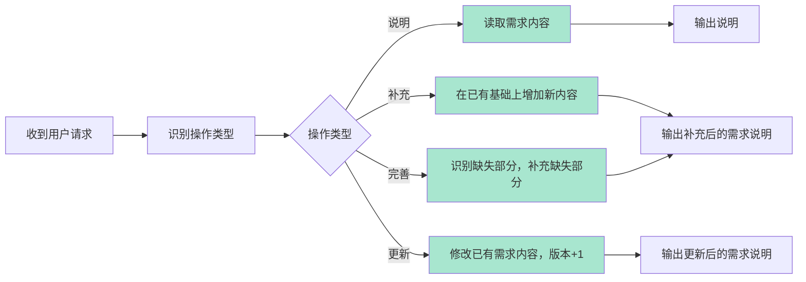

## 能做什么

对 requirement-understanding 输出的结构化需求进行深度补充，定义用户场景（Actor/Context/Trigger/Flow/Pain），明确功能边界（in_scope/out_of_scope），制定验收标准（功能/操作/数据/交互），识别依赖项和阻塞项。

## 核心能力

1. **用户场景模板**：Actor/Context/Trigger/Flow/Pain 五要素分析
2. **功能边界定义**：清晰区分 in_scope 和 out_of_scope
3. **验收标准 4 项**：强制功能/操作/数据/交互四项验收标准
4. **追问策略**：依赖项分析、阻塞项识别
5. **结构化输出**：完整需求说明文档

## 激活条件

### 操作类型

| 操作类型 | 说明 | 触发条件 |
|:---|:---|:---|
| **说明** | 对已有需求进行说明、解释 | 用户要求"说明"、"解释"、"讲讲"某个需求 |
| **补充** | 在已有需求基础上增加新内容 | 用户要求"补充"、"新增"需求内容 |
| **完善** | 完善已有需求的缺失部分 | 用户要求"完善"、"补全"、"补充完整" |
| **更新** | 修改已有需求的内容 | 用户要求"更新"、"修改"、"变更"需求内容 |

### 激活前置条件

**必须先完成自然语言与需求ID的对应**

收到用户请求时，必须先确认：

1. **用户是否指定了需求ID**
   - 指定了 REQ-{YYYYMMDD}-{序号} → 直接定位该需求
   - 未指定 → 要求用户提供，或通过自然语言描述匹配已有需求

2. **自然语言 → 需求ID 匹配规则**
   ```
   如果用户说："我想补充XX功能的验收标准"
   且系统中存在需求：REQ-20260420-001（XX功能）
   则：映射到 REQ-20260420-001，执行"完善"操作
   ```

3. **无法匹配时**
   - 系统中无相关需求 → 提示用户"未找到相关需求，是否需要新建需求"
   - 多个需求相关 → 列出所有匹配需求，供用户选择

### 激活条件

- **Skill 1 自动触发**：requirement-understanding 完成后自动进入（无需用户再次触发）
- 收到包含 REQ-{YYYYMMDD}-{序号} 的需求ID
- 用户明确要求补充/完善/更新需求（"补充需求"、"完善需求"、"更新需求"）

---

核心原则：需求补充必须基于已确认的 9 项信息清单，不重复追问存量信息，只补充清单之外的用户场景细节。

---

## 1. 步骤定义与边界

| 步骤 | 名称 | 输入 | 输出 | 边界责任 |
|:---:|:---|:---|:---|:---|
| **S1** | 接收与解析 | requirement-understanding 输出 | 结构化需求 JSON | 只接收解析，不补充 |
| **S2** | 用户场景分析 | 需求 JSON | Actor/Context/Trigger/Flow/Pain | 只分析场景，不定义边界 |
| **S3** | 功能边界定义 | 场景分析结果 | in_scope / out_of_scope | 只定义边界，不写验收标准 |
| **S4** | 验收标准制定 | 功能边界 | 4 项验收标准 | 只写标准，不识别依赖 |
| **S5** | 依赖项与阻塞项 | 验收标准 | 依赖项列表 + 阻塞项 | 只识别，不解决 |
| **S6** | 输出完整需求说明 | 所有步骤结果 | 完整需求说明文档 | 汇总，不做修改 |

### 1.7 步骤流程图（Mermaid）



### 1.8 操作类型流程图（Mermaid）



---

## 2. 每步校验机制

| 步骤 | 校验规则 | 校验失败处理 |
|:---:|:---|:---|
| **S1** | 能解析出有效的 requirement_summary JSON | 无效 JSON → 返回错误，要求重新传入 |
| **S2** | Actor/Context/Trigger/Flow/Pain 五要素齐全 | 缺任何一项 → 追问用户补全 |
| **S3** | in_scope 和 out_of_scope 都非空，且不相交 | 有交集 → 重新梳理；空 → 追问 |
| **S4** | 功能/操作/数据/交互四项验收标准齐全 | 缺任何一项 → 补充缺失项 |
| **S5** | 依赖项和阻塞项列表都存在 | 列表为空 → 标注"待识别" |
| **S6** | 完整需求说明包含所有章节 | 章节缺失 → 返回对应步骤重做 |

---

## 3. 中间文档留存

| 步骤 | 中间文档路径 | 文件名格式 |
|:---:|:---|:---|
| S1 接收解析 | `/tmp/requirement/step1_received_{req_id}.json` | 接收的原始 JSON |
| S2 场景分析 | `/tmp/requirement/step2_scenario_{req_id}.json` | 五要素分析结果 |
| S3 边界定义 | `/tmp/requirement/step3_boundary_{req_id}.json` | in_scope/out_of_scope |
| S4 验收标准 | `/tmp/requirement/step4_acceptance_{req_id}.json` | 4项验收标准 |
| S5 依赖识别 | `/tmp/requirement/step5_deps_{req_id}.json` | 依赖项 + 阻塞项 |
| S6 最终输出 | `/tmp/requirement/req_detail_{req_id}.md` + `.json` | 完整需求说明 |

中间文档格式：
```json
{
  "step": "S2",
  "req_id": "REQ-20260420-001",
  "status": "completed | pending | failed",
  "result": {},
  "timestamp": "2026-04-20 10:45",
  "retry_count": 0,
  "error_message": "（失败时填写）"
}
```

---

## 4. 重试机制

| 场景 | 重试策略 | 最大重试次数 | 超过最大次数后 |
|:---|:---|:---:|:---|
| S1 JSON 解析失败 | 返回错误，要求重新传入 | 1 | 直接返回错误 |
| S2 场景要素缺失 | 追问用户 | 无限制 | 保持追问状态 |
| S3 边界不清晰 | 追问用户 | 无限制 | 保持追问状态 |
| S4 验收标准缺失 | 自动补充通用标准 | 3 | 输出部分标准，标注缺失 |
| S5 依赖项识别失败 | 标注"待技术评估" | 1 | 输出空列表，标注待识别 |

---

## 5. S2 用户场景分析

### 5.1 场景分析五要素

| 要素 | 说明 | 追问话术（缺失时） |
|:---|:---|:---|
| **Actor（角色）** | 主要用户角色 | "这个功能的主要用户是谁？" |
| **Context（上下文）** | 使用环境和前置条件 | "用户在使用这个功能前，需要做什么准备？" |
| **Trigger（触发）** | 触发条件和操作步骤 | "用户怎么进入这个功能？点击哪里？" |
| **Flow（流程）** | 核心操作流程 | "用户主要做哪几步操作？" |
| **Pain（痛点）** | 当前痛点和期望 | "这个功能解决了什么现有问题？" |

### 5.2 场景分析模板

```
## 用户场景分析

### 场景编号：SC-{req_id}-{序号}

**Actor（角色）**: 
- 主要用户：{角色名称}
- 角色描述：{角色职责}

**Context（上下文）**:
- 使用环境：{在哪个页面/系统/模块}
- 前置条件：{需要满足什么条件才能使用}
- 数据状态：{需要什么数据准备}

**Trigger（触发）**:
- 触发入口：{从哪个菜单/按钮进入}
- 触发条件：{满足什么条件可以操作}
- 触发频率：{每天/每周/每月多少次}

**Flow（流程）**:
1. {步骤1：用户进入功能}
2. {步骤2：用户选择/输入}
3. {步骤3：系统处理}
4. {步骤4：结果展示}
5. {步骤5：用户确认/完成}

**Pain（痛点）**:
- 当前问题：{现在怎么做，有什么问题}
- 期望状态：{希望变成什么样}
```

---

## 6. S3 功能边界定义

### 6.1 边界定义规则

| 类型 | 说明 | 示例 |
|:---|:---|:---|
| **in_scope** | 本需求包含的功能范围 | 短信模板批量导入、模板格式校验 |
| **out_of_scope** | 本需求不包含的功能范围 | 模板设计、发送统计、个性化变量 |

### 6.2 边界定义模板

```
## 功能边界定义

### in_scope（包含）
- [ ] {功能点1}
- [ ] {功能点2}
- [ ] {功能点3}

### out_of_scope（不包含）
- [ ] {功能点1}
- [ ] {功能点2}
- [ ] {功能点3}

### 边界说明
{对边界的详细解释，为什么某些功能不在范围内}
```

### 6.3 边界定义检查清单

- [ ] 每个 in_scope 项都有对应的验收标准
- [ ] out_of_scope 项不会被遗漏到验收标准中
- [ ] in_scope 和 out_of_scope 不存在交集
- [ ] 边界定义与产品域定位一致

---

## 7. S4 验收标准制定

### 7.1 验收标准四要素（强制）

**每一项功能点必须包含以下 4 项验收标准**：

| 类型 | 说明 | 验证方式 |
|:---|:---|:---|
| **功能** | 功能是否按需求实现 | 功能测试 |
| **操作** | 操作流程是否符合预期 | 流程测试 |
| **数据** | 数据处理是否正确 | 数据验证 |
| **交互** | 界面交互是否友好 | UX 测试 |

### 7.2 验收标准模板

```
## 验收标准

### 功能点1：{功能名称}

| 验收类型 | 验收内容 | 通过条件 | 验证方式 |
|:---|:---|:---|:---|
| 功能 | {功能描述} | {具体通过条件} | 功能测试 |
| 操作 | {操作流程} | {操作符合预期} | 流程测试 |
| 数据 | {数据处理} | {数据结果正确} | 数据验证 |
| 交互 | {界面交互} | {交互友好} | UX测试 |

### 功能点2：{功能名称}
...
```

### 7.3 验收标准编写规则

1. **功能验收**：描述系统应该做什么，不描述系统怎么做
2. **操作验收**：描述用户操作流程，标注关键步骤
3. **数据验收**：描述数据输入、处理、输出的正确性标准
4. **交互验收**：描述用户界面交互的期望行为
5. **每项验收必须可测试**：必须有明确的通过/失败条件

---

## 8. S5 依赖项与阻塞项识别

### 8.1 依赖项定义

| 类型 | 说明 | 示例 |
|:---|:---|:---|
| **系统依赖** | 需要其他系统提供的能力 | 需要XX系统提供用户数据接口 |
| **数据依赖** | 需要特定数据支持 | 需要提前导入1000条模板数据 |
| **技术依赖** | 需要特定技术支持 | 需要新增短信网关接口 |
| **业务依赖** | 需要业务方配合 | 需要市场部提供模板规范 |

### 8.2 阻塞项定义

| 类型 | 说明 | 示例 |
|:---|:---|:---|
| **技术阻塞** | 技术方案未确定 | 第三方接口文档未提供 |
| **资源阻塞** | 开发资源不足 | 前端人手不足 |
| **业务阻塞** | 业务方决策未完成 | 审批流未确定 |
| **外部阻塞** | 外部因素影响 | 供应商交付延期 |

### 8.3 依赖项与阻塞项模板

```
## 依赖项与阻塞项

### 依赖项
| 类型 | 依赖内容 | 负责方 | 预计完成时间 | 状态 |
|:---:|:---|:---|:---:|:---:|
| 系统依赖 | {描述} | XX系统 | {时间} | 待确认 |
| 数据依赖 | {描述} | 数据团队 | {时间} | 待确认 |

### 阻塞项
| 类型 | 阻塞内容 | 影响范围 | 状态 |
|:---:|:---|:---|:---:|
| 技术阻塞 | {描述} | {影响的功能} | 阻塞中 |
| 业务阻塞 | {描述} | {影响的流程} | 待确认 |
```

---

## 9. S6 输出规范

### 9.1 完整需求说明模板

```
# 需求详细说明

**需求ID**: REQ-{YYYYMMDD}-{序号}
**需求类型**: new_feature / enhancement / bug_fix
**产品域**: {PD-XX}
**状态**: 已补充

---

## 1. 需求概要

{从 requirement-understanding 复制过来的需求概要}

---

## 2. 用户场景分析

{从 S2 输出复制}

---

## 3. 功能边界

### in_scope（包含）
- [ ] {功能点}

### out_of_scope（不包含）
- [ ] {功能点}

---

## 4. 验收标准

{从 S4 输出复制}

---

## 5. 依赖项与阻塞项

{从 S5 输出复制}

---

## 6. 版本历史

| 版本 | 日期 | 修改内容 | 修改人 |
|:---:|:---|:---|:---:|
| 1.0 | {日期} | 初始版本 | Tony Stark |
```

### 9.2 结构化 JSON 输出

```json
{
  "requirement_detail": {
    "requirement_id": "REQ-20260420-001",
    "status": "supplemented",
    "scenario": {
      "actor": {},
      "context": {},
      "trigger": {},
      "flow": [],
      "pain": {}
    },
    "boundary": {
      "in_scope": [],
      "out_of_scope": []
    },
    "acceptance_criteria": {
      "功能点1": {
        "功能": {},
        "操作": {},
        "数据": {},
        "交互": {}
      }
    },
    "dependencies": [],
    "blockers": []
  }
}
```

---

## 10. 工作流程（含校验、重试、留存）

```
requirement-understanding 输出
    ↓ [S1: 接收与解析]
验证 JSON 有效性
    ↓ 校验 S1 → 通过 → 写入 step1_received_{req_id}.json
    ↓ [S2: 用户场景分析]
分析 Actor/Context/Trigger/Flow/Pain
    ↓
    ├── 五要素缺失 → 追问用户 → 等待回复 → 重新分析 S2
    ↓
    └── 五要素齐全 → 写入 step2_scenario_{req_id}.json
            ↓ 校验 S2 → 通过
            ↓ [S3: 功能边界定义]
梳理 in_scope / out_of_scope
            ↓
            ├── 边界不清 → 追问用户 → 等待回复 → 重新梳理 S3
            ↓
            └── 边界清晰 → 写入 step3_boundary_{req_id}.json
                    ↓ 校验 S3 → 通过
                    ↓ [S4: 验收标准制定]
制定功能/操作/数据/交互验收标准
                    ↓
                    └── 写入 step4_acceptance_{req_id}.json → 校验 S4 → 通过
                            ↓ [S5: 依赖项与阻塞项识别]
识别依赖项和阻塞项
                            ↓
                            └── 写入 step5_deps_{req_id}.json → 校验 S5 → 通过
                                    ↓ [S6: 输出完整需求说明]
汇总所有步骤结果，输出完整需求说明
                                    ↓
                                    ↓ 写入 req_detail_{req_id}.md + .json
                                    ↓ 校验 S6 → 通过
                                    ↓ 触发下一步：prd-generation
```

---

## 11. 错误处理原则

1. **错误在当前步骤内解决**：不把错误传到下一步
2. **每步必须校验通过**：校验失败 → 追问或重试 → 等待回复
3. **中间文档可追溯**：任何时候可查看中间文档
4. **重试有上限**：超过最大重试次数后，输出错误提示，等待人工介入

---

## 12. 依赖 Skill

| Skill | 关系 | 说明 |
|:---|:---|:---|
| `requirement-understanding` | 前置 | 必须先完成需求理解 |
| `prd-generation` | 后续 | 需求补充完成后，进入 PRD 生成 |

---

*Version: 1.2 | For: Tony Stark | Based: Product Management Ontology v3.0*
