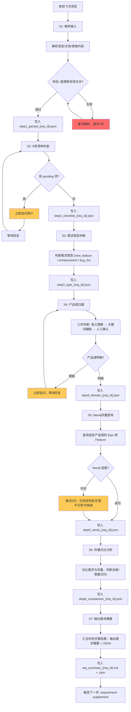

## 能做什么
收到飞书消息、文档、表格后，自动解析需求内容，填充 9 项信息清单，判断需求类型和产品域归属，查询 Neo4j 存量进行对比分析，输出结构化需求概要。

## 核心能力
1. **9 项信息清单检查**：强制逐项检查，缺失立即追问
2. **产品域三步判定**：语义理解 → 关键词辅助 → 人工确认
3. **Neo4j 存量对比**：先查存量再判断全新/增量/优化
4. **追问话术生成**：每项缺失自动生成对应追问话术
5. **结构化输出**：需求概要 + JSON，方便后续 Skill 调用

## 激活条件
- 收到飞书消息中包含"需求"、"新功能"、"做一个 xx"
- 用户分享飞书文档/表格并说明是需求
- 用户直接说"我有一个需求"
- 从其他 Skill 传入结构化需求（作为第一个 Skill）

**核心原则**：每次需求理解必须先查 Neo4j 存量，再结合文档补充缺口。绝不能闭门造车。

---

## 1. 触发条件

| 触发类型 | 说明 |
|:---|:---|
| 飞书消息 | 用户在飞书中发送需求描述 |
| 飞书文档 | 用户分享 PRD、产品文档链接 |
| 飞书表格 | 用户分享多维表格、业务数据 |
| 直接对话 | 用户说"我有一个需求"、"需要做一个 xx 功能" |

**激活关键词**：需求、理解、新功能、优化、需要一个 xx

---

## 2. 输入格式

```json
{
  "meta": {
    "source_type": "feishu_message | feishu_doc | feishu_bitable",
    "source_id": "消息ID / doc_token / table_id",
    "sender_id": "用户 open_id",
    "received_at": "2026-04-20 10:25"
  },
  "payload": {
    "content": "原始需求内容",
    "attachments": ["附件链接列表"]
  }
}
```

---

## 3. 9 项信息清单（必须逐项检查）

| # | 字段 | 说明 | 追问示例 | 检查结果 |
|:---:|:---|:---|:---|:---:|
| 1 | **谁提出** | 需求发起人/业务方 | "这个需求是谁提的？" | 待确认 |
| 2 | **何时上线** | 目标上线时间/截止日期 | "希望什么时候上线？" | 待确认 |
| 3 | **使用场景** | 具体的使用环境和操作步骤 | "用户在哪里、怎么用这个功能？" | 待确认 |
| 4 | **核心诉求** | 用户真正想解决的问题 | "做这个功能，最想达成什么？" | 待确认 |
| 5 | **当前痛点** | 现有流程/系统的具体问题 | "现在哪里不方便/有问题？" | 待确认 |
| 6 | **使用频率/范围** | 用户规模、触发频率、数据量级 | "多少人用？每天多少量？" | 待确认 |
| 7 | **主要用户** | 角色/部门/使用对象 | "谁会用这个功能？运营？销售？" | 待确认 |
| 8 | **关注指标** | 成功标准/衡量指标/KPI | "怎么衡量这个功能做得好不好？" | 待确认 |
| 9 | **关联已有功能** | 是否复用/扩展现有系统 | "这个功能和现有的XX功能有什么关系？" | 待确认 |

**决策规则**：
```
9 项全部已确认 → 输出【需求概要】
9 项有缺失 → 立即追问缺失项，禁止跳到 Step 1-8
```

---

## 4. 需求类型识别

| 类型 | 说明 | 处理策略 |
|:---|:---|:---|
| **new_feature** | 新功能开发 | 进入完整需求拆解流程 |
| **enhancement** | 功能优化/增强 | 识别增量部分，复用存量结构 |
| **bug_fix** | Bug 修复 | 聚焦问题根因，不拆 Feature/Story |
| **refactor** | 重构 | 不进入产品需求流程，走技术重构 |
| **data_migration** | 数据迁移 | 不进入产品需求流程 |

---

## 5. 产品域归属判断

**核心原则**：产品域归属不是简单的关键词匹配，而是一个【理解业务本质】的过程。当关键词命中模糊时，必须通过追问和使用场景分析来确定。

### 5.1 三步判断流程

```
Step 1: 语义理解
    ↓
    ├── 明确：基于使用场景直接判断
    └── 模糊：进入 Step 2
            ↓
Step 2: 关键词辅助 + 边界排除
    ↓
    ├── 唯一命中：确认归属
    └── 多重命中 / 无命中：进入 Step 3
            ↓
Step 3: 人工确认（必须追问）
    ↓
    输出：待确认状态 + 追问话术
```

### 5.2 6 大产品域边界定义（必须熟记）

| 产品域 | 代码 | 核心职责 | 边界说明 |
|:---|:---:|:---|:---|
| 数据发现 | PD-DFD | 帮助用户**找到**数据 | 数据在哪里、怎么找、数据是什么。关键词：资产、目录、字典、要素、搜索、资源、标签、分类 |
| 数字营销 | PD-MKT | 帮助用户**触达**客户 | 怎么把消息发出去、发给谁、发什么。关键词：营销、触达、短信、模板、客群、活动、内容、增长、渠道 |
| 数字风险 | PD-RISK | 帮助用户**做决策** | 风险怎么识别、决策怎么执行、合规怎么保障。关键词：风控、风险、信用、决策、模型、合规、调查、反欺诈 |
| 数字社区 | PD-COM | 帮助用户**使用系统** | 系统怎么登录、怎么授权、怎么协作。关键词：门户、权限、消息、通知、协作、应用、市场 |
| 数据探索 | PD-DEX | 帮助用户**分析数据** | 数据怎么用、报表怎么做、洞察怎么找。关键词：查询、分析、报表、仪表盘、洞察、可视化 |
| 数据管理 | PD-DMT | 帮助用户**治理数据** | 数据怎么管、质量怎么保、标准怎么定。关键词：元数据、数据标准、数据质量、主数据、数据服务 |

### 5.3 关键词辅助规则（仅作为参考，不能直接判定）

| 命中关键词 | 可能的产品域 | 说明 |
|:---|:---|:---|
| 短信、模板、客群、触达、营销、活动 | PD-MKT | 数字营销 |
| 风控、模型、决策、合规、调查 | PD-RISK | 数字风险 |
| 数据、字典、要素、资源、搜索 | PD-DFD | 数据发现 |
| 社区、门户、权限、消息、应用 | PD-COM | 数字社区 |
| 查询、分析、报表、洞察 | PD-DEX | 数据探索 |
| 元数据、标准、质量、服务 | PD-DMT | 数据管理 |

**注意**：命中关键词只是【可能的】指示，不是【确定的】判定。必须结合使用场景综合判断。

### 5.4 模糊场景判定规则

| 模糊类型 | 判定规则 | 示例 |
|:---|:---|:---|
| **多重命中** | 以【核心使用场景】为准，忽略附带功能 | 一个"营销数据分析"功能，核心是分析（PD-DEX）而非营销（PD-MKT） |
| **功能交叉** | 以【用户角色】判断 | 运营用 → PD-MKT，风控用 → PD-RISK |
| **无明确命中** | 人工追问，不强行判定 | 新技术/新业务形态 |
| **跨产品域** | 判断为主产品域，关联产品域注明 | 营销+风控 → 以营销为主，风控注明 |

### 5.5 人工确认标准（必须追问）

**满足以下任一条件，必须追问，不能直接判定**：

1. **关键词命中 ≥ 2 个产品域**
2. **关键词命中 = 0**
3. **使用场景描述模糊**（如"做一个数据功能"）
4. **涉及新技术/新业务形态**（无法匹配已知关键词）
5. **用户明确表示不确定**

### 5.6 产品域归属追问话术

| 模糊场景 | 追问话术 |
|:---|:---|
| 多重命中 | "这个需求看起来涉及多个产品域。能说一下用户最核心的使用场景是什么吗？比如是【发消息】、【看数据】还是【做决策】？" |
| 无命中 | "这个需求比较新，我需要了解一下：用户主要的操作是什么？是【找数据】、【发消息】、【分析数据】还是其他？" |
| 跨产品域 | "这个功能涉及 XX 和 XX 两个产品域。能帮我们确认一下哪个是主场景吗？比如是运营侧为主还是风控侧为主？" |
| 完全模糊 | "能描述一下用户在这个功能里主要做什么吗？在哪个页面、会看到什么、然后会做什么操作？" |

### 5.7 输出格式

**明确归属时**：
```
产品域归属：PD-XX（{产品域名称}）
判定依据：{使用场景描述}
置信度：高
```

**模糊待确认时**：
```
产品域归属：【待确认】
可能的产品域：PD-XX / PD-XX（多选）
模糊原因：{具体原因}
追问话术：{使用的追问话术}
状态：追问中
```

---

## 6. Neo4j 存量查询（必须先做）

### 查询存量 Epic

```python
from neo4j import GraphDatabase

driver = GraphDatabase.driver("bolt://localhost:7687", auth=("neo4j", "password123"))

def query_epics_by_domain(domain_code: str):
    """查询指定产品域的所有 Epic"""
    with driver.session() as tx:
        result = tx.run("""
            MATCH (d:ProductDomain {uri: $domainUri})
            OPTIONAL MATCH (d)-[:CONTAINS]->(e:Epic)
            RETURN e.uri as epic_uri, e.label as epic_label,
                   e.status as epic_status, e.priority as epic_priority
            ORDER BY e.priority, e.label
        """, domainUri=f"ProductDomain:{domain_code}")
        return list(result)
```

### 查询存量 Feature

```python
def query_features_by_epic(epic_uri: str):
    """查询指定 Epic 的所有 Feature"""
    with driver.session() as tx:
        result = tx.run("""
            MATCH (e:Epic {uri: $epicUri})
            OPTIONAL MATCH (e)-[:CONTAINS]->(f:Feature)
            RETURN f.uri as feature_uri, f.label as feature_label,
                   f.status as feature_status, f.priority as feature_priority
            ORDER BY f.priority, f.label
        """, epicUri=epic_uri)
        return list(result)
```

### 存量对比分析

| 判断维度 | 说明 |
|:---|:---|
| **全新需求** |  Neo4j 中无相关 Epic，视为新 Epic |
| **增量需求** | Neo4j 中有相关 Epic，需判断是新增 Feature 还是扩展已有 |
| **优化需求** | Neo4j 中有相关 Feature，需判断是新增 Story 还是修改已有 |

---

## 7. 输出规范

### 7.1 需求概要模板

```
## 需求概要
- **需求ID**: REQ-{YYYYMMDD}-{序号}
- **需求类型**: new_feature | enhancement | bug_fix | refactor
- **产品域**: {PD-XX} - {产品域名称}
- **状态**: 待确认 | 信息不全（追问中）

### 9 项信息清单
- [x] 谁提出：（已确认 / 待确认）
- [x] 何时上线：（已确认 / 待确认）
- [x] 使用场景：（已确认 / 待确认）
- [x] 核心诉求：（已确认 / 待确认）
- [x] 当前痛点：（已确认 / 待确认）
- [x] 使用频率/范围：（已确认 / 待确认）
- [x] 主要用户：（已确认 / 待确认）
- [x] 关注指标：（已确认 / 待确认）
- [x] 关联已有功能：（已确认 / 待确认）

### Neo4j 存量对比
- **相关 Epic**: （无 / 列出相关 Epic）
- **相关 Feature**: （无 / 列出相关 Feature）
- **判断结论**: 全新需求 | 增量需求 | 优化需求
```

### 7.2 结构化需求 JSON

```json
{
  "requirement_summary": {
    "requirement_id": "REQ-20260420-001",
    "title": "短信模板批量导入功能",
    "type": "new_feature",
    "product_domain": { "code": "PD-MKT", "label": "数字营销" },
    "status": "confirmed",
    "source": { "type": "feishu_message", "sender_id": "ou_xxx" },
    "info_checklist": {
      "who_raised": { "value": "运营部-小李", "status": "confirmed" },
      "target_date": { "value": "2026-05-15", "status": "confirmed" },
      "use_case": { "value": "运营人员在后台批量创建月度模板", "status": "confirmed" },
      "core_pain_point": { "value": "每月创建100+模板，手动效率低", "status": "confirmed" },
      "pain_point_detail": { "value": "逐个创建耗时长，格式易错", "status": "confirmed" },
      "usage_frequency": { "value": "每月1次批量操作", "status": "confirmed" },
      "target_users": { "value": "运营人员", "status": "confirmed" },
      "success_metrics": { "value": "效率提升80%", "status": "confirmed" },
      "related_features": { "value": "短信模板管理", "status": "confirmed" }
    },
    "neo4j_comparison": {
      "related_epic": "Epic:EPIC-MKT-REACH",
      "related_features": ["Feature:FEAT-MKT-REACH-SMS"],
      "conclusion": "增量需求 - 新增 Feature"
    }
  }
}
```

---

## 8. 追问话术模板

### 通用追问

| 缺失项 | 追问话术 |
|:---|:---|
| **谁提出** | "这个需求是谁提的？是业务方还是用户直接反馈？" |
| **何时上线** | "希望什么时候上线？有没有硬截止日期？" |
| **使用场景** | "能描述一下具体的使用场景吗？用户在哪个页面、做什么操作？" |
| **核心诉求** | "做这个功能，最想解决什么问题？" |
| **当前痛点** | "现在哪里不方便？最好能举个具体例子。" |
| **使用频率** | "这个功能大概多少人用？每天/每月多少量？" |
| **主要用户** | "哪些角色会用这个功能？运营？销售？管理员？" |
| **关注指标** | "怎么衡量这个功能做得好不好？有没有具体的 KPI？" |
| **关联已有功能** | "这个功能和现有的哪个模块关系最密切？" |

### 产品域归属追问

| 模糊场景 | 追问话术 |
|:---|:---|
| 跨产品域 | "这个功能涉及营销和风控，能具体说是偏运营还是偏合规吗？" |
| 不确定 | "这个功能看起来跨了多个域，能说一下最核心的场景是哪个吗？" |

---

## 9. ID 命名规范

| 层级 | 格式 | 示例 |
|:---|:---|:---|
| 需求ID | `REQ-{YYYYMMDD}-{序号}` | `REQ-20260420-001` |
| 产品域 | `ProductDomain:PD-{code}` | `ProductDomain:PD-MKT` |
| Epic | `EPIC-{域}-{模块}` | `EPIC-MKT-REACH` |
| Feature | `FEAT-{域}-{Epic}-{特性}` | `FEAT-MKT-REACH-SMS-IMPORT` |
| Story | `STORY-{域}-{Epic}-{特性}-{序号}` | `STORY-MKT-REACH-SMS-IMPORT-001` |

---

## 10. 工作流程

**核心原则**：错误在每一步内解决，不把问题传到下一步。每一步完成后必须校验通过才能进入下一步。

### 10.1 步骤定义与边界

| 步骤 | 名称 | 输入 | 输出 | 边界责任 |
|:---:|:---|:---|:---|:---|
| **S1** | 解析输入 | 飞书消息/文档/表格 | 原始需求文本 | 只负责解析，不负责判断 |
| **S2** | 9项清单检查 | 原始需求文本 | 逐项确认状态 | 发现缺失立即追问，不跳步 |
| **S3** | 需求类型判断 | 9项已确认的清单 | 需求类型（new_feature等） | 只判断类型，不做产品域判断 |
| **S4** | 产品域归属 | 需求类型 + 使用场景 | PD-XX 或【待确认】 | 模糊时必须追问，不强行判定 |
| **S5** | Neo4j存量查询 | 产品域归属 | 存量 Epic/Feature 列表 | 只查询，不做对比结论 |
| **S6** | 存量对比分析 | 存量列表 + 需求类型 | 全新/增量/优化结论 | 只做结论，不输出需求概要 |
| **S7** | 输出需求概要 | 所有前面步骤的结果 | 需求概要 + JSON | 汇总，不做补充 |

### 10.2 每步校验机制

**通用校验原则**：每一步完成后，必须校验通过才能进入下一步。校验失败 → 立即重试或追问。

| 步骤 | 校验规则 | 校验失败处理 |
|:---:|:---|:---|
| **S1** | 能提取到有效的原始需求文本 | 重试解析，最多3次；仍失败则输出"解析失败，请检查输入格式" |
| **S2** | 9项中每一项都有明确状态（confirmed/pending） | 有pending项 → 立即追问 → 等待回复后重新检查 |
| **S3** | 需求类型在定义的五种类型内 | 类型不明 → 默认识别为 new_feature，并注明 |
| **S4** | 产品域在6个已知域内，或状态为【待确认】 | 【待确认】状态 → 追问 → 等待回复 |
| **S5** | Neo4j连接成功，返回查询结果 | 连接失败 → 重试3次 → 失败则标注"Neo4j暂不可用"，可继续 |
| **S6** | 结论在三种类型内（全新/增量/优化） | 结论矛盾 → 优先采用"增量"，并注明原因 |
| **S7** | JSON格式正确，required字段齐全 | JSON无效 → 重新生成，最多3次 |

### 10.3 中间文档留存

**原则**：每一步完成后，将结果写入中间文档，作为下一步的输入参考和错误追溯依据。

| 步骤 | 中间文档路径 | 文件名格式 |
|:---:|:---|:---|
| S1 解析输入 | `/tmp/requirement/step1_parsed_{req_id}.json` | 原始需求文本 + meta 信息 |
| S2 清单检查 | `/tmp/requirement/step2_checklist_{req_id}.json` | 9项状态 + 追问记录 |
| S3 类型判断 | `/tmp/requirement/step3_type_{req_id}.json` | 需求类型 + 判断依据 |
| S4 产品域 | `/tmp/requirement/step4_domain_{req_id}.json` | 产品域归属 + 置信度 + 追问记录 |
| S5 存量查询 | `/tmp/requirement/step5_neo4j_{req_id}.json` | Epic/Feature 列表 + 查询时间 |
| S6 对比分析 | `/tmp/requirement/step6_comparison_{req_id}.json` | 结论 + 分析依据 |
| S7 最终输出 | `/tmp/requirement/req_summary_{req_id}.md` + `.json` | 最终需求概要 |

**中间文档内容**：
```json
{
  "step": "S2",
  "req_id": "REQ-20260420-001",
  "status": "completed | pending | failed",
  "result": {},
  "timestamp": "2026-04-20 10:40",
  "retry_count": 0,
  "error_message": "（失败时填写）"
}
```

### 10.4 重试机制

| 场景 | 重试策略 | 最大重试次数 | 超过最大次数后 |
|:---|:---|:---:|:---|
| S1 解析失败 | 重新解析输入 | 3 | 输出错误提示，等待用户重新输入 |
| S2 追问无响应 | 等待用户回复 | 无限制 | 保持追问状态，定期提醒（每天最多1次） |
| S4 产品域模糊 | 追问 | 无限制 | 保持【待确认】状态，先用推测的域继续 |
| S5 Neo4j连接失败 | 等待 + 重试 | 3 | 标注"Neo4j暂不可用"，可继续后续步骤 |
| S7 JSON生成失败 | 重新生成 | 3 | 输出 Markdown 格式，不输出 JSON |

### 10.5 完整工作流（含校验、重试、留存）



### 10.6 错误处理原则

1. **错误在当前步骤内解决**：不把错误传到下一步
2. **每步必须校验通过**：校验失败 → 重试或追问 → 等待回复
3. **中间文档可追溯**：任何时候都可以查看中间文档，了解进度和错误原因
4. **重试有上限**：超过最大重试次数后，输出错误提示，等待人工介入

---

## 11. 依赖 Skill

| Skill | 关系 | 说明 |
|:---|:---|:---|
| `requirement-supplement` | 后续 | 需求理解完成后，进入需求补充 |
| `product-breakdown` | 参考 | 本体论结构参考 |
| `requirement-breakdown` | 参考 | 存量查询逻辑参考 |

---

## 12. 关键路径速查

| 用途 | 路径 |
|:---|:---|
| Neo4j | `bolt://localhost:7687` (neo4j/password123) |
| 产品域查询 | `ProductDomain:PD-MKT/DFD/RISK/COM/DEX/DMT` |

---

*Version: 1.3 | For: Tony Stark | Based: Product Management Ontology v3.0 + Requirement Breakdown SOP*
