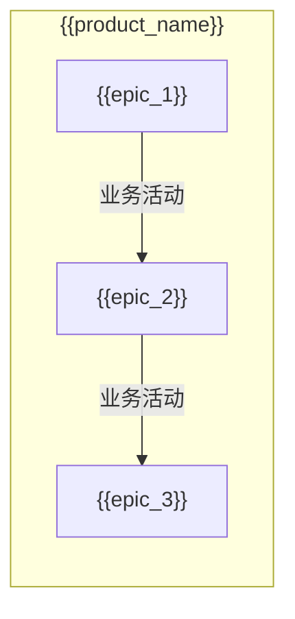

# 产品域说明文档模板

> **版本**: v1.4
> **日期**: {{date}}
> **作者**: {{author}}
> **状态**: {{status}}

---

## 1. 产品域概述

### 1.1 基本信息

| 字段 | 内容 |
|:---|:---|
| 产品域 ID | {{PD-ID}} |
| 产品域名称 | {{name}} |
| 英文名 | {{english_name}} |
| 所属业务线 | {{business_line}} |
| 产品负责人 | {{product_owner}} |
| 创建日期 | {{created_date}} |

### 1.2 产品域定位

{{description}}

### 1.3 核心价值

| 价值维度 | 说明 |
|:---|:---|
| 用户价值 | {{value}} |
| 业务价值 | {{value}} |
| 技术价值 | {{value}} |

---

## 2. 逻辑架构图（业务流程）

> **用途**：描述业务域之间的流程流转，供产品/运营/业务方理解
> **关注点**：业务流程、活动流转、数据流向
> **特点**：无系统边界概念，关注"做什么"



### 2.1 逻辑层级说明

| 层级 | Epic/模块 | 业务流程 | 说明 |
|:---|:---|:---|:---|
| 策略层 | {{epic_1}} | {{flow_description}} | {{description}} |
| 执行层 | {{epic_2}} | {{flow_description}} | {{description}} |
| 触达层 | {{epic_3}} | {{flow_description}} | {{description}} |

---

## 3. 物理架构图（系统模块）

> **用途**：描述系统模块之间的调用关系，供开发/测试/架构师理解
> **关注点**：系统边界、模块间调用、数据流
> **特点**：有明确的技术实现和系统边界

```mermaid
flowchart TB
    subgraph 前端["前端系统"]
        {{frontend_module_1}}
        {{frontend_module_2}}
    end

    subgraph 后端["后端服务"]
        {{backend_module_1}}
        {{backend_module_2}}
    end

    subgraph 数据层["数据/存储"]
        {{data_module}}
    end

    {{frontend_module_1}} -->|"API调用"| {{backend_module_1}}
    {{backend_module_1}} -->|"读写"| {{data_module}}
```

### 3.1 系统模块说明

| 模块 | 类型 | 说明 |
|:---|:---|:---|
| {{module_name}} | 前端/后端/数据 | {{description}} |

---

## 4. Epic 列表

| 序号 | Epic ID | Epic 名称 | Feature 数量 |
|:---:|:---|:---|:---:|
| 1 | EPIC-001 | {{epic_name}} | {{count}} |
| 2 | EPIC-002 | {{epic_name}} | {{count}} |
| 3 | EPIC-003 | {{epic_name}} | {{count}} |

### 4.1 Epic 详细

#### EPIC-001 {{epic_name}}

| 属性 | 值 |
|:---|:---|
| Epic ID | EPIC-001 |
| Epic 名称 | {{epic_name}} |
| 目标 | {{goal}} |
| 负责人 | {{owner}} |

**Feature 列表**：
| Feature | 名称 | 优先级 |
|:---|:---|:---:|
| FEAT-001 | {{name}} | P0 |
| FEAT-002 | {{name}} | P1 |

---

## 5. 能力地图

> **用途**：描述产品核心能力矩阵，含关键能力子项、业务价值、建设情况
> **关注点**：能力项与业务价值对应，建设阶段清晰

### 5.1 能力域名称

| 关键能力 | 能力子项 | 业务价值 | 建设情况 |
|:---|:---|:---|:---|
| {{capability_1}} | {{sub_item}} | {{value}} | 🟢已实现 / 🟡部分实现 / ⏸️已规划 |

### 5.2 能力域名称

| 关键能力 | 能力子项 | 业务价值 | 建设情况 |
|:---|:---|:---|:---|
| {{capability_2}} | {{sub_item}} | {{value}} | 🟢已实现 / 🟡部分实现 / ⏸️已规划 |

### 5.3 能力地图汇总

| 能力域 | 🟢已实现 | 🟡部分实现 | ⏸️已规划 | 合计 |
|:---|:---:|:---:|:---:|:---:|
| 能力域1 | X | X | X | X |
| 能力域2 | X | X | X | X |
| **合计** | **X** | **X** | **X** | **X** |

---

## 6. 菜单结构与功能映射

> **用途**：供技术团队（钟离等）绑定路由和组件

### 6.1 顶部导航栏（全角色可见）

| 序号 | 菜单名称 | 功能说明 | 权限说明 |
|:---:|:---|:---|:---|
| 1 | {{menu_name}} | {{function_description}} | {{permission}} |

### 6.2 左侧菜单栏

#### （一）{{module_name}}

| 一级菜单 | 二级菜单 | 功能说明 | 权限说明 |
|:---|:---|:---|:---|
| {{menu_1}} | - | {{description}} | {{permission}} |
| | {{sub_menu}} | {{description}} | {{permission}} |

**适用场景**：{{scenario_description}}

### 6.3 路由与组件映射

| 菜单路径 | 路由 | 组件 | 说明 |
|:---|:---|:---|:---|
| {{menu_path}} | {{route}} | {{component}} | {{description}} |

### 6.4 权限说明

| 角色 | 可访问菜单 |
|:---|:---|
| 管理员 | 全部 |
| 普通用户 | {{visible_menus}} |

---

## 7. 依赖关系

### 7.1 依赖的其他产品域

| 产品域 | 依赖类型 | 说明 |
|:---|:---|:---|
| PD-XXX | 数据依赖 | {{description}} |
| PD-YYY | 功能依赖 | {{description}} |

### 7.2 依赖的外部系统

| 系统 | 依赖类型 | 接口地址 | 说明 |
|:---|:---|:---|:---|
| 系统名 | 接口依赖 | {{api_url}} | {{description}} |

---

## 8. 变更记录

| 日期 | 版本 | 变更内容 | 作者 |
|:---|:---:|:---|:---|
| {{date}} | v1.0 | 初始版本 | {{author}} |
| {{date}} | v1.1 | 新增字段（对标产品、菜单结构等）| {{author}} |
| {{date}} | v1.2 | Epic 列表移除优先级、状态，完成度 | {{author}} |
| {{date}} | v1.3 | 增加逻辑架构图与物理架构图 | {{author}} |
| {{date}} | v1.4 | 增加能力地图模块；统一四象限能力域定位 | {{author}} |

---

🦍 *产品域说明文档模板 v1.4*
