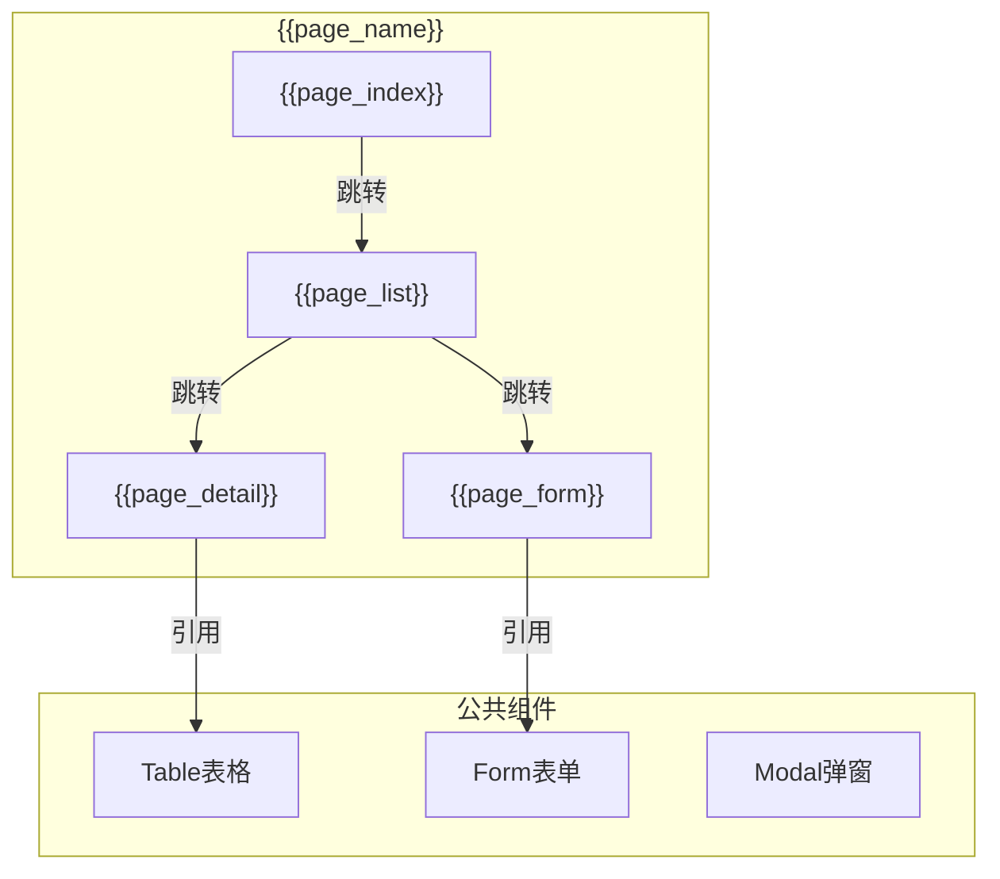
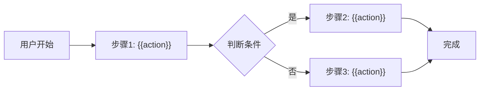

# Feature 说明文档模板

> **版本**: v1.1
> **日期**: {{date}}
> **作者**: {{author}}

---

## 1. Feature 基本信息

| 字段 | 内容 |
|:---|:---|
| Feature ID | {{FEAT-ID}} |
| Feature 名称 | {{feature_name}} |
| 所属 EPIC | {{epic_id}} |
| 所属产品域 | {{product_domain}} |
| 负责人 | {{owner}} |

---

## 2. Feature 概述

### 2.1 是什么

{{what_is_it}}

### 2.2 解决什么问题

{{problem_solved}}

### 2.3 用户场景

| 场景 | 用户 | 描述 |
|:---|:---|:---|
| 场景1 | {{user}} | {{description}} |
| 场景2 | {{user}} | {{description}} |

---

## 3. 系统模块图（页面/组件结构）

> **用途**：描述本 Feature 的前端页面结构和组件关系
> **关注点**：页面层级、组件划分、路由绑定

### 3.1 页面说明

| 页面 | 路由 | 组件 | 说明 |
|:---|:---|:---|:---|
| {{page_name}} | {{route}} | {{component}} | {{description}} |

### 3.2 组件说明

| 组件 | 类型 | 说明 |
|:---|:---|:---|
| {{component_name}} | 业务/公共 | {{description}} |

---

## 4. 功能说明

### 4.1 功能清单

| 功能点 | 类型 | 描述 |
|:---|:---|:---|
| FP-001 | 页面/接口/数据 | {{description}} |
| FP-002 | 页面/接口/数据 | {{description}} |

### 4.2 用户流程

---

## 5. 验收标准

| 验收项 | 标准 |
|:---|:---|
| 功能验收 | {{criteria}} |
| 性能验收 | {{criteria}} |
| 交互验收 | {{criteria}} |

---

## 6. 依赖关系

| 依赖项 | 类型 | 说明 |
|:---|:---|:---|
| {{dependency}} | 接口/数据 | {{description}} |

---

## 7. 变更记录

| 日期 | 版本 | 变更内容 | 作者 |
|:---|:---:|:---|:---|
| {{date}} | v1.0 | 初始版本 | {{author}} |
| {{date}} | v1.1 | 增加系统模块图（页面/组件结构） | {{author}} |

---

🦍 *Feature 说明文档模板 v1.1*
