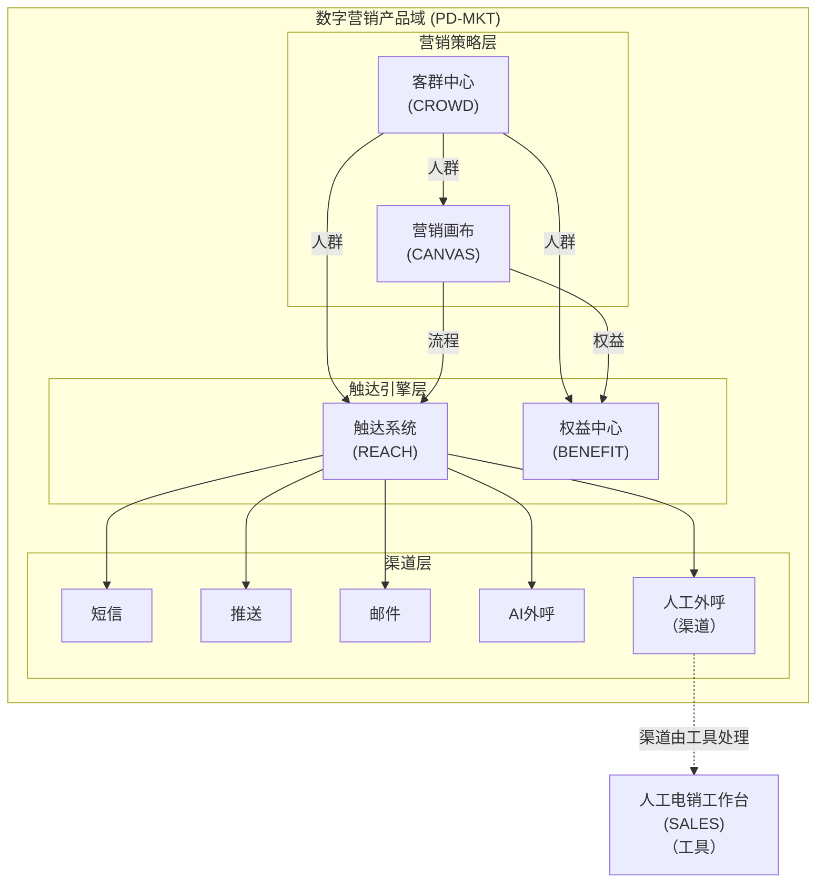
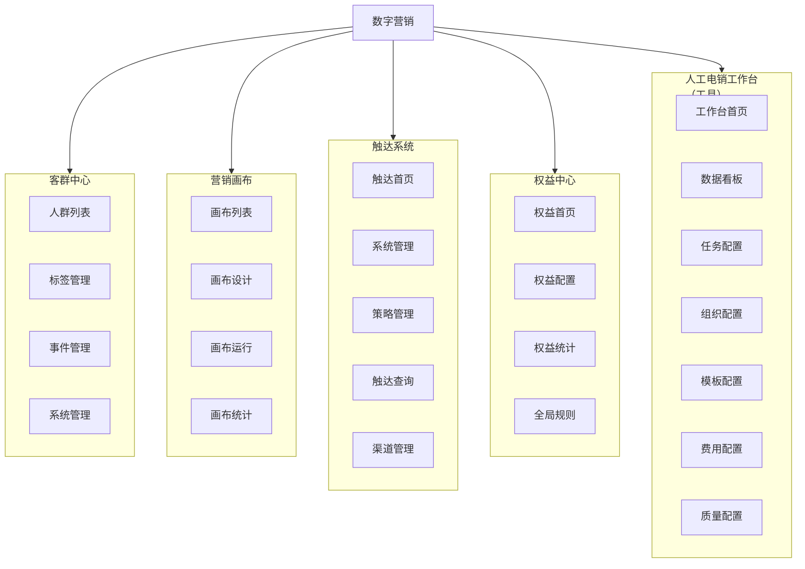
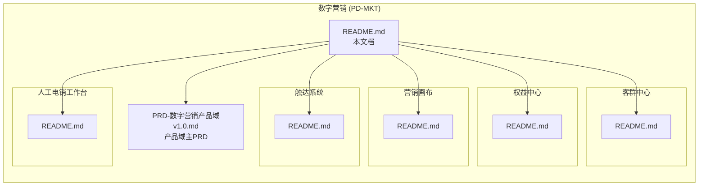

# 数字营销 (PD-MKT)

> **版本**: v1.5 | **日期**: 2026-04-27 | **作者**: Tony Stark | **状态**: 已上线

---

## 元信息

| 项目 | 内容 |
|:---|:---|
| 产品域 | PD-MKT 数字营销 |
| 创建时间 | 2026-04-24 |
| 更新时间 | 2026-04-27 |
| 维护者 | Tony Stark |

---

## 概述

### 产品定位

数字营销产品域（PD-MKT）为企业提供全渠道营销触达、客群管理和营销自动化能力。

### 核心价值

| 价值 | 说明 |
|:---|:---|
| 触达 | 多渠道统一触达（短信、推送、邮件，外呼） |
| 客群 | 精准人群圈选与分析 |
| 自动化 | 营销流程自动化编排 |
| 权益 | 优惠券/积分等权益管理 |

### 目标用户

- **运营人员**：创建营销活动、圈选人群、配置触达策略
- **分析师**：分析营销效果、优化策略
- **客服**：查看客户触达历史、进行人工电销

---

## 产品架构



### 层级说明

| 层级 | EPIC | 说明 |
|:---|:---|:---|
| **营销策略层** | 客群中心、营销画布 | 用户洞察、流程编排 |
| **触达引擎层** | 触达系统、权益中心 | 统一触达、权益管理 |
| **渠道层** | 短信、推送、邮件，AI外呼 | 实际触达 |
| **电销工作台** | 人工电销工作台 | 人工外呼渠道 |

---

## EPIC 列表

| # | EPIC ID | 名称 | 目录 | Feature | 优先级 | 状态 |
|:---:|:---|:---|:---|:---:|:---:|:---:|
| 1 | EPIC-MKT-CROWD | 客群中心 | `客群中心/` | 5 | P0 | 已上线 |
| 2 | EPIC-MKT-CANVAS | 营销画布 | `营销画布/` | 7 | P0 | 已上线 |
| 3 | EPIC-MKT-REACH | 触达系统 | `触达系统/` | 5 | P0 | 已上线 |
| 4 | EPIC-MKT-BENEFIT | 权益中心 | `权益中心/` | 8 | P1 | 已上线 |
| 5 | EPIC-MKT-SALES | 人工电销工作台 | `人工电销工作台/` | 12 | P1 | 已上线 |

---

## 菜单结构总览



---

## 目录结构



```
数字营销/
├── README.md                              ← 本文档
├── PRD-数字营销产品域v1.0.md             ← 产品域主PRD
│
├── 触达系统/                             ← EPIC-REACH
│   └── README.md                          ← 菜单与路由映射
│
├── 营销画布/                             ← EPIC-CANVAS
│   └── README.md
│
├── 权益中心/                             ← EPIC-BENEFIT
│   └── README.md
│
├── 客群中心/                             ← EPIC-CROWD
│   └── README.md
│
└── 人工电销工作台/                       ← EPIC-SALES
    └── README.md
```

---

## 相关资源

- [数字社区项目总索引](../README.md) - 返回项目总索引
- [PRD-数字营销产品域v1.0.md](./PRD-数字营销产品域v1.0.md) - 产品域主PRD

---

## 更新日志

| 日期 | 版本 | 变更内容 | 更新人 |
|:---|:---:|:---|:---|
| 2026-04-24 | v1.0 | 初始创建 | Tony Stark |
| 2026-04-27 | v1.1 | 补充目录结构说明 | Tony Stark |
| 2026-04-27 | v1.2 | 合并文档，架构图改用mermaid | Tony Stark |
| 2026-04-27 | v1.3 | 增加菜单结构总览与功能映射 | Tony Stark |
| 2026-04-27 | v1.4 | 标准化EPIC层菜单结构说明框架 | Tony Stark |
| 2026-04-27 | v1.5 | 参照钟离模板重写菜单结构说明 | Tony Stark |

---

*最后更新: 2026-04-27*
*维护者: Tony Stark*
