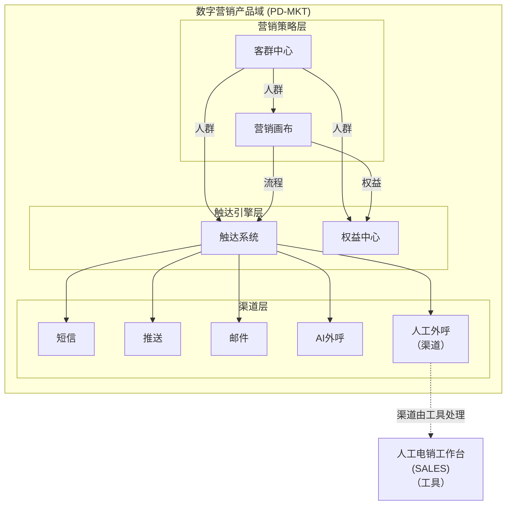

# EPIC-MKT-SALES - 人工电销工作台

> **版本**: v1.5 | **日期**: 2026-04-27 | **作者**: Tony Stark | **状态**: 已上线

---

## 元信息

| 项目 | 内容 |
|:---|:---|
| EPIC ID | EPIC-MKT-SALES |
| EPIC 名称 | 人工电销工作台 |
| 所属产品域 | PD-MKT 数字营销 |
| 优先级 | P1 |
| 状态 | 已上线 |
| Feature数 | 16 |
| 路由前缀 | `/telemarketing/*` |

---

## 概述

人工电销工作台是数字营销产品域的**渠道层**重要模块，提供电销场景下的工作台主页、任务管理、数据看板等能力，支持客服高效开展人工电销工作。

> ⚠️ **整改说明**：当前人工电销是独立应用（telemarketing-workbench），目标整合到数字营销作为子模块

---

## 在产品架构中的位置



---

## Feature 清单

| # | Feature ID | Feature 名称 | 优先级 | 状态 |
|:---:|:---|:---|:---:|:---:|
| 1 | FEAT-MKT-SALES-SYS | 系统设置 | P1 | 已上线 |
| 2 | FEAT-MKT-SALES-DASH | 数据监控 | P1 | 已上线 |
| 3 | FEAT-MKT-SALES-CUST | 电销工作台 | P0 | 已上线 |
| 4 | FEAT-MKT-SALES-ORG | 架构管理 | P1 | 已上线 |
| 5 | FEAT-MKT-SALES-TASK | 外呼任务管理 | P0 | 已上线 |
| 6 | FEAT-MKT-SALES-COST | 费用管理 | P1 | 已上线 |
| 7 | FEAT-MKT-SALES-QUAL | 质检管理 | P1 | 已上线 |
| 8 | FEAT-MKT-SALES-RECORD | 通话记录查询 | P1 | 已上线 |
| 9 | FEAT-MKT-SALES-POOL | 出池配置 | P2 | 已上线 |
| 10 | FEAT-MKT-SALES-LOG | 用户日志 | P2 | 已上线 |
| 11 | FEAT-MKT-SALES-REVIEW | 预约回电 | P1 | 已上线 |
| 12 | FEAT-发送管理-39D5 | 发送管理 | P2 | 已上线 |
| 13 | FEAT-数据看板-7D72 | 数据看板 | P1 | 已上线 |
| 14 | FEAT-模板配置-070C | 模板配置 | P2 | 已上线 |
| 15 | FEAT-渠道管理-8E92 | 渠道管理 | P1 | 已上线 |
| 16 | FEAT-MKT-SALES-CUSTOMER | 客户管理 | P2 | 待开发 |

---

## 菜单结构与功能映射

> ⚠️ **层级说明**：一级菜单（顶部）→ 二级菜单（模块）→ 三级菜单（功能）→ 内嵌功能（页面操作）

### 一、顶部导航栏（全角色可见）

**入口**：数字营销 → 人工电销（整改后）/ 当前：独立应用

| 序号 | 菜单名称 | 功能说明 | 权限说明 |
|:---:|:---|:---|:---|
| 1 | 数据监控 | 数据概览、绩效概览、工位监控 | 全角色 |
| 2 | 电销工作台 | 目标客群工作台、外呼任务、呼叫记录 | 全角色 |
| 3 | 费用管理 | 费用规则、费用详情 | 管理员 |
| 4 | 架构管理 | 团队、组、坐席、角色管理 | 管理员 |
| 5 | 系统设置 | 池规则、用户日志 | 管理员 |
| 6 | 质检管理 | 质检列表、质检详情、评分模板 | 管理员/全角色 |
| 7 | 客户管理 | 客户详情 | 全角色 |

---

### 二、左侧菜单栏

#### （一）数据监控

| 二级菜单 | 三级菜单（功能） | 内嵌功能 | 功能说明 | 权限 |
|:---|:---|:---|:---|:---|
| **数据监控** | 数据概览 | - | 数据总览与统计 | 全角色 |
| | 工位监控 | - | 坐席工位监控 | 管理员 |
| | 绩效概览 | - | 绩效数据概览 | 全角色 |
| | 坐席绩效 | 查看/导出 | 坐席绩效明细 | 全角色 |

#### （二）电销工作台

| 二级菜单 | 三级菜单（功能） | 内嵌功能 | 功能说明 | 权限 |
|:---|:---|:---|:---|:---|
| **电销工作台** | 目标客群工作台 | 查看/编辑/分配 | 目标客群列表与管理 | 全角色 |
| | 回访管理 | 查看/编辑/新建 | 回访任务管理 | 全角色 |
| | 外呼任务管理 | 新建/编辑/删除/详情 | 外呼任务列表管理 | 全角色 |
| | 外呼任务详情 | 查看/编辑 | 任务执行详情查看 | 全角色 |
| | 呼叫记录 | 查看/导出/筛选 | 呼叫记录查询 | 全角色 |

#### （三）费用管理

| 二级菜单 | 三级菜单（功能） | 内嵌功能 | 功能说明 | 权限 |
|:---|:---|:---|:---|:---|
| **费用管理** | 费用规则 | 新建/编辑/删除/详情 | 费用规则配置管理 | 管理员 |
| | 费用详情 | 查看/导出 | 费用明细查询 | 全角色 |

#### （四）架构管理

| 二级菜单 | 三级菜单（功能） | 内嵌功能 | 功能说明 | 权限 |
|:---|:---|:---|:---|:---|
| **架构管理** | 团队管理 | 新建/编辑/删除/详情 | 团队配置与管理 | 管理员 |
| | 组管理 | 新建/编辑/删除/详情 | 组配置与管理 | 管理员 |
| | 坐席管理 | 新建/编辑/删除/详情 | 坐席配置与管理 | 管理员 |
| | 角色管理 | 新建/编辑/删除/详情 | 角色权限配置 | 管理员 |

#### （五）系统设置

| 二级菜单 | 三级菜单（功能） | 内嵌功能 | 功能说明 | 权限 |
|:---|:---|:---|:---|:---|
| **系统设置** | 池规则 | 新建/编辑/删除 | 池规则配置 | 管理员 |
| | 用户日志 | 查看/导出/筛选 | 用户日志查询 | 管理员 |

#### （六）质检管理

| 二级菜单 | 三级菜单（功能） | 内嵌功能 | 功能说明 | 权限 |
|:---|:---|:---|:---|:---|
| **质检管理** | 质检列表 | 查看/详情/导出 | 质检记录列表 | 全角色 |
| | 质检详情 | 查看/评分/导出 | 质检结果详情 | 全角色 |
| | 评分模板 | 新建/编辑/删除/详情 | 评分模板管理 | 管理员 |

#### （七）客户管理

| 二级菜单 | 三级菜单（功能） | 内嵌功能 | 功能说明 | 权限 |
|:---|:---|:---|:---|:---|
| **客户管理** | 客户详情 | 查看/编辑/导出 | 客户详情查看 | 全角色 |

---

### 三、路由映射

| 菜单路径 | 路由 | 说明 |
|:---|:---|:---|
| 数据监控/数据概览 | /telemarketing/overview | 数据概览 |
| 数据监控/工位监控 | /telemarketing/station-monitor | 工位监控 |
| 数据监控/绩效概览 | /telemarketing/performance-overview | 绩效概览 |
| 数据监控/坐席绩效 | /telemarketing/agent-performance | 坐席绩效 |
| 电销工作台/目标客群工作台 | /telemarketing/customer-workbench | 目标客群工作台 |
| 电销工作台/回访管理 | /telemarketing/visit-manage | 回访管理 |
| 电销工作台/外呼任务管理 | /telemarketing/outbound-task | 外呼任务管理 |
| 电销工作台/外呼任务详情 | /telemarketing/outbound-task/:id | 外呼任务详情 |
| 电销工作台/呼叫记录 | /telemarketing/call-records | 呼叫记录 |
| 费用管理/费用规则 | /telemarketing/cost-rules | 费用规则 |
| 费用管理/费用详情 | /telemarketing/cost-detail | 费用详情 |
| 架构管理/团队管理 | /telemarketing/team-management | 团队 |
| 架构管理/组管理 | /telemarketing/group-management | 组 |
| 架构管理/坐席管理 | /telemarketing/agent-management | 坐席 |
| 架构管理/角色管理 | /telemarketing/role-management | 角色 |
| 系统设置/池规则 | /telemarketing/pool-rules | 池规则 |
| 系统设置/用户日志 | /telemarketing/user-log | 用户日志 |
| 质检管理/质检列表 | /telemarketing/quality-inspection | 质检列表 |
| 质检管理/质检详情 | /telemarketing/quality-detail | 质检详情 |
| 质检管理/评分模板 | /telemarketing/score-template | 评分模板 |
| 客户管理/客户详情 | /telemarketing/customer-detail | 客户详情 |

---

### 四、权限说明

| 角色 | 可访问菜单 |
|:---|:---|
| 管理员 | 全部菜单（含架构管理、费用管理、系统设置）|
| 运营主管 | 数据监控（绩效概览/坐席绩效）、电销工作台、费用管理（费用详情）、质检管理 |
| 客服 | 电销工作台（仅自己的任务）、客户管理（仅自己的客户）|
| 质检人员 | 质检管理（质检列表/详情）|

---

## 目录结构

```
人工电销工作台/
├── README.md                        ← 本文档
├── 产品PRD/
├── 业务需求入口/
├── 产品操作手册/
├── 需求拆解结果/Feature/
└── 技术方案/Feature/
```

---

## 相关资源

- [数字营销产品域总索引](../README.md)
- [人工电销工作台PRD](./产品PRD/PRD-人工电销工作台v1.0.md)
- [技术方案](./技术方案/)

---

## 更新日志

| 日期 | 版本 | 变更内容 | 更新人 |
|:---|:---:|:---|:---|
| 2026-04-27 | v1.4 | 参照钟离模板重写菜单结构说明 | Tony Stark |
| 2026-04-27 | v1.5 | 对齐钟离理想整改菜单：重构菜单分类（数据监控/电销工作台/费用管理/架构管理等），新增池规则/用户日志/客户管理，更新路由映射 | Tony Stark |

---

*最后更新: 2026-04-27*
