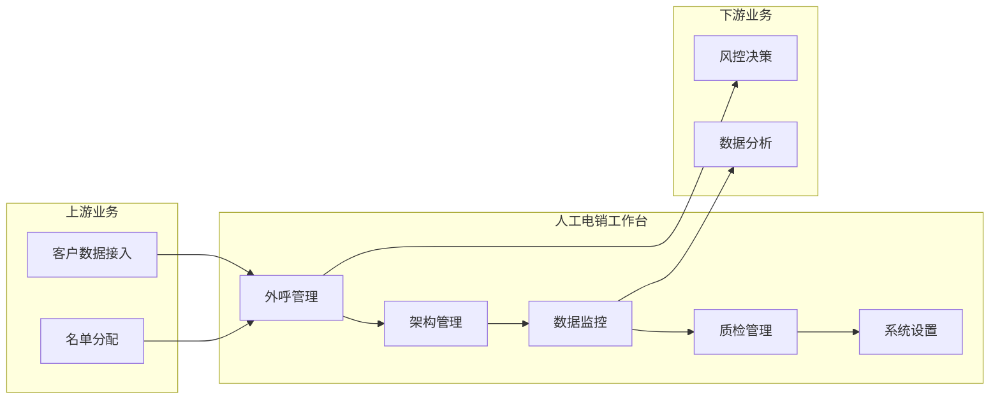
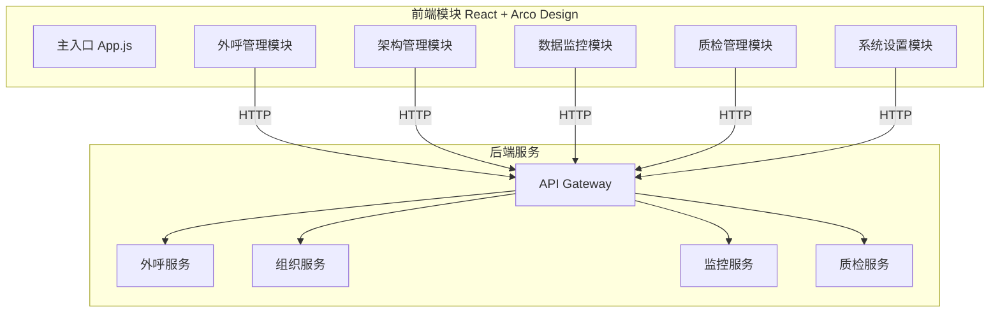

# EPIC 说明文档 - 人工电销工作台

> **版本**: v1.0
> **日期**: 2026-04-29
> **作者**: Tony Stark
> **状态**: DONE

---

## 1. EPIC 基本信息

| 字段 | 内容 |
|:---|:---|
| EPIC ID | EPIC-人工电销工作台 |
| EPIC 名称 | 人工电销工作台 |
| 所属产品域 | PD-MKT 数字营销 |
| 负责人 | Tony Stark |
| Feature数 | 5 |
| FP总数 | 34 |

---

## 2. 逻辑架构图（业务流程）



### 2.1 功能模块说明

| 模块 | 功能 | 业务流程 |
|:---|:---|:---|
| 外呼管理 | 名单搜索、任务管理、回电预约、通话记录 | 核心业务流程 |
| 架构管理 | 团队、小组、坐席、角色管理 | 组织支撑 |
| 数据监控 | 业务指标、坐席监控、业绩统计 | 运营分析 |
| 质检管理 | 质检任务、评分模板、结果查看 | 质量管控 |
| 系统设置 | 出池规则、日志、通知配置 | 系统支撑 |

---

## 3. 物理架构图（系统模块）



---

## 4. 功能范围

### 4.1 Feature 清单

| # | Feature ID | Feature 名称 | 优先级 | 状态 | FP数 |
|:---:|:---|:---|:---:|:---:|:---:|
| 1 | FEAT-MKT-人工电销-外呼管理 | 外呼管理 | P0 | TODO | 15 |
| 2 | FEAT-MKT-人工电销-架构管理 | 架构管理 | P0 | TODO | 7 |
| 3 | FEAT-MKT-人工电销-数据监控 | 数据监控 | P0 | TODO | 6 |
| 4 | FEAT-MKT-人工电销-质检管理 | 质检管理 | P1 | TODO | 3 |
| 5 | FEAT-MKT-人工电销-系统设置 | 系统设置 | P1 | TODO | 3 |

### 4.2 FP 清单汇总

| Feature | FP列表 |
|:---|:---|
| 外呼管理 | OM-001~OM-015 |
| 架构管理 | OG-001~OG-007 |
| 数据监控 | DM-001~DM-006 |
| 质检管理 | QM-001~QM-003 |
| 系统设置 | SM-001~SM-003 |

### 4.3 不包含的功能

- 预测式外呼算法（由算法团队独立开发）
- 通话语音转文字（由语音服务提供）
- CRM集成（后续版本规划）

---

## 5. 菜单结构

### 5.1 左侧菜单栏

```
人工电销工作台
├── 📞 外呼管理
│   ├── 名单列表 (/target-prospect-workbench)
│   ├── 预约回电 (/callback-management)
│   ├── 外呼任务管理 (/outbound-task-management)
│   └── 通话记录查询 (/call-records)
├── 👥 架构管理
│   ├── 电销团队管理 (/team-management)
│   ├── 小组管理 (/group-management)
│   └── 坐席管理 (/seat-management)
├── 📊 数据监控
│   ├── 数据概览 (/data-overview)
│   ├── 坐席组监控 (/seat-monitor)
│   ├── 业绩统计总览 (/performance-overview)
│   └── 坐席业绩看板 (/seat-performance)
├── 👁 质检管理
│   ├── 质检列表 (/quality-inspection)
│   └── 评分模板 (/scoring-template)
└── ⚙ 系统设置
    ├── 出池配置 (/pool-rules)
    ├── 用户操作日志 (/user-logs)
    └── 通知管理 (/notification-management)
```

### 5.2 路由与组件映射

详见各Feature说明文档

---

## 6. 技术说明

### 6.1 技术选型

| 层级 | 技术选型 | 说明 |
|:---|:---|:---|
| 前端框架 | React 18.x | 主框架 |
| UI组件库 | Arco Design Web 2.x | 组件库 |
| 路由管理 | React Router 6.x | 路由 |
| 图表库 | ECharts 5.x | 可视化 |
| 状态管理 | Zustand 4.x | 状态 |
| 构建工具 | Vite 5.x | 构建 |
| 语言 | TypeScript/ES2020 | 语言 |

### 6.2 目录结构

```
telemarketing-workbench/
├── src/
│   ├── features/                 # 功能模块
│   │   ├── outbound/            # 外呼管理
│   │   ├── organization/        # 架构管理
│   │   ├── dashboard/           # 数据监控
│   │   ├── quality/             # 质检管理
│   │   └── system/              # 系统设置
│   ├── shared/                   # 共享资源
│   │   └── components/          # 公共组件
│   └── app/                      # 应用入口
└── docs/                         # 文档目录
```

---

## 7. 变更记录

| 日期 | 版本 | 变更内容 | 作者 |
|:---|:---:|:---|:---|
| 2026-04-29 | v1.0 | 初始版本，基于功能清单重构 | Tony Stark |

---

🦾 *EPIC 说明文档 v1.0 - 人工电销工作台*
