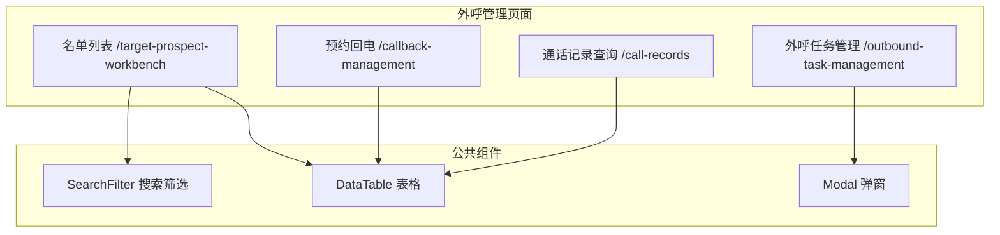
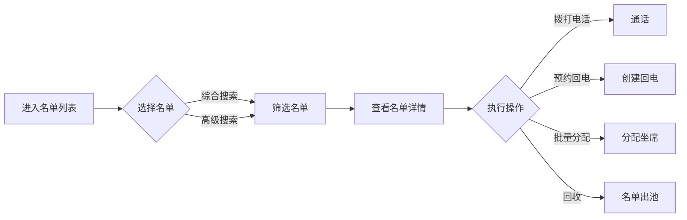

# Feature 说明文档 - 外呼管理

> **版本**: v1.0
> **日期**: 2026-04-29
> **作者**: Tony Stark
> **状态**: TODO

---

## 1. Feature 基本信息

| 字段 | 内容 |
|:---|:---|
| Feature ID | FEAT-MKT-人工电销-外呼管理 |
| Feature 名称 | 外呼管理 |
| 所属 EPIC | EPIC-人工电销工作台 |
| 所属产品域 | PD-MKT 数字营销 |
| 负责人 | Tony Stark |
| FP数量 | 15 |

---

## 2. Feature 概述

### 2.1 是什么
外呼管理模块是人工电销工作台的核心功能，提供名单搜索、外呼任务管理、预约回电、通话记录查询等功能，支持手拨和预测式外呼两种模式。

### 2.2 解决什么问题
- 名单筛选效率低，无法快速定位目标客户
- 外呼任务管理分散，缺乏统一视图
- 回电预约管理混乱，容易遗漏
- 通话记录查询不便，无法快速回溯

### 2.3 用户场景

| 场景 | 用户 | 描述 |
|:---|:---|:---|
| 名单筛选 | 坐席 | 根据多条件筛选目标名单进行外呼 |
| 任务管理 | 主管 | 创建、启动、暂停外呼任务 |
| 回电处理 | 坐席 | 管理预约回电，按时联系客户 |
| 记录查询 | 主管/坐席 | 查询历史通话记录和录音 |

---

## 3. 系统模块图

### 3.1 页面说明

| 页面 | 路由 | 组件 | 说明 |
|:---|:---|:---|:---|
| 名单列表 | /target-prospect-workbench | TargetProspectWorkbenchPage | 默认首页，名单搜索和管理 |
| 预约回电 | /callback-management | CallbackManagementPage | 回电任务管理 |
| 外呼任务管理 | /outbound-task-management | OutboundTaskManagementPage | 外呼任务CRUD |
| 通话记录查询 | /call-records | CallRecordQueryPage | 历史通话记录 |

---

## 4. 功能说明

### 4.1 功能清单

| 功能点 | 类型 | 描述 |
|:---|:---|:---|
| FP-001 综合搜索 | 页面 | 名单列表，支持客户编号模糊搜索、手机尾号搜索、客户姓名搜索 |
| FP-002 高级搜索 | 页面 | 多条件组合筛选：分配时间、名单名称、联系时间、团队、坐席组、额度区间、备注等 |
| FP-003 名单表格展示 | 页面 | 展示客户编号、姓名、手机、状态、标签等；双击跳转详情 |
| FP-004 批量选择 | 页面 | 全选当前页、取消全选、清空选择 |
| FP-005 一键回收 | 页面 | 批量回收选中的名单，支持同步出池选项 |
| FP-006 一键分配 | 页面 | 批量分配名单到目标坐席 |
| FP-007 预测式外呼 | 页面 | 触发预测式外呼弹窗，显示客户信息，显示跟进状态 |
| FP-008 回电预约 | 页面 | 客户号精确查询、手机尾号查询、跟进状态筛选；创建、取消回电 |
| FP-009 回电查询 | 页面 | 按任务名称、日期范围筛选；查看回电状态 |
| FP-010 任务创建 | 页面 | 新建外呼任务：基本信息、坐席组选择、分配策略、执行时间 |
| FP-011 任务筛选 | 页面 | 按任务名称/ID、状态、创建时间筛选 |
| FP-012 任务启停 | 页面 | 启动、暂停、停止外呼任务 |
| FP-013 任务编辑 | 页面 | 编辑任务配置，**限制**：开始时间不能晚于原开始时间，结束时间不能早于原结束时间 |
| FP-014 通话记录查询 | 页面 | 按时间、客户、坐席、通话结果筛选；展示通话ID、时长、时间、结果 |
| FP-015 通话录音播放 | 页面 | 在线播放通话录音；支持Excel导出 |

### 4.2 用户流程

---

## 5. 验收标准

| 验收项 | 标准 |
|:---|:---|
| 功能验收 | 综合搜索支持客户编号/手机尾号/姓名三个维度模糊搜索 |
| 功能验收 | 高级搜索支持8+个筛选条件组合 |
| 功能验收 | 名单表格展示15+个字段，支持排序 |
| 功能验收 | 批量操作（选择/回收/分配）成功率≥99% |
| 功能验收 | 预测式外呼弹窗正确显示客户信息 |
| 功能验收 | 回电预约支持创建、取消、状态跟踪 |
| 功能验收 | 任务启停操作在5s内生效 |
| 功能验收 | 任务编辑时间限制校验正确 |
| 功能验收 | 通话记录支持按时间/客户/坐席/结果筛选 |
| 功能验收 | 录音播放支持拖动定位 |
| 交互验收 | 列表分页支持10/20/50/100条 |
| 性能验收 | 列表加载时间≤2s |
| 数据验收 | 名单列表/回电/通话记录每页最大100条，分页支持10/20/50/100 |
| 数据验收 | 名单搜索返回时间≤2s（单次查询最多返回10000条） |
| 数据验收 | 批量操作单次上限100条；一键回收/一键分配 |
| 数据验收 | 通话记录Excel导出单次上限10000条 |
| 数据验收 | 外呼任务最大并发数根据后端配置，默认不超过500 |
| 数据验收 | 名单表格展示字段15+个，单条记录数据量≤5KB |
| 数据验收 | 录音文件单条大小≤50MB，支持MP3/WAV格式 |

---

## 6. 依赖关系

| 依赖项 | 类型 | 说明 |
|:---|:---|:---|
| 客户数据接口 | 接口 | 获取客户基础信息和名单数据 |
| 外呼服务 | 接口 | 发起外呼、获取通话状态 |
| 预测式外呼服务 | 接口 | 触发预测式外呼 |
| 通话记录服务 | 接口 | 查询通话记录和录音 |
| 坐席服务 | 接口 | 获取坐席列表和状态 |

---

## 7. 变更记录

| 日期 | 版本 | 变更内容 | 作者 |
|:---|:---:|:---|:---|
| 2026-04-29 | v1.0 | 初始版本 | Tony Stark |

---

🦾 *Feature 说明文档 v1.0 - 外呼管理*
