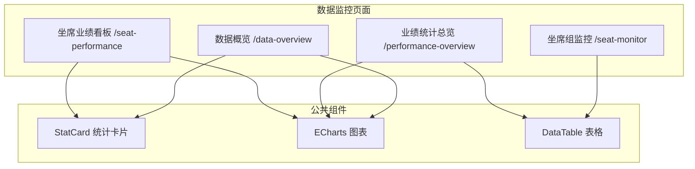
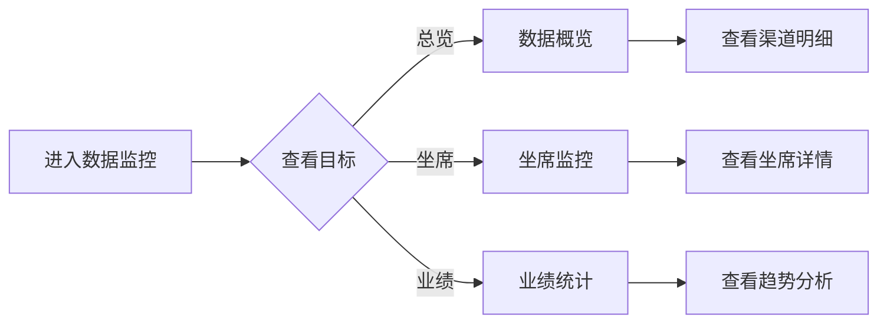

# Feature 说明文档 - 数据监控

> **版本**: v1.0
> **日期**: 2026-04-29
> **作者**: Tony Stark
> **状态**: TODO

---

## 1. Feature 基本信息

| 字段 | 内容 |
|:---|:---|
| Feature ID | FEAT-MKT-人工电销-数据监控 |
| Feature 名称 | 数据监控 |
| 所属 EPIC | EPIC-人工电销工作台 |
| 所属产品域 | PD-MKT 数字营销 |
| 负责人 | Tony Stark |
| FP数量 | 6 |

---

## 2. Feature 概述

### 2.1 是什么
数据监控模块提供电销业务的实时数据监控和分析功能，包括核心业务指标展示、坐席状态监控、业绩统计和个人业绩看板。

### 2.2 解决什么问题
- 缺乏实时业务数据视图
- 坐席工作状态无法实时掌握
- 业绩统计分散，难以统一分析
- 个人业绩缺乏可视化展示

### 2.3 用户场景

| 场景 | 用户 | 描述 |
|:---|:---|:---|
| 数据概览 | 主管 | 查看今日外呼总量、有效通话量、平均通话时长 |
| 渠道分析 | 主管 | 查看各渠道效果分布和转化情况 |
| 坐席监控 | 主管 | 实时监控坐席状态和通话情况 |
| 业绩统计 | 主管/管理员 | 查看团队/小组/个人业绩排名和趋势 |

---

## 3. 系统模块图

### 3.1 页面说明

| 页面 | 路由 | 组件 | 说明 |
|:---|:---|:---|:---|
| 数据概览 | /data-overview | DataOverviewPage | 核心指标卡片、渠道分析图、明细数据表 |
| 坐席组监控 | /seat-monitor | SeatMonitorPage | 实时坐席状态、坐席组概览 |
| 业绩统计总览 | /performance-overview | PerformanceOverviewPage | 业绩排名、趋势图 |
| 坐席业绩看板 | /seat-performance | SeatPerformancePage | 个人业绩展示、对比分析 |

---

## 4. 功能说明

### 4.1 功能清单

| 功能点 | 类型 | 描述 |
|:---|:---|:---|
| FP-001 数据概览 | 页面 | 顶部统计卡片：今日外呼总量、有效通话量、平均通话时长；渠道分析饼图 |
| FP-002 渠道分析 | 页面 | ECharts饼图展示渠道效果分布；交互式图表 |
| FP-003 明细数据 | 页面 | 渠道名称、接通率（可排序）、转化率（可排序）、平均通话时长；分页展示 |
| FP-004 坐席监控 | 页面 | 坐席状态实时更新、通话状态监控、排队情况监控；坐席组列表（在线/通话中/空闲坐席数） |
| FP-005 业绩统计 | 页面 | 今日/本周/本月业绩汇总；坐席/团队/小组排名；日/周/月趋势图 |
| FP-006 业绩看板 | 页面 | 个人业绩（接通量、通话时长、转化率、满意度）；与团队平均/历史数据对比；每日业绩明细 |

### 4.2 用户流程

---

## 5. 验收标准

| 验收项 | 标准 |
|:---|:---|
| 功能验收 | 顶部统计卡片正确展示今日外呼/有效通话/平均时长 |
| 功能验收 | 渠道分析饼图正确显示各渠道占比 |
| 功能验收 | 接通率/转化率支持升序/降序排列 |
| 功能验收 | 坐席状态实时更新，刷新间隔≤5s |
| 功能验收 | 业绩排名支持坐席/团队/小组维度 |
| 功能验收 | 趋势图支持日/周/月切换 |
| 功能验收 | 个人业绩看板正确计算各项指标 |
| 交互验收 | 图表支持交互：悬停显示详情 |
| 性能验收 | 数据加载时间≤3s |
| 数据验收 | 坐席状态实时刷新间隔≤5s（轮询方式） |
| 数据验收 | 业绩统计数据支持日/周/月维度，默认展示当月数据 |
| 数据验收 | 业绩排名单次最多展示前100名 |
| 数据验收 | 明细数据表格每页最大100条，支持10/20/50/100分页 |
| 数据验收 | ECharts图表异步加载，单图表数据点≤500个 |
| 数据验收 | 统计卡片数据按天聚合，日报表数据保留12个月 |

---

## 6. 依赖关系

| 依赖项 | 类型 | 说明 |
|:---|:---|:---|
| 通话记录数据 | 数据 | 通话时长、接通量统计 |
| 坐席状态服务 | 接口 | 实时坐席状态 |
| 业绩统计服务 | 接口 | 业绩数据汇总 |

---

## 7. 变更记录

| 日期 | 版本 | 变更内容 | 作者 |
|:---|:---:|:---|:---|
| 2026-04-29 | v1.0 | 初始版本 | Tony Stark |

---

🦾 *Feature 说明文档 v1.0 - 数据监控*
