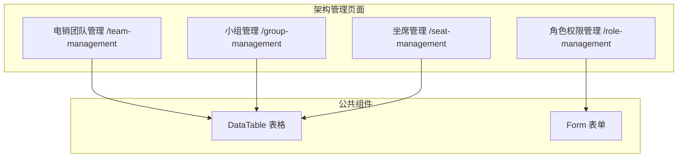

# Feature 说明文档 - 架构管理

> **版本**: v1.0
> **日期**: 2026-04-29
> **作者**: Tony Stark
> **状态**: TODO

---

## 1. Feature 基本信息

| 字段 | 内容 |
|:---|:---|
| Feature ID | FEAT-MKT-人工电销-架构管理 |
| Feature 名称 | 架构管理 |
| 所属 EPIC | EPIC-人工电销工作台 |
| 所属产品域 | PD-MKT 数字营销 |
| 负责人 | Tony Stark |
| FP数量 | 7 |

---

## 2. Feature 概述

### 2.1 是什么
架构管理模块管理电销团队的组织架构，包括团队创建和管理、小组划分、坐席账号管理、角色权限配置等功能。

### 2.2 解决什么问题
- 团队和坐席信息分散，缺乏统一管理
- 坐席状态无法实时监控
- 权限控制粒度粗，缺乏精细化配置

### 2.3 用户场景

| 场景 | 用户 | 描述 |
|:---|:---|:---|
| 团队管理 | 主管 | 创建团队、分配负责人、添加坐席 |
| 小组管理 | 主管 | 创建小组、分配坐席、配置技能组 |
| 坐席管理 | 管理员 | 开通账号、配置权限、监控状态 |
| 角色配置 | 管理员 | 定义角色、分配权限 |

---

## 3. 系统模块图

### 3.1 页面说明

| 页面 | 路由 | 组件 | 说明 |
|:---|:---|:---|:---|
| 电销团队管理 | /team-management | TeamManagementPage | 团队CRUD、添加坐席 |
| 小组管理 | /group-management | GroupManagementPage | 小组CRUD、坐席分配 |
| 坐席管理 | /seat-management | SeatManagementPage | 坐席账号和状态管理 |
| 角色权限管理 | /role-management | RoleManagementPage | 角色和权限配置 |

---

## 4. 功能说明

### 4.1 功能清单

| 功能点 | 类型 | 描述 |
|:---|:---|:---|
| FP-001 团队搜索 | 页面 | 按团队名称模糊搜索 |
| FP-002 团队CRUD | 页面 | 创建、查看、编辑、删除团队；**校验**：团队名称唯一性（2-30字符） |
| FP-003 团队详情 | 页面 | 查看团队详细信息：坐席组数量、账号数、创建日期、负责人 |
| FP-004 添加坐席 | 页面 | 从团队添加坐席：选择坐席组/选择坐席；**删除校验**：检查激活状态、近似外呼记录、未完成任务 |
| FP-005 小组管理 | 页面 | 小组CRUD：所属团队、名称、负责人、关联产品配置 |
| FP-006 坐席管理 | 页面 | 坐席CRUD、状态管理（在线/离线/示闲/示忙/通话中）、权限配置、统计（今日接通量、通话时长、成功率） |
| FP-007 角色管理 | 页面 | 角色CRUD、**权限配置**：功能权限、数据权限、页面权限、操作权限；用户角色绑定、批量分配 |

### 4.2 用户流程

---

## 5. 验收标准

| 验收项 | 标准 |
|:---|:---|
| 功能验收 | 团队名称唯一性校验：最少2字符，最多30字符 |
| 功能验收 | 团队删除前检查：激活状态坐席、近似外呼记录、未完成任务 |
| 功能验收 | 坐席状态实时更新（在线/离线/示闲/示忙/通话中） |
| 功能验收 | 角色权限配置支持功能/数据/页面/操作四级 |
| 交互验收 | 团队列表展示坐席组数量、账号数 |
| 性能验收 | 坐席状态刷新间隔≤5s |
| 数据验收 | 团队名称：2-30字符，支持中英文数字下划线 |
| 数据验收 | 团队备注字段最大200字符 |
| 数据验收 | 单个团队下坐席账号数量上限500（超出需分团队） |
| 数据验收 | 单个团队下坐席组数量上限50 |
| 数据验收 | 角色权限配置单次最多保存100条权限记录 |
| 数据验收 | 坐席状态刷新间隔≤5s，单次请求超时≤3s |
| 数据验收 | 用户操作日志保留180天 |

---

## 6. 依赖关系

| 依赖项 | 类型 | 说明 |
|:---|:---|:---|
| 组织架构数据 | 数据 | 团队、小组、坐席表 |
| 权限服务 | 接口 | 角色和权限验证 |
| 外呼记录 | 数据 | 坐席外呼统计 |

---

## 7. 变更记录

| 日期 | 版本 | 变更内容 | 作者 |
|:---|:---:|:---|:---|
| 2026-04-29 | v1.0 | 初始版本 | Tony Stark |

---

🦾 *Feature 说明文档 v1.0 - 架构管理*
