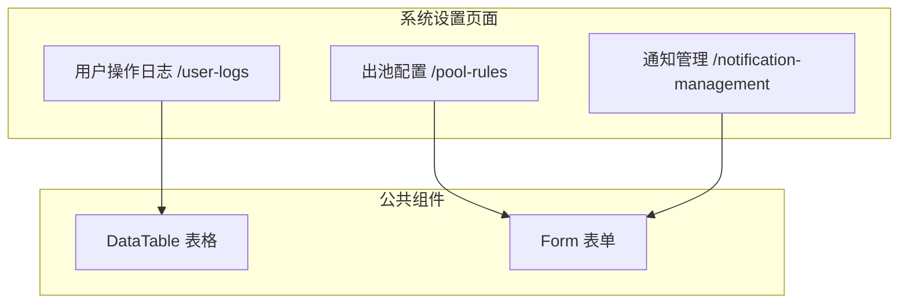
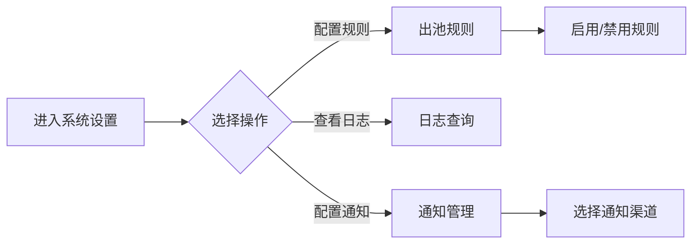

# Feature 说明文档 - 系统设置

> **版本**: v1.0
> **日期**: 2026-04-29
> **作者**: Tony Stark
> **状态**: TODO

---

## 1. Feature 基本信息

| 字段 | 内容 |
|:---|:---|
| Feature ID | FEAT-MKT-人工电销-系统设置 |
| Feature 名称 | 系统设置 |
| 所属 EPIC | EPIC-人工电销工作台 |
| 所属产品域 | PD-MKT 数字营销 |
| 负责人 | Tony Stark |
| FP数量 | 3 |

---

## 2. Feature 概述

### 2.1 是什么
系统设置模块提供电销工作台的通用配置功能，包括名单出池规则配置、用户操作日志查询、系统通知管理。

### 2.2 解决什么问题
- 名单出池规则缺乏统一配置
- 用户操作行为难以追溯
- 系统通知无法灵活配置

### 2.3 用户场景

| 场景 | 用户 | 描述 |
|:---|:---|:---|
| 出池规则 | 主管 | 配置名单自动/手动出池条件 |
| 日志查询 | 管理员 | 查询用户操作记录 |
| 通知配置 | 管理员 | 配置系统通知规则 |

---

## 3. 系统模块图

### 3.1 页面说明

| 页面 | 路由 | 组件 | 说明 |
|:---|:---|:---|:---|
| 出池配置 | /pool-rules | PoolRulePage | 规则CRUD、类型选择、生效时间 |
| 用户操作日志 | /user-logs | UserLogQueryPage | 日志查询、导出 |
| 通知管理 | /notification-management | NotificationManagementPage | 通知规则配置 |

---

## 4. 功能说明

### 4.1 功能清单

| 功能点 | 类型 | 描述 |
|:---|:---|:---|
| FP-001 出池规则 | 页面 | 规则CRUD（新增/修改/删除）；规则类型：自动出池/手动出池/条件出池；**规则配置**：生效时间设置、适用小组选择、启用/禁用状态；按规则名称/类型搜索 |
| FP-002 日志查询 | 页面 | 按操作用户/操作时间/操作类型/操作对象查询；日志展示：时间/用户/类型/内容/结果/IP；支持按条件导出、自定义时间范围 |
| FP-003 通知管理 | 页面 | 通知规则CRUD；通知类型：系统通知/任务通知/预警通知/自定义通知；通知渠道：站内通知/短信通知/邮件通知；发送记录查询、发送状态跟踪、失败重发机制 |

### 4.2 用户流程

---

## 5. 验收标准

| 验收项 | 标准 |
|:---|:---|
| 功能验收 | 出池规则支持自动/手动/条件三种类型 |
| 功能验收 | 规则生效时间和小组成员配置正确 |
| 功能验收 | 日志查询支持多条件组合筛选 |
| 功能验收 | 日志导出支持自定义字段 |
| 功能验收 | 通知支持站内/短信/邮件三种渠道 |
| 功能验收 | 通知发送失败支持重发 |
| 交互验收 | 规则列表支持按名称/类型筛选 |
| 性能验收 | 日志查询响应时间≤3s |
| 数据验收 | 出池规则名称最大50字符，规则描述最大200字符 |
| 数据验收 | 单个团队最多配置20条出池规则 |
| 数据验收 | 日志查询单次最多返回1000条，支持导出最大10000条 |
| 数据验收 | 日志记录保留180天，超期自动清理 |
| 数据验收 | 通知模板内容最大2000字符 |
| 数据验收 | 通知渠道支持站内/短信/邮件；短信单次≤500字 |
| 数据验收 | 操作日志查询响应时间≤3s（覆盖180天数据量） |

---

## 6. 依赖关系

| 依赖项 | 类型 | 说明 |
|:---|:---|:---|
| 操作日志服务 | 接口 | 用户操作记录 |
| 消息通知服务 | 接口 | 发送通知 |

---

## 7. 变更记录

| 日期 | 版本 | 变更内容 | 作者 |
|:---|:---:|:---|:---|
| 2026-04-29 | v1.0 | 初始版本 | Tony Stark |

---

🦾 *Feature 说明文档 v1.0 - 系统设置*
