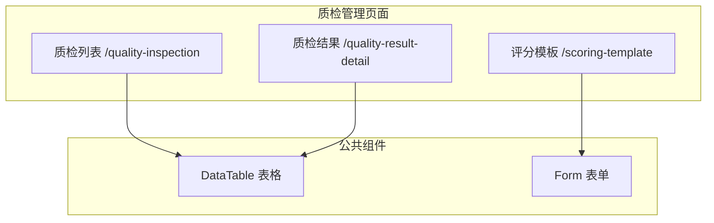
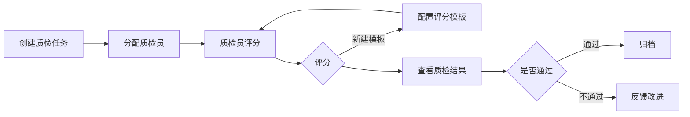

# Feature 说明文档 - 质检管理

> **版本**: v1.0
> **日期**: 2026-04-29
> **作者**: Tony Stark
> **状态**: TODO

---

## 1. Feature 基本信息

| 字段 | 内容 |
|:---|:---|
| Feature ID | FEAT-MKT-人工电销-质检管理 |
| Feature 名称 | 质检管理 |
| 所属 EPIC | EPIC-人工电销工作台 |
| 所属产品域 | PD-MKT 数字营销 |
| 负责人 | Tony Stark |
| FP数量 | 3 |

---

## 2. Feature 概述

### 2.1 是什么
质检管理模块提供电销通话的质检功能，包括质检任务管理、评分模板配置、质检结果查看。

### 2.2 解决什么问题
- 通话质量缺乏系统化评估
- 评分标准不统一
- 质检结果难以追溯和分析

### 2.3 用户场景

| 场景 | 用户 | 描述 |
|:---|:---|:---|
| 质检任务 | 质检员 | 创建质检任务、分配质检员、设置范围 |
| 评分操作 | 质检员 | 播放录音、评分、添加备注、标记问题 |
| 模板管理 | 管理员 | 配置评分模板、管理评分项和权重 |

---

## 3. 系统模块图

### 3.1 页面说明

| 页面 | 路由 | 组件 | 说明 |
|:---|:---|:---|:---|
| 质检列表 | /quality-inspection | QualityInspectionPage | 质检任务管理、分配、评分 |
| 评分模板 | /scoring-template | ScoringTemplatePage | 模板CRUD、评分项配置 |
| 质检结果 | /quality-result-detail/:id | QualityResultDetailPage | 质检评分详情查看 |

---

## 4. 功能说明

### 4.1 功能清单

| 功能点 | 类型 | 描述 |
|:---|:---|:---|
| FP-001 质检列表 | 页面 | 创建质检任务、分配质检员、设置范围；录音播放、评分操作、备注添加、问题标记；状态跟踪（待质检/质检中/已完成/已复核） |
| FP-002 评分模板 | 页面 | 模板CRUD（创建/编辑/复制/删除）；**评分项配置**：添加评分项、设置分值权重、配置评分标准、设置扣分规则；按业务类型/质检类型分类 |
| FP-003 质检结果 | 页面 | 录音播放、通话记录展示、客户信息展示；各项评分展示、总分计算、扣分原因说明；质检员备注、复核意见、改进建议 |

### 4.2 用户流程

---

## 5. 验收标准

| 验收项 | 标准 |
|:---|:---|
| 功能验收 | 质检任务支持创建、分配、范围设置 |
| 功能验收 | 录音播放支持拖动定位 |
| 功能验收 | 评分支持多评分项，权重可配置 |
| 功能验收 | 质检状态正确流转：待质检→质检中→已完成→已复核 |
| 功能验收 | 模板支持创建/编辑/复制/删除 |
| 功能验收 | 评分项支持权重配置和扣分规则 |
| 交互验收 | 模板支持按类型分类 |
| 性能验收 | 录音加载时间≤2s |
| 数据验收 | 录音文件单条大小≤50MB，支持MP3/WAV格式 |
| 数据验收 | 质检列表每页最大100条，支持10/20/50/100分页 |
| 数据验收 | 单个评分模板最多包含50个评分项 |
| 数据验收 | 评分权重总和必须等于100%，系统自动校验 |
| 数据验收 | 质检录音加载时间≤2s（网络正常条件） |
| 数据验收 | 质检结果备注最大500字符 |
| 数据验收 | 质检任务分配记录保留180天 |

---

## 6. 依赖关系

| 依赖项 | 类型 | 说明 |
|:---|:---|:---|
| 通话记录服务 | 接口 | 获取通话录音 |
| 质检评分服务 | 接口 | 评分计算和存储 |

---

## 7. 变更记录

| 日期 | 版本 | 变更内容 | 作者 |
|:---|:---:|:---|:---|
| 2026-04-29 | v1.0 | 初始版本 | Tony Stark |

---

🦾 *Feature 说明文档 v1.0 - 质检管理*
