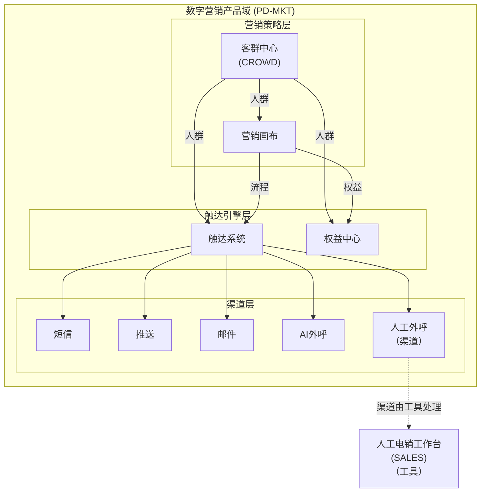

# EPIC-MKT-CROWD - 客群中心

> **版本**: v1.5 | **日期**: 2026-04-27 | **作者**: Tony Stark | **状态**: 已上线

---

## 元信息

| 项目 | 内容 |
|:---|:---|
| EPIC ID | EPIC-MKT-CROWD |
| EPIC 名称 | 客群中心 |
| 所属产品域 | PD-MKT 数字营销 |
| 优先级 | P0 |
| 状态 | 已上线 |
| Feature数 | 5 |
| 路由前缀 | `/exploration/customer-center/*`（目标：`/marketing/customer-center/*`）|

---

## 概述

客群中心是数字营销产品域的**营销策略层**核心模块，提供人群管理、标签管理、事件管理能力，支持精准的用户分群和画像分析。

> ⚠️ **整改说明**：当前客群中心位于数据探索（/exploration），目标迁移至数字营销（/marketing）

---

## 在产品架构中的位置



---

## Feature 清单

| # | Feature ID | Feature 名称 | 优先级 | 状态 |
|:---:|:---|:---|:---:|:---:|
| 1 | FEAT-MKT-CRD-SYSTEM | 系统管理 | P0 | 已上线 |
| 2 | FEAT-MKT-CRD-LIST | 人群管理 | P0 | 已上线 |
| 3 | FEAT-MKT-CRD-EVENT | 事件中心 | P0 | 已上线 |
| 4 | FEAT-MKT-CRD-TAG | 标签系统 | P0 | 已上线 |
| 5 | FEAT-MKT-CRD-IDMAPPING | ID映射 | P2 | 已上线 |

---

## 菜单结构与功能映射

> ⚠️ **层级说明**：一级菜单（顶部）→ 二级菜单（模块）→ 三级菜单（功能）→ 内嵌功能（页面操作）

### 一、顶部导航栏（全角色可见）

**入口**：数字营销 → 客群中心（整改后）/ 当前：数据探索 → 客群中心

| 序号 | 菜单名称 | 功能说明 | 权限说明 |
|:---:|:---|:---|:---|
| 1 | 客群管理 | 人群圈选与管理 | 全角色 |
| 2 | 标签系统 | 标签定义与管理 | 管理员/全角色 |
| 3 | 事件中心 | 事件管理 | 全角色 |
| 4 | 系统管理 | 数据源配置 | 管理员 |
| 5 | ID映射 | 用户ID关联关系 | 全角色 |

---

### 二、左侧菜单栏

#### （一）客群管理

| 二级菜单 | 三级菜单（功能） | 内嵌功能 | 功能说明 | 权限 |
|:---|:---|:---|:---|:---|
| **客群管理** | 人群管理 | 新建/编辑/审批/删除/详情 | 人群列表与圈选管理 | 全角色 |

#### （二）标签系统

| 二级菜单 | 三级菜单（功能） | 内嵌功能 | 功能说明 | 权限 |
|:---|:---|:---|:---|:---|
| **标签系统** | 标签体系首页 | - | 标签概览与统计卡片 | 全角色 |
| | 标签管理 | 新建/编辑/详情/删除 | 标签列表管理 | 全角色 |
| | 标签表管理 | 新建/编辑/详情 | 标签表配置与管理 | 管理员 |
| | 属性管理 | 新建/编辑/删除 | 标签属性配置 | 管理员 |
| | 标签表注册 | 新建/查看 | 新增标签表（表单注册） | 管理员 |

#### （三）事件中心

| 二级菜单 | 三级菜单（功能） | 内嵌功能 | 功能说明 | 权限 |
|:---|:---|:---|:---|:---|
| **事件中心** | 事件中心首页 | - | 事件概览与统计 | 全角色 |
| | 事件管理 | 新建/编辑/测试/删除/详情 | 事件列表管理 | 全角色 |
| | 事件样本统计 | 查看/查询 | 特定事件原始报文查询 | 全角色 |
| | 虚拟事件 | 新建/编辑/详情/测试/删除 | 虚拟事件列表管理 | 全角色 |
| | 样本统计 | - | 全局样本趋势分析 | 全角色 |

#### （四）系统管理

| 二级菜单 | 三级菜单（功能） | 内嵌功能 | 功能说明 | 权限 |
|:---|:---|:---|:---|:---|
| **系统管理** | 数据源管理 | 新建/编辑/删除 | 数据源配置与管理 | 管理员 |
| | Kafka数据源 | 新建/编辑/测试/删除 | Kafka数据源注册与配置 | 管理员 |

#### （五）ID映射

| 二级菜单 | 三级菜单（功能） | 内嵌功能 | 功能说明 | 权限 |
|:---|:---|:---|:---|:---|
| **ID映射** | ID映射 | 查看/导出 | 用户ID关联关系 | 全角色 |

---

### 三、路由映射

| 菜单路径 | 路由（当前） | 路由（目标）| 说明 |
|:---|:---|:---|:---|
| 客群管理/人群管理 | /exploration/customer-center/audience-system | /marketing/customer-center/audience-system | 人群列表 |
| 客群管理/删除审批 | /exploration/customer-center/delete-approval | /marketing/customer-center/delete-approval | 删除审批 |
| 标签系统/标签管理 | /exploration/customer-center/tag-system/tag-management | /marketing/customer-center/tag-system/tag-management | 标签管理 |
| 标签系统/标签表管理 | /exploration/customer-center/tag-system/table-management | /marketing/customer-center/tag-system/table-management | 标签表 |
| 事件中心/事件管理 | /exploration/customer-center/event-center/event-management | /marketing/customer-center/event-center/event-management | 事件管理 |
| ID映射 | /exploration/customer-center/idmap | /marketing/customer-center/idmap | ID映射 |

---

### 四、权限说明

| 角色 | 可访问菜单 |
|:---|:---|
| 管理员 | 全部菜单（含标签表管理、属性管理、系统管理）|
| 运营专员 | 客群管理、标签管理、事件中心（只读）、ID映射 |
| 数据分析师 | 客群管理、事件中心、ID映射 |
| 访客 | 客群管理（只读）|

---

## 目录结构

```
客群中心/
├── README.md                        ← 本文档
├── 产品PRD/
├── 业务需求入口/
├── 产品操作手册/
├── 需求拆解结果/Feature/
└── 技术方案/Feature/
```

---

## 相关资源

- [数字营销产品域总索引](../README.md)
- [客群中心PRD](./产品PRD/PRD-客群中心v1.0.md)
- [技术方案](./技术方案/)

---

## 更新日志

| 日期 | 版本 | 变更内容 | 更新人 |
|:---|:---:|:---|:---|
| 2026-04-27 | v1.4 | 参照钟离模板重写菜单结构说明 | Tony Stark |
| 2026-04-27 | v1.5 | 对齐钟离理想整改菜单：更新标签系统/事件中心层级，新增标签表注册/属性管理/Kafka数据源，补充路由映射（当前/目标）| Tony Stark |

---

*最后更新: 2026-04-27*
