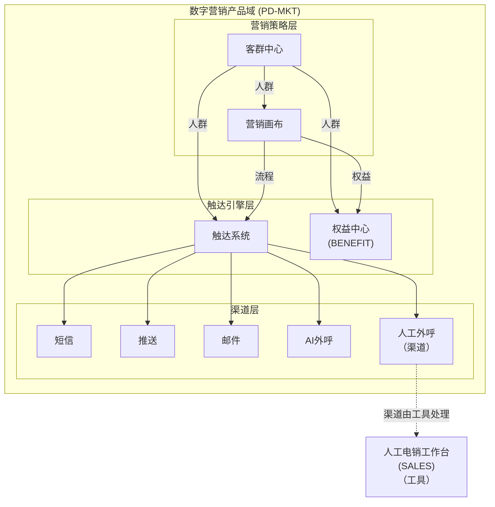

# EPIC-MKT-BENEFIT - 权益中心

> **版本**: v1.6 | **日期**: 2026-04-27 | **作者**: Tony Stark | **状态**: 已上线

---

## 元信息

| 项目 | 内容 |
|:---|:---|
| EPIC ID | EPIC-MKT-BENEFIT |
| EPIC 名称 | 权益中心 |
| 所属产品域 | PD-MKT 数字营销 |
| 优先级 | P1 |
| 状态 | 已上线 |
| Feature数 | 9 |
| 路由前缀 | `/marketing/benefit/*` |

---

## 概述

权益中心是数字营销产品域的**触达引擎层**核心模块，提供优惠券、积分、券包等权益的管理和发放能力，支持多种权益类型的配置和统计。

---

## 在产品架构中的位置



---

## Feature 清单

| # | Feature ID | Feature 名称 | 优先级 | 状态 | 目录 |
|:---:|:---|:---|:---:|:---:|:---|
| 1 | FEAT-MKT-BENEFIT-01 | 权益概览 | P0 | 已上线 | FEAT-MKT-BENEFIT-01 |
| 2 | FEAT-MKT-BENEFIT-02 | 券模板管理 | P0 | 已上线 | FEAT-MKT-BENEFIT-02 |
| 3 | FEAT-MKT-BENEFIT-03 | 权益数据统计看板 | P1 | 已上线 | FEAT-MKT-BENEFIT-03 |
| 4 | FEAT-MKT-BENEFIT-04 | 券库存管理 | P0 | 已上线 | FEAT-MKT-BENEFIT-04 |
| 5 | FEAT-MKT-BENEFIT-05 | 券包管理 | P0 | 已上线 | FEAT-MKT-BENEFIT-05 |
| 6 | FEAT-MKT-BENEFIT-06 | 权益日志 | P1 | 已上线 | FEAT-MKT-BENEFIT-06 |
| 7 | FEAT-MKT-BENEFIT-07 | 库存查询 | P1 | 已上线 | FEAT-MKT-BENEFIT-07 |
| 8 | FEAT-MKT-BENEFIT-08 | 预警管理 | P1 | 已上线 | FEAT-MKT-BENEFIT-08 |
| 9 | FEAT-MKT-BENEFIT-09 | 全局规则 | P1 | 已上线 | FEAT-MKT-BENEFIT-09 |

---

## 菜单结构与功能映射

> ⚠️ **层级说明**：一级菜单（顶部）→ 二级菜单（模块）→ 三级菜单（功能）→ 内嵌功能（页面操作）

### 一、顶部导航栏（全角色可见）

**入口**：数字营销 → 权益中心

| 序号 | 菜单名称 | 功能说明 | 权限说明 |
|:---:|:---|:---|:---|
| 1 | 权益首页 | 权益概览、数据统计看板 | 全角色 |
| 2 | 权益配置 | 券模板/券/券包管理 | 全角色/管理员 |
| 3 | 数据统计 | 权益日志、库存查询 | 全角色/管理员 |
| 4 | 全局管理 | 全局规则、预警管理 | 管理员 |

---

### 二、左侧菜单栏

#### （一）权益首页

| 二级菜单 | 三级菜单（功能） | 内嵌功能 | 功能说明 | 权限 |
|:---|:---|:---|:---|:---|
| **权益首页** | 权益概览 | - | 权益发放数据概览 | 全角色 |
| | 权益统计 | - | 权益数据统计看板 | 全角色 |

#### （二）权益配置

| 二级菜单 | 三级菜单（功能） | 内嵌功能 | 功能说明 | 权限 |
|:---|:---|:---|:---|:---|
| **权益配置** | 券模板管理 | 新建/编辑/详情/删除 | 券模板列表管理 | 全角色 |
| | 券管理 | 发放/核销/详情 | 已发券列表管理 | 全角色 |
| | 券包管理 | 新建/编辑/详情 | 券包配置与管理 | 管理员 |

#### （三）数据统计

| 二级菜单 | 三级菜单（功能） | 内嵌功能 | 功能说明 | 权限 |
|:---|:---|:---|:---|:---|
| **数据统计** | 权益日志 | 查看/导出 | 操作日志查询 | 全角色 |
| | 库存查询 | 批量创建/审批/历史查看 | 券库存查询管理 | 全角色 |

#### （四）全局管理

| 二级菜单 | 三级菜单（功能） | 内嵌功能 | 功能说明 | 权限 |
|:---|:---|:---|:---|:---|
| **全局管理** | 全局规则 | 新建/编辑/删除 | 全局业务规则配置 | 管理员 |
| | 预警管理 | 新建/编辑/查看历史 | 预警规则与历史管理 | 全角色 |

---

### 三、路由映射

| 菜单路径 | 路由 | 说明 |
|:---|:---|:---|
| 权益首页 | `/marketing/benefit/dashboard` | 权益概览 |
| 权益首页/权益统计 | `/marketing/benefit/stats` | 权益统计看板 |
| 权益配置/券模板管理 | `/marketing/benefit/template` | 券模板 |
| 权益配置/券管理 | `/marketing/benefit/management` | 券列表 |
| 权益配置/券包管理 | `/marketing/benefit/package` | 券包 |
| 数据统计/权益日志 | `/marketing/statistics/logs` | 日志 |
| 数据统计/库存查询 | `/marketing/statistics/inventory` | 库存 |
| 全局管理/全局规则 | `/marketing/global/rules` | 全局规则 |
| 全局管理/预警管理 | `/marketing/global/alert` | 预警管理 |

---

### 四、权限说明

| 角色 | 可访问菜单 |
|:---|:---|
| 管理员 | 全部菜单（含权益配置（全部）、全局管理（全部））|
| 运营专员 | 权益首页、数据统计（只读）、权益配置（券模板列表/券管理）|
| 数据分析师 | 权益首页、权益统计 |
| 访客 | 权益首页（只读）|

---

## 目录结构

```
权益中心/
├── README.md                        ← 本文档
├── 产品PRD/
├── 业务需求入口/
├── 产品操作手册/
├── 需求拆解结果/Feature/
└── 技术方案/Feature/
```

---

## 更新日志

| 日期 | 版本 | 变更内容 | 更新人 |
|:---|:---:|:---|:---|
| 2026-04-27 | v1.4 | 参照钟离模板重写菜单结构说明 | Tony Stark |
| 2026-04-27 | v1.6 | 重建Feature清单：删除哈希格式旧数据，补全FEAT-MKT-BENEFIT-09，名称全部对齐实际目录 | Tony Stark |
| 2026-04-27 | v1.5 | 对齐钟离理想整改菜单：路由前缀改为/marketing/benefit，权益统计→数据统计，全局规则→全局管理，新增权益日志/库存查询/预警管理功能 | Tony Stark |

---

*最后更新: 2026-04-27*
