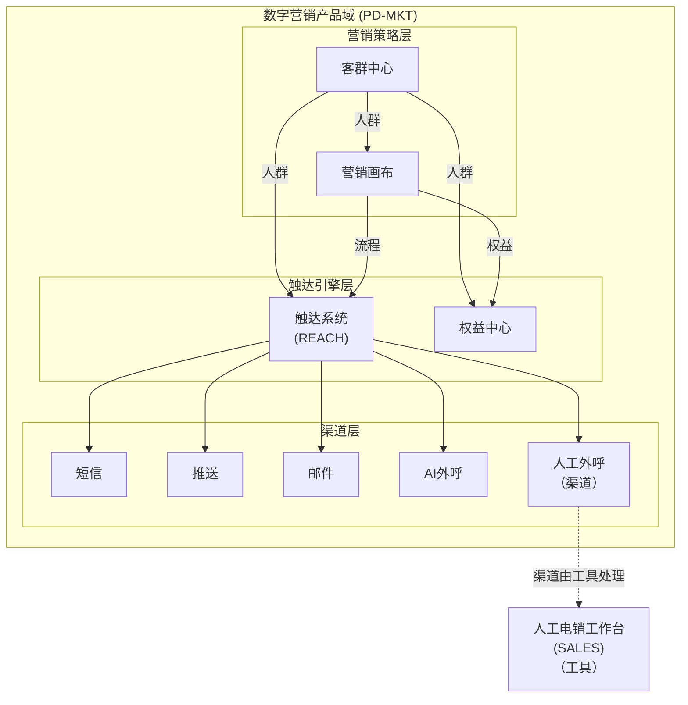

# EPIC-MKT-REACH - 触达系统

> **版本**: v2.5 | **日期**: 2026-04-27 | **作者**: Tony Stark | **状态**: 已上线

---

## 元信息

| 项目 | 内容 |
|:---|:---|
| EPIC ID | EPIC-MKT-REACH |
| EPIC 名称 | 触达系统 |
| 所属产品域 | PD-MKT 数字营销 |
| 优先级 | P0 |
| 状态 | 已上线 |
| Feature数 | 6 |
| 路由前缀 | `/touch/*` |

---

## 概述

触达系统是数字营销产品域的**触达引擎层**核心模块，提供多渠道触达能力，支持短信、推送、邮件、AI外呼等渠道的统一管理和发送。

---

## 在产品架构中的位置



---

## Feature 清单

| # | Feature ID | Feature 名称 | 优先级 | 状态 |
|:---:|:---|:---|:---:|:---:|
| 1 | FEAT-MKT-REACH-INDEX | 触达首页 | P0 | 已上线 |
| 2 | FEAT-MKT-REACH-SYSTEM | 系统配置 | P0 | 已上线 |
| 3 | FEAT-MKT-REACH-POLICY | 策略管理 | P0 | 已上线 |
| 4 | FEAT-MKT-REACH-QUERY | 触达查询 | P1 | 已上线 |
| 5 | FEAT-MKT-REACH-CHANNEL | 渠道管理 | P1 | 已上线 |
| 6 | FEAT-MKT-REACH-MANUAL | 手工短信 | P2 | 已上线 |

---

## 菜单结构与功能映射

> ⚠️ **层级说明**：一级菜单（顶部）→ 二级菜单（模块）→ 三级菜单（功能）→ 内嵌功能（页面操作）

### 一、顶部导航栏（全角色可见）

**入口**：数字营销 → 触达管理

| 序号 | 菜单名称 | 功能说明 | 权限说明 |
|:---:|:---|:---|:---|
| 1 | 触达首页 | 系统概览、核心指标 | 全角色 |
| 2 | 策略管理 | 策略模板、数据概览 | 全角色 |
| 3 | 渠道管理 | 短信/AI外呼/人工外呼配置 | 全角色/管理员 |
| 4 | 触达查询 | 触达总览、明细、记录查询 | 全角色 |
| 5 | 系统配置 | 系统概览、字典管理 | 管理员 |
| 6 | 手工短信 | 新建手工短信、历史记录 | 全角色 |

---

### 二、左侧菜单栏

#### （一）触达首页

| 二级菜单 | 三级菜单（功能） | 内嵌功能 | 功能说明 | 权限 |
|:---|:---|:---|:---|:---|
| **触达首页** | 触达概览 | - | 系统概览与核心指标 | 全角色 |

#### （二）策略管理

| 二级菜单 | 三级菜单（功能） | 内嵌功能 | 功能说明 | 权限 |
|:---|:---|:---|:---|:---|
| **策略管理** | 策略模板 | 新建/编辑/删除/详情/测试 | 策略模板列表管理 | 全角色 |
| | 数据概览 | - | 策略数据概览 | 全角色 |

#### （三）渠道管理

| 二级菜单 | 三级菜单（功能） | 内嵌功能 | 功能说明 | 权限 |
|:---|:---|:---|:---|:---|
| **渠道管理** | 渠道首页 | - | 渠道总览与管理 | 全角色 |
| | 短信渠道 | 新建/编辑/删除/签名管理 | 短信模板与签名管理 | 全角色 |
| | AI外呼 | 新建/编辑/删除/详情 | AI话术模板管理 | 全角色 |
| | 人工外呼 | 新建/编辑/删除/详情 | 人工话术模板管理 | 全角色 |
| | 渠道黑名单 | 新增/删除/导入/导出 | 黑名单管理 | 管理员 |
| | 渠道预警 | 新建/编辑/删除/详情 | 预警管理 | 全角色 |
| | 全局频控 | 新建/编辑/删除 | 频控配置 | 管理员 |
| | 供应商管理 | 新建/编辑/删除/详情 | AI/短信供应商管理 | 管理员 |

#### （四）触达查询

| 二级菜单 | 三级菜单（功能） | 内嵌功能 | 功能说明 | 权限 |
|:---|:---|:---|:---|:---|
| **触达查询** | 触达总览 | - | 查询概览与统计 | 全角色 |
| | 触达明细 | 查看/导出 | 触达任务明细记录 | 全角色 |
| | 短信记录 | 查看/导出 | 短信发送记录查询 | 全角色 |
| | AI外呼记录 | 查看/导出 | AI外呼明细查询 | 全角色 |
| | 人工外呼记录 | 查看/导出 | 人工外呼明细查询 | 全角色 |
| | 营销记录 | 查看/导出 | 营销记录查询与列表 | 全角色 |

#### （五）系统配置

| 二级菜单 | 三级菜单（功能） | 内嵌功能 | 功能说明 | 权限 |
|:---|:---|:---|:---|:---|
| **系统配置** | 系统概览 | - | 系统状态监控 | 全角色 |
| | 字典管理 | 新建/编辑/删除 | 触达类型字典配置 | 管理员 |

#### （六）手工短信

| 二级菜单 | 三级菜单（功能） | 内嵌功能 | 功能说明 | 权限 |
|:---|:---|:---|:---|:---|
| **手工短信** | 新建手工短信 | 发送/保存草稿 | 创建手工短信 | 全角色 |
| | 手工短信列表 | 查看/删除/导出 | 手工短信历史记录 | 全角色 |

---

### 三、路由映射

| 菜单路径 | 路由 | 说明 |
|:---|:---|:---|
| 触达首页 | /touch | 触达概览 |
| 策略管理/策略模板 | /touch/policy/template | 策略模板 |
| 策略管理/数据概览 | /touch/policy/overview | 数据概览 |
| 渠道管理/短信渠道 | /touch/channel/sms-template | 短信模板 |
| 渠道管理/AI外呼 | /touch/channel/ai-call-template | AI外呼 |
| 渠道管理/人工外呼 | /touch/channel/manual-call-template | 人工外呼 |
| 渠道管理/渠道黑名单 | /touch/channel/blacklist | 黑名单 |
| 渠道管理/渠道预警 | /touch/channel/alert | 预警 |
| 渠道管理/全局频控 | /touch/channel/rate-limit | 频控 |
| 触达查询/触达总览 | /touch/query | 总览 |
| 触达查询/触达明细 | /touch/query/detail | 触达明细 |
| 触达查询/短信记录 | /touch/query/sms-records | 短信记录 |
| 触达查询/AI外呼记录 | /touch/query/ai-call-records | AI外呼记录 |
| 触达查询/人工外呼记录 | /touch/query/manual-call-records | 人工外呼记录 |
| 触达查询/营销记录 | /touch/query/marketing-records | 营销记录 |
| 系统配置/系统概览 | /touch/system/overview | 系统概览 |
| 系统配置/字典管理 | /touch/system/dictionary | 字典 |
| 手工短信/新建手工短信 | /touch/manual-sms | 新建 |
| 手工短信/手工短信列表 | /touch/manual-sms/list | 列表 |

---

### 四、权限说明

| 角色 | 可访问菜单 |
|:---|:---|
| 管理员 | 全部菜单（含系统配置、渠道黑名单、全局频控、供应商管理）|
| 运营专员 | 触达首页、策略管理、渠道管理（模板使用）、触达查询、手工短信 |
| 访客 | 触达首页（只读）|

---

## 技术架构

### 前端路径

```
/apps/touch/
├── src/
│   ├── pages/
│   │   └── touch/
│   │       ├── index.vue           # 触达首页
│   │       ├── system/             # 系统配置
│   │       ├── policy/             # 策略管理
│   │       ├── query/             # 触达查询
│   │       ├── channel/           # 渠道管理
│   │       └── manual-sms/        # 手工短信
│   ├── router.ts                   # 路由配置
│   └── services/                   # API服务
```

---

## 目录结构

```
触达系统/
├── README.md                        ← 本文档
├── 产品PRD/
├── 业务需求入口/
├── 产品操作手册/
├── 需求拆解结果/Feature/
│   ├── FEAT-MKT-REACH-INDEX/
│   ├── FEAT-MKT-REACH-SYSTEM/
│   ├── FEAT-MKT-REACH-POLICY/
│   ├── FEAT-MKT-REACH-QUERY/
│   └── FEAT-MKT-REACH-CHANNEL/
└── 技术方案/Feature/
```

---

## 相关资源

- [数字营销产品域总索引](../README.md)
- [触达系统PRD](./产品PRD/PRD-触达系统v1.0.md)
- [技术方案](./技术方案/)

---

## 更新日志

| 日期 | 版本 | 变更内容 | 更新人 |
|:---|:---:|:---|:---|
| 2026-04-24 | v2.0 | 基于 Neo4j 交叉核验后重建 | Tony Stark |
| 2026-04-27 | v2.1 | 合并文档，架构图改用mermaid | Tony Stark |
| 2026-04-27 | v2.2 | 增加菜单结构与功能映射表 | Tony Stark |
| 2026-04-27 | v2.3 | 标准化菜单结构说明框架 | Tony Stark |
| 2026-04-27 | v2.4 | 参照钟离模板重写菜单结构说明 | Tony Stark |
| 2026-04-27 | v2.5 | 对齐钟离理想整改菜单：新增系统配置/手工短信，更新路由映射，补充渠道管理子功能（供应商管理/全局频控等）| Tony Stark |

---

*最后更新: 2026-04-27*
*维护者: Tony Stark*
