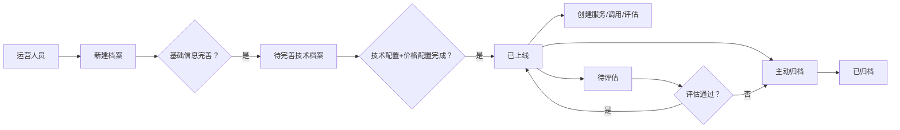

# 业务需求-外数档案管理

> **版本**: v1.0
> **日期**: 2026-05-13
> **作者**: Tony Stark
> **状态**: DONE
> **需求ID**: REQ-20260512-001
> **关联Epic**: EPIC-RISK-EXT-ARCHIVE
> **目标上线**: Q3

---

## 元数据

```yaml
产品域: PD-RISK - 数字风险
Epic: EPIC-RISK-EXT-ARCHIVE - 外数档案管理
Epic URI: Epic:EPIC-RISK-EXT-ARCHIVE
需求版本: 1.0
创建日期: 20260512
审核人: 文博（模拟）
产品经理: Tony Stark
```

---

## 1. 业务背景

### 1.1 业务现状

外部数据（外数）产品在数字风险域中没有统一的档案管理入口，各能力模块分散管理，缺乏统一的外数生命周期管理机制。

### 1.2 业务痛点

| 痛点 | 描述 | 影响 |
|:---|:---|:---|
| 缺乏统一入口 | 各外数能力分散，无统一档案管理 | 运营效率低 |
| 状态流转不清晰 | 档案状态与能力模块无联动 | 生命周期管理混乱 |
| 信息分散 | 基础信息、技术配置、合同信息分散在多个模块 | 查询困难 |

### 1.3 目标用户

| 用户群体 | 角色 | 描述 |
|:---|:---|:---|
| 运营人员 | 档案管理者 | 负责外数档案的创建、配置、上线 |
| 业务人员 | 档案使用者 | 查询档案、使用外数服务 |
| 数据分析师 | 质量评估者 | 对外数质量进行评估 |
| 财务人员 | 费用查看者 | 查看外数调用费用 |

---

## 2. 需求概述

### 2.1 需求目标

建立统一的外数档案管理模块，作为外数生命周期的基础，承载档案信息、配置、状态流转，并与服务、评估、结算等能力模块联动。

### 2.2 核心价值

| 价值维度 | 说明 |
|:---|:---|
| 用户价值 | 统一入口，全生命周期管理，一站式查询 |
| 业务价值 | 规范化外数管理，状态流转自动化 |
| 技术价值 | 建立档案实体模型，支撑上层能力模块 |

### 2.3 成功标准

| 指标 | 目标值 | 衡量方式 |
|:---|:---:|:---|
| 档案列表加载时间 | < 2s | 性能测试 |
| 操作响应时间 | < 1s | 性能测试 |
| 系统可用性 | 99.9% | 月度统计 |
| 支持档案规模 | 1000+ | 容量测试 |

---

## 3. 功能范围

### 3.1 包含的功能

本次需求聚焦**外数档案管理**，核心覆盖：

- 档案列表管理（查询、新建、编辑、导出）
- 档案详情管理（多标签页展示）
- 供应商管理（CRUD、启用/停用）
- 定价档案管理（CRUD，挂在合同下）

### 3.2 不在本次范围内

- 审批流接入（后续根据业务需要补充）
- 外数服务调用（外数服务模块负责）
- 外数效果评估（外数评估模块负责）
- 费用结算（费用结算模块负责）

---

## 4. 功能详情

### 4.1 功能清单

| 功能点 | 类型 | 描述 |
|:---|:---|:---|
| FP-001 | 页面 | 档案列表页（支持状态筛选、供应商筛选、分页） |
| FP-002 | 页面 | 新建档案页（基础信息录入） |
| FP-003 | 页面 | 编辑档案页（信息修改） |
| FP-004 | 页面 | 导出档案功能（CSV/Excel） |
| FP-005 | 页面 | 档案详情页（多标签：产品信息/接口技术/落库信息/调用费用/合同关联/别名/维护日志） |
| FP-006 | 页面 | 供应商列表页 |
| FP-007 | 页面 | 供应商新增/编辑页 |
| FP-008 | 页面 | 供应商启用/停用 |
| FP-009 | 页面 | 定价档案列表页 |
| FP-010 | 页面 | 定价档案新增/编辑页 |

### 4.2 用户流程



### 4.3 用户场景

| 场景 | 用户 | 描述 |
|:---|:---|:---|
| 新建档案并上线 | 运营人员 | 新建档案 → 完善信息 → 配置技术+价格 → 自动上线 |
| 查询档案详情 | 业务人员 | 筛选档案 → 查看详情（多标签） |
| 管理供应商 | 运营人员 | 新增/编辑/启用停用供应商 |
| 配置定价 | 运营人员 | 在供应商下新增/编辑定价档案 |

---

## 5. 验收标准

| 验收项 | 标准 |
|:---|:---|
| 功能验收 | 档案CRUD、状态流转、供应商CRUD、定价CRUD功能完整 |
| 操作验收 | 列表加载<2s，操作响应<1s，表单校验提示清晰 |
| 数据验收 | 档案数据正确存储，状态流转逻辑正确，关联关系准确 |
| 交互验收 | 页面布局规范，标签页切换流畅，错误提示准确 |

---

## 6. 依赖关系

### 6.1 依赖的其他 Epic

| Epic ID | 依赖类型 | 说明 |
|:---|:---|:---|
| EPIC-RISK-SVC（待创建） | 数据依赖 | 外数服务模块，档案上线后创建服务 |
| EPIC-RISK-EVAL（待创建） | 功能依赖 | 外数评估模块，待评估状态联动 |

### 6.2 依赖的外部系统

| 系统 | 依赖类型 | 说明 |
|:---|:---|:---|
| 合同管理 | 数据依赖 | 档案关联合同，读取合同信息 |
| 供应商管理 | 数据依赖 | 档案关联供应商，读取供应商信息 |

---

## 7. 非功能需求

| 类别 | 要求 | 说明 |
|:---|:---:|:---|
| 性能 | 列表查询 < 2s，操作响应 < 1s | 常规操作体验 |
| 并发 | 支持 100+ 同时在线 | 内部运营系统估算 |
| 可用性 | 系统可用性 99.9% | 月级停机 ≤ 8.7h |
| 安全 | 角色权限控制，敏感信息脱敏 | 数据安全 |
| 容量 | 支持 1000+ 档案规模 | 按当前业务估算 |
| 兼容性 | Chrome/Edge 最新2版本 | 内部系统标准 |

---

## 8. 变更记录

| 日期 | 版本 | 变更内容 | 作者 |
|:---|:---:|:---|:---|
| 2026-05-13 | v1.0 | 初始版本，补充9项信息+非功能需求+用户场景 | Tony Stark |

---

🦾 *业务需求文档 - 外数档案管理 v1.0*
