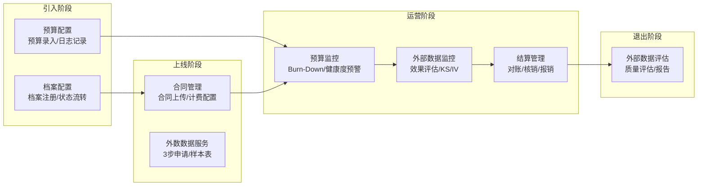

# EPIC说明文档 - 外部数据生命周期管理

> **版本**: v2.0
> **日期**: 2026-04-28
> **作者**: Tony Stark
> **数据来源**: 飞书Wiki原始需求文档(4份)

---

## 1. EPIC基本信息

| 字段 | 内容 |
|:---|:---|
| EPIC ID | EPIC-RISK-EXT |
| EPIC 名称 | 外部数据生命周期管理 |
| 所属产品域 | PD-RISK 数字风险 |
| 负责人 | Tony Stark |
| Feature数 | 9 |

---

## 2. 逻辑架构图（业务流程）

### 2.1 逻辑流程说明

| 阶段 | 功能 | 业务流程 | 说明 |
|:---|:---|:---|:---|
| 引入阶段 | 档案配置 | 新建外数档案 → 录入基础信息 | 生成初始档案 |
| 引入阶段 | 预算配置 | 制定年度预算计划 | 为后续监控奠定基础 |
| 上线阶段 | 合同管理 | 签订采购合同 → 配置计费方式 | 关联生效合同后开放权限 |
| 上线阶段 | 外数数据服务 | 3步申请 → 样本选择 → 参数绑定 → 审批 | 完成外数调用申请 |
| 运营阶段 | 预算监控 | 监控消耗 → Burn-Down图 → 健康度预警 | 实时跟踪预算执行 |
| 运营阶段 | 外部数据监控 | 效果指标 → 综合评分 → 归因分析 | 评估外数性价比 |
| 运营阶段 | 结算管理 | 费用核算 → 外部对账 → 核销 → 报销 | 完成费用结算全流程 |
| 退出阶段 | 外部数据评估 | 质量评估 → 生成报告 → 决策 | 尾部数源退出 |

---

## 3. 功能范围

### 3.1 Feature清单

| # | Feature ID | Feature 名称 | 优先级 | 状态 |
|:---:|:---|:---|:---:|:---:|
| 1 | FEAT-RISK-EXT-LIFECYCLE-OVERVIEW | 外数生命周期总览 | P0 | 已完成 |
| 2 | FEAT-RISK-EXT-ARCHIVE | 档案配置 | P0 | 已完成 |
| 3 | FEAT-RISK-EXT-BUDGET-CONFIG | 预算配置 | P0 | 已完成 |
| 4 | FEAT-RISK-EXT-BUDGET-MONITOR | 预算监控 | P0 | 已完成 |
| 5 | FEAT-RISK-EXT-CONTRACT | 合同管理 | P0 | 已完成 |
| 6 | FEAT-RISK-EXT-SETTLEMENT | 结算管理 | P0 | 已完成 |
| 7 | FEAT-RISK-EXT-SERVICE | 外数数据服务 | P1 | 已完成 |
| 8 | FEAT-RISK-EXT-MONITOR | 外部数据监控 | P1 | 已完成 |
| 9 | FEAT-RISK-EXT-EVALUATION | 外部数据评估 | P2 | 已完成 |

### 3.2 包含的功能

| 功能模块 | 功能描述 |
|:---|:---|
| 生命周期总览 | 统一入口，展示KPI/状态统计/待办/快捷入口 |
| 档案配置 | 外数档案的创建/编辑/状态流转管理 |
| 预算配置 | 预算数据录入/日志记录/权限控制 |
| 预算监控 | Burn-Down图/健康度预警/归因分析 |
| 合同管理 | 合同上传/计费配置(固定/阶梯/特殊)/状态管理 |
| 结算管理 | 费用核算/外部对账/核销/报销全流程 |
| 外数数据服务 | 3步服务申请流程/样本表管理/审批执行 |
| 外部数据监控 | 效果监控/KS/IV/PSI/综合评分 |
| 外部数据评估 | 质量评估/报告生成/退出决策 |

### 3.3 不包含的功能

- 外数评估模块（后续版本设计）
- 与第三方系统的深度集成

---

## 4. 菜单结构与功能映射

### 4.1 入口

**路径**：数字风险 → 外数生命周期管理

| 序号 | 菜单名称 | 功能说明 |
|:---:|:---|:---|
| 1 | 生命周期总览 | 默认首页，展示概览 |
| 2 | 档案管理 | 外数档案配置 |
| 3 | 预算管理 | 预算配置与监控 |
| 4 | 合同管理 | 合同与计费配置 |
| 5 | 结算管理 | 费用结算 |
| 6 | 外数评估 | 效果评估（后续版本） |

### 4.2 路由与组件映射

| 菜单路径 | 路由 | 说明 |
|:---|:---|:---|
| 生命周期总览 | /risk/external-data/lifecycle | 默认首页 |
| 档案管理 | /risk/external-data/archive | 档案CRUD |
| 预算管理-配置 | /risk/external-data/budget/config | 预算录入 |
| 预算管理-监控 | /risk/external-data/budget/monitor | 监控看板 |
| 合同管理 | /risk/external-data/contract | 合同列表/详情 |
| 结算管理 | /risk/external-data/settlement | 结算任务列表 |
| 外数评估 | /risk/external-data/evaluation | 评估报告 |

---

## 5. 与其他EPIC的关系

### 5.1 依赖的EPIC

| EPIC ID | 依赖类型 | 说明 |
|:---|:---|:---|
| PD-DFD 数据发现 | 数据 | 元数据信息查询 |
| PD-DMT 数据管理 | 数据 | 外数服务接口调用 |

### 5.2 被依赖的EPIC

| EPIC ID | 说明 |
|:---|:---|
| PD-DEX 数据探索 | 监控数据供分析使用 |

---

## 6. 原始需求文档

| 文档 | 覆盖功能 | 链接 |
|:---|:---|:---|
| 外数生命周期管理模块-V1.0.0 | 生命周期总览/档案/预算配置/合同/结算/评估 | 飞书Wiki |
| 外数服务-新增在线服务类型 | 外数数据服务 | 飞书Wiki |
| 外数监控看板&外数注册信息编辑 | 预算监控/外部数据监控 | 飞书Wiki |
| 外数卡片编辑 | 档案编辑/打标 | 飞书Wiki |

---

## 7. 技术说明

### 7.1 技术选型

| 层级 | 技术选型 | 说明 |
|:---|:---|:---|
| 前端 | React/Vue | 数字社区技术栈 |
| 后端 | Java/Python | 数据服务接口 |
| 数据库 | Doris/Hive | 数据底表存储 |

### 7.2 数据源

| 数据表 | 用途 |
|:---|:---|
| adm.ads_report_ws_prod_consuption_full | 预算数据/实际消耗 |
| adm.dws_ws_prod_consuption_full | 消耗明细数据 |

---

## 8. 变更记录

| 日期 | 版本 | 变更内容 | 作者 |
|:---|:---:|:---|:---|
| 2025-12-12 | v1.0 | 初始版本 | 翟文博 |
| 2026-04-28 | v2.0 | 按模板v1.1重构，补充Feature清单和架构图 | Tony Stark |

---

🦍 *EPIC说明文档 v2.0 | 外部数据生命周期管理*
