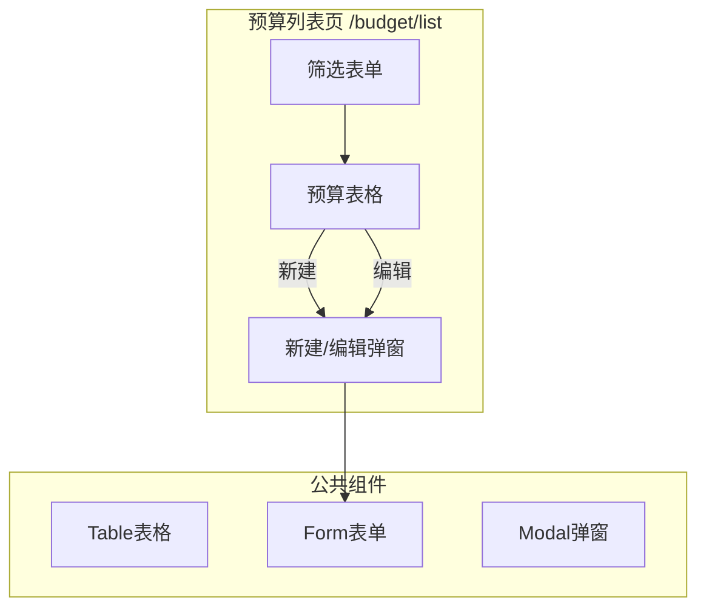
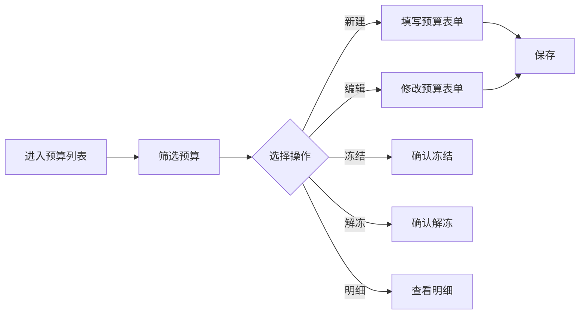

# Feature说明文档 - 预算列表

> **版本**: v1.0
> **日期**: 2026-04-30
> **作者**: Tony Stark

---

## 1. Feature 基本信息

| 字段 | 内容 |
|:---|:---|
| Feature ID | FEAT-RISK-BUDGET-LIST |
| Feature 名称 | 预算列表 |
| 所属 EPIC | EPIC-RISK-BUDGET 预算管理 |
| 所属产品域 | PD-RISK 数字风险 |
| 负责人 | Tony Stark |

---

## 2. Feature 概述

### 2.1 是什么
预算列表管理页面，支持预算的增删改查、冻结解冻操作，是预算配置管理的核心操作页面。

### 2.2 解决什么问题
- 缺乏统一的预算配置管理入口
- 预算冻结/解冻操作不便
- 预算状态（正常/预警/超支/冻结）无法直观管理

### 2.3 用户场景

| 场景 | 用户 | 描述 |
|:---|:---|:---|
| 预算查询 | 采购管理 | 按项目名称、状态、创建时间筛选预算 |
| 预算新建 | 采购管理 | 创建新的预算配置，设置金额和周期 |
| 预算冻结 | 采购管理 | 冻结暂不使用的预算金额 |
| 预算明细查看 | 采购管理 | 查看单个预算的使用明细 |

---

## 3. 系统模块图（页面/组件结构）

### 3.1 页面说明

| 页面 | 路由 | 组件 | 说明 |
|:---|:---|:---|:---|
| 预算列表 | /budget/list | List.vue | 默认展示预算列表，支持新建/编辑/冻结/解冻 |

### 3.2 组件说明

| 组件 | 类型 | 说明 |
|:---|:---|:---|
| 预算筛选表单 | 业务 | 项目名称(文本模糊)、预算状态(下拉)、创建时间(日期范围) |
| 预算数据表格 | 业务 | 展示预算列表，支持操作按钮 |
| 新建/编辑弹窗 | 业务 | 预算表单，包含项目、金额、周期等字段 |

---

## 4. 功能说明

### 4.1 功能清单

| 功能点 | 类型 | 描述 |
|:---|:---|:---|
| FP-001 | 页面 | 预算列表展示。**筛选器**：项目名称文本输入(模糊匹配)、预算状态下拉(正常/预警/超支/冻结)、创建时间日期范围选择 |
| FP-002 | 页面 | 新建预算，点击"新建预算"按钮打开表单弹窗 |
| FP-003 | 页面 | 编辑预算，点击"编辑"按钮修改预算配置 |
| FP-004 | 页面 | 冻结预算，点击"冻结"按钮冻结预算金额。**业务规则**：冻结后剩余可用=原剩余-冻结金额；冻结状态不参与正常消耗统计 |
| FP-005 | 页面 | 解冻预算，点击"解冻"按钮释放冻结金额。**业务规则**：解冻后冻结金额归零，剩余可用恢复 |
| FP-006 | 页面 | 查看明细，点击"明细"按钮查看预算使用明细详情 |

### 4.2 用户流程

---

## 5. 验收标准

| 验收项 | 标准 |
|:---|:---|
| 功能验收 | 筛选器支持项目名称模糊搜索、状态下拉、时间范围筛选 |
| 功能验收 | 新建预算表单字段完整（项目编码/名称/类型/金额/周期等） |
| 功能验收 | 冻结后预算状态更新为冻结，剩余可用正确计算 |
| 功能验收 | 解冻后冻结金额归零，剩余可用恢复 |
| 交互验收 | 冻结/解冻操作需二次确认 |
| 性能验收 | 列表加载时间 ≤ 2s |

---

## 6. 依赖关系

| 依赖项 | 类型 | 说明 |
|:---|:---|:---|
| 预算数据表 | 数据 | 存储预算主数据（表名待定） |
| 预算明细接口 | 接口 | 获取预算使用明细（表名待定） |

---

## 7. 变更记录

| 日期 | 版本 | 变更内容 | 作者 |
|:---|:---:|:---|:---|
| 2026-04-30 | v1.0 | 基于走查结果和功能清单初始化 | Tony Stark |

---

🦾 *Feature 说明文档 v1.0*
