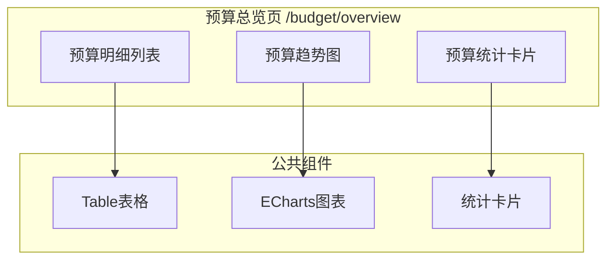
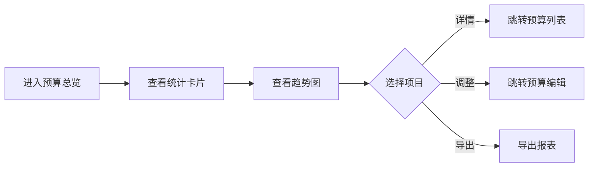

# Feature说明文档 - 预算总览

> **版本**: v1.0
> **日期**: 2026-04-30
> **作者**: Tony Stark

---

## 1. Feature 基本信息

| 字段 | 内容 |
|:---|:---|
| Feature ID | FEAT-RISK-BUDGET-OVERVIEW |
| Feature 名称 | 预算总览 |
| 所属 EPIC | EPIC-RISK-BUDGET 预算管理 |
| 所属产品域 | PD-RISK 数字风险 |
| 负责人 | Tony Stark |

---

## 2. Feature 概述

### 2.1 是什么
预算总览页面，展示整体预算使用情况和统计概览，通过统计卡片、趋势图和明细列表帮助用户快速了解预算执行状态。

### 2.2 解决什么问题
- 无法快速了解整体预算使用情况
- 缺乏可视化的预算消耗趋势
- 无法直观对比各项目预算执行进度

### 2.3 用户场景

| 场景 | 用户 | 描述 |
|:---|:---|:---|
| 预算执行概览 | 采购管理 | 进入页面快速查看总预算、已使用、剩余预算等核心指标 |
| 趋势分析 | 采购管理 | 查看预算消耗趋势图表，分析执行节奏 |
| 明细下钻 | 采购管理 | 查看各项目预算使用明细，点击详情跳转预算列表 |

---

## 3. 系统模块图（页面/组件结构）

### 3.1 页面说明

| 页面 | 路由 | 组件 | 说明 |
|:---|:---|:---|:---|
| 预算总览 | /budget/overview | Overview.vue | 默认首页，展示预算统计卡片、趋势图、明细列表 |

### 3.2 组件说明

| 组件 | 类型 | 说明 |
|:---|:---|:---|
| 预算统计卡片 | 业务 | 总预算/已使用/剩余预算/使用率统计展示 |
| 预算趋势图 | 公共 | ECharts 折线图，展示月度预算消耗趋势 |
| 预算明细列表 | 业务 | Table 表格，展示各项目预算使用明细 |

---

## 4. 功能说明

### 4.1 功能清单

| 功能点 | 类型 | 描述 |
|:---|:---|:---|
| FP-001 | 页面 | 预算统计卡片，展示总预算金额、已使用金额、剩余预算、使用率。**筛选器**：业务类型多选(默认全选)、时间维度切换(年/季/月) |
| FP-002 | 页面 | 预算趋势图，展示预算消耗趋势折线图。**计算规则**：X轴为时间周期，Y轴为金额；两条曲线（预算消耗曲线、实际消耗曲线） |
| FP-003 | 页面 | 预算明细列表，展示各项目预算使用明细。**字段**：项目名称、总预算、已使用、剩余、使用率、状态(正常/预警/超支，阈值待定) |
| FP-004 | 页面 | 详情跳转，点击"详情"按钮跳转预算列表对应项目 |
| FP-005 | 页面 | 调整预算，点击"调整"按钮跳转预算编辑 |
| FP-006 | 页面 | 导出报表，点击"导出"按钮导出 Excel/CSV |

### 4.2 用户流程

---

## 5. 验收标准

| 验收项 | 标准 |
|:---|:---|
| 功能验收 | 统计卡片正确显示总预算、已使用、剩余预算、使用率 |
| 功能验收 | 趋势图正确渲染预算vs实际两条曲线 |
| 功能验收 | 明细列表正确展示各项目预算数据 |
| 功能验收 | 状态标识正确（正常/预警/超支颜色区分） |
| 交互验收 | 支持时间维度切换（年/季/月） |
| 交互验收 | 详情/调整/导出按钮跳转正确 |
| 性能验收 | 页面加载时间 ≤ 2s |

---

## 6. 依赖关系

| 依赖项 | 类型 | 说明 |
|:---|:---|:---|
| 预算数据表 | 数据 | 存储各项目预算配置和消耗数据（具体表名待定） |
| 预算列表页面 | 页面 | 详情跳转目标页面 /budget/list |
| 预算编辑页面 | 页面 | 调整跳转目标页面 /budget/edit |

---

## 7. 变更记录

| 日期 | 版本 | 变更内容 | 作者 |
|:---|:---:|:---|:---|
| 2026-04-30 | v1.0 | 基于走查结果和功能清单初始化 | Tony Stark |

---

🦾 *Feature 说明文档 v1.0*
