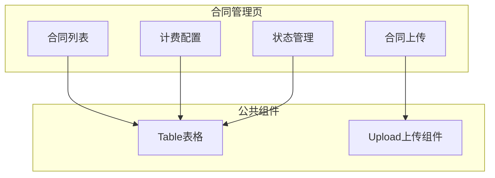
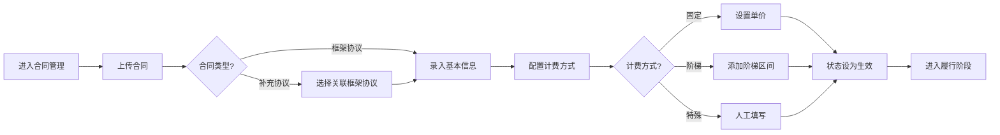

# Feature说明文档 - 合同管理

> **版本**: v1.0
> **日期**: 2026-04-28
> **作者**: Tony Stark

---

## 1. Feature 基本信息

| 字段 | 内容 |
|:---|:---|
| Feature ID | FEAT-RISK-EXT-CONTRACT |
| Feature 名称 | 合同管理 |
| 所属 EPIC | EPIC-RISK-EXT |
| 所属产品域 | PD-RISK 数字风险 |
| 负责人 | Tony Stark |

---

## 2. Feature 概述

### 2.1 是什么
合同管理模块负责外数采购合同的上传、计费配置和状态管理，为结算对账提供基础。

### 2.2 解决什么问题
- 合同信息分散，难以统一管理
- 计费方式复杂（固定/阶梯/特殊），配置不规范
- 合同状态变更缺乏记录

### 2.3 用户场景

| 场景 | 用户 | 描述 |
|:---|:---|:---|
| 合同上传 | 采购管理 | 上传框架协议或补充合同 |
| 计费配置 | 采购管理 | 配置外数产品计费方式 |
| 合同查看 | 数据管理员 | 查看合同关键指标 |

---

## 3. 系统模块图

### 3.1 页面说明

| 页面 | 路由 | 组件 | 说明 |
|:---|:---|:---|:---|
| 合同列表 | /risk/external-data/contract | ContractListPage | 合同管理首页 |
| 合同上传 | /risk/external-data/contract/upload | ContractUploadPage | 上传合同文件 |
| 计费配置 | /risk/external-data/contract/charge | ContractChargePage | 配置计费方式 |

### 3.2 组件说明

| 组件 | 类型 | 说明 |
|:---|:---|:---|
| ContractTable | 业务 | 合同列表表格组件 |
| ContractUpload | 业务 | 合同上传组件，支持word/pdf |
| ChargeConfig | 业务 | 计费配置组件，支持阶梯区间添加 |

---

## 4. 功能说明

### 4.1 功能清单

| 功能点 | 类型 | 描述 |
|:---|:---|:---|
| FP-EXT-CONTRACT-001 | 页面 | 合同列表展示，展示关键指标（数量/总额/覆盖率/供应商数）。**筛选器**：合同状态(生效/完结/中止)、供应商搜索 |
| FP-EXT-CONTRACT-002 | 页面 | 合同上传，支持上传word/pdf格式合同。**规则**：框架协议可关联多个补充协议，补充协议必须关联框架协议 |
| FP-EXT-CONTRACT-003 | 页面 | 计费配置，支持三种方式。**计费规则**：固定单价（固定金额，保留小数点后4位）；阶梯计费（按用量区间递增计算）；特殊计费（手工填写，需人工核销） |
| FP-EXT-CONTRACT-004 | 页面 | 合同状态管理。**状态规则**：生效（合同已录入，进入履行阶段）；完结（所有金额已核销，锁定）；中止（合同终止，锁定） |

### 4.2 用户流程

---

## 5. 验收标准

| 验收项 | 标准 |
|:---|:---|
| 功能验收 | 支持上传word/pdf格式合同 |
| 功能验收 | 计费配置支持三种方式（固定单价/阶梯计费/特殊计费） |
| 功能验收 | 合同状态正确流转（生效→完结/中止） |
| 功能验收 | 展示关键指标（数量/总额/覆盖率/供应商数） |
| 功能验收 | **预警触发**：合同即将到期前7天，发送通知到采购管理员 |
| 交互验收 | 计费配置支持添加阶梯区间 |
| 交互验收 | 合同列表支持分页和筛选 |

---

## 6. 依赖关系

| 依赖项 | 类型 | 说明 |
|:---|:---|
| adm.ext_contract | 数据 | 合同主数据表 |
| adm.ext_contract_charge | 数据 | 合同计费配置表 |
| 档案管理模块 | 模块 | 关联档案信息 |

---

## 7. 变更记录

| 日期 | 版本 | 变更内容 | 作者 |
|:---|:---:|:---|:---|
| 2026-04-28 | v1.0 | 初始版本，按模板v1.2重构 | Tony Stark |

---

🦍 *Feature说明文档 v1.0 | 合同管理*
