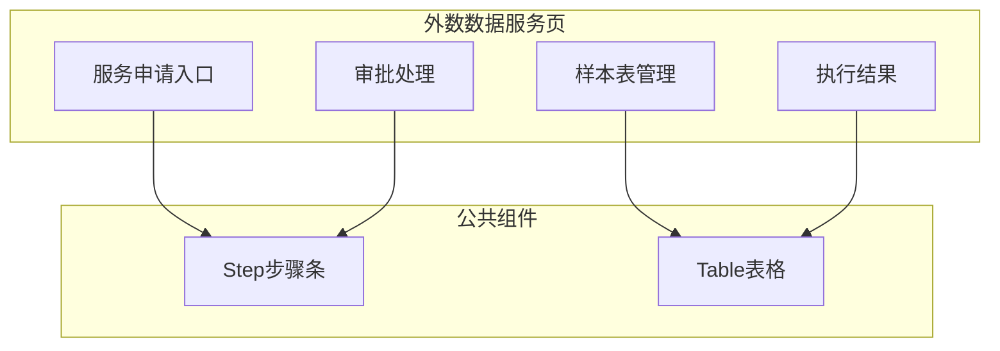
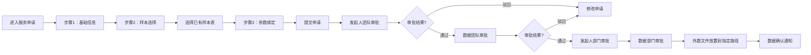

# Feature说明文档 - 外数数据服务

> **版本**: v1.0
> **日期**: 2026-04-28
> **作者**: Tony Stark

---

## 1. Feature 基本信息

| 字段 | 内容 |
|:---|:---|
| Feature ID | FEAT-RISK-EXT-SERVICE |
| Feature 名称 | 外数数据服务 |
| 所属 EPIC | EPIC-RISK-EXT |
| 所属产品域 | PD-RISK 数字风险 |
| 负责人 | Tony Stark |

---

## 2. Feature 概述

### 2.1 是什么
外数数据服务模块提供3步服务申请流程、样本表管理和审批执行全流程管理。

### 2.2 解决什么问题
- 外数调用流程分散，缺乏统一入口
- 样本表管理不规范，版本混乱
- 审批流程缺乏有效跟踪

### 2.3 用户场景

| 场景 | 用户 | 描述 |
|:---|:---|:---|
| 服务申请 | 业务用户 | 通过3步流程申请外数服务 |
| 样本表管理 | 数据管理员 | 创建/编辑/版本管理样本表 |
| 审批跟踪 | 业务用户 | 查看审批进度和执行结果 |

---

## 3. 系统模块图

### 3.1 页面说明

| 页面 | 路由 | 组件 | 说明 |
|:---|:---|:---|:---|
| 服务申请 | /risk/external-data/service/apply | ServiceApplyPage | 3步申请流程 |
| 样本表管理 | /risk/external-data/service/sample | SampleManagePage | 样本表列表与维护 |
| 审批处理 | /risk/external-data/service/approval | ApprovalPage | 审批列表 |
| 执行结果 | /risk/external-data/service/result | ResultPage | 执行结果查看 |

### 3.2 组件说明

| 组件 | 类型 | 说明 |
|:---|:---|:---|
| ApplyStepper | 业务 | 3步申请步骤条组件 |
| SampleTable | 业务 | 样本表列表组件 |
| ApprovalStepper | 业务 | 审批流程步骤条组件 |
| ResultViewer | 业务 | 执行结果查看组件 |

---

## 4. 功能说明

### 4.1 功能清单

| 功能点 | 类型 | 描述 |
|:---|:---|:---|
| FP-EXT-SVC-001 | 页面 | 服务场景入口，展示新增申请卡片，支持快速发起申请 |
| FP-EXT-SVC-002 | 页面 | 3步申请流程。**步骤1**：基础信息配置（外数产品、团队经理、申请原因）；**步骤2**：样本选择（选择已创建的样本表）；**步骤3**：参数绑定配置（绑定产品要素与样本字段） |
| FP-EXT-SVC-003 | 页面 | 样本表列表与筛选，支持按状态/名称搜索。**筛选器**：状态多选(运行中/已完成/运行失败)、样本表名称搜索 |
| FP-EXT-SVC-004 | 页面 | 样本表创建/编辑/版本管理。**默认值**：版本号默认为v1，支持版本回滚 |
| FP-EXT-SVC-005 | 页面 | 审批处理，支持通过/驳回操作。**规则**：审批流程（发起人团队审批→数据团队审批→发起人部门审批→数据部门审批）；驳回时需填写驳回原因 |
| FP-EXT-SVC-006 | 页面 | 执行结果查看与重试。**状态**：运行中（正在执行同步/更新）；已完成（执行成功）；运行失败（执行异常，可重试） |

### 4.2 用户流程

---

## 5. 验收标准

| 验收项 | 标准 |
|:---|:---|
| 功能验收 | 3步流程配置完整（基础信息→样本选择→参数绑定），步骤间可切换 |
| 功能验收 | 样本表创建/编辑/版本回滚正常 |
| 功能验收 | 审批流程状态正确展示（发起人团队→数据团队→发起人部门→数据部门） |
| 功能验收 | 执行结果支持查看/下载/重试 |
| 功能验收 | **预警触发**：审批驳回时，发送通知到申请人 |
| 交互验收 | 样本表选择后展示预览数据 |
| 交互验收 | 执行失败时支持重试操作 |

---

## 6. 依赖关系

| 依赖项 | 类型 | 说明 |
|:---|:---|
| adm.ext_sample_table | 数据 | 样本表主数据表 |
| adm.ext_service_apply | 数据 | 服务申请表 |
| adm.ext_approval_record | 数据 | 审批记录表 |
| 文件存储服务 | 接口 | 外数文件存储 |

---

## 7. 变更记录

| 日期 | 版本 | 变更内容 | 作者 |
|:---|:---:|:---|:---|
| 2026-04-28 | v1.0 | 初始版本，按模板v1.2重构 | Tony Stark |

---

🦍 *Feature说明文档 v1.0 | 外数数据服务*
