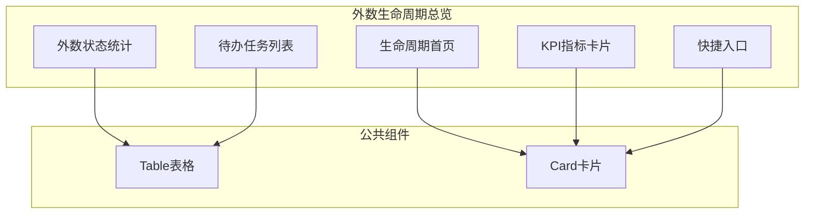
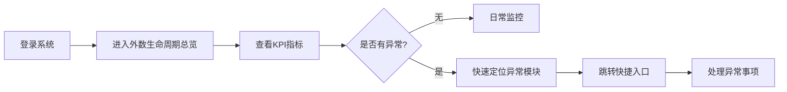

# Feature说明文档 - 外数生命周期总览

> **版本**: v1.0
> **日期**: 2026-04-28
> **作者**: Tony Stark

---

## 1. Feature 基本信息

| 字段 | 内容 |
|:---|:---|
| Feature ID | FEAT-RISK-EXT-LIFECYCLE-OVERVIEW |
| Feature 名称 | 外数生命周期总览 |
| 所属 EPIC | EPIC-RISK-EXT |
| 所属产品域 | PD-RISK 数字风险 |
| 负责人 | Tony Stark |

---

## 2. Feature 概述

### 2.1 是什么
外数生命周期总览是外数管理的统一入口，聚合各模块数据与状态，提供流程可视化、KPI监控、待办聚合功能。

### 2.2 解决什么问题
- 业务用户：无法实时跟踪外数申请进度
- 采购人员：对账结算效率低，差异处理流程繁琐
- 数据管理员：难以统筹监控全流程状态，无法实现全局管控

### 2.3 用户场景

| 场景 | 用户 | 描述 |
|:---|:---|:---|
| 日常监控 | 数据管理员 | 登录系统后快速了解外数整体状态 |
| 异常处理 | 采购管理 | 发现预警信息后快速定位并处理 |
| 进度跟踪 | 业务用户 | 查看外数申请和服务的实时状态 |

---

## 3. 系统模块图

### 3.1 页面说明

| 页面 | 路由 | 组件 | 说明 |
|:---|:---|:---|:---|
| 外数生命周期总览 | /risk/external-data/lifecycle | ExternalDataLifecyclePage | 默认首页 |
| 档案配置 | /risk/external-data/archive | ArchiveConfigPage | 快捷入口跳转 |
| 预算配置 | /risk/external-data/budget/config | BudgetConfigPage | 快捷入口跳转 |
| 预算监控 | /risk/external-data/budget/monitor | BudgetMonitorPage | 快捷入口跳转 |
| 合同管理 | /risk/external-data/contract | ContractManagePage | 快捷入口跳转 |
| 结算管理 | /risk/external-data/settlement | SettlementManagePage | 快捷入口跳转 |
| 外部数据评估 | /risk/external-data/evaluation | ExternalDataEvalPage | 快捷入口跳转 |

### 3.2 组件说明

| 组件 | 类型 | 说明 |
|:---|:---|:---|
| KPICard | 业务 | KPI指标卡片组件，展示总数/调用成功率/数据准确率 |
| StatusStatistics | 业务 | 外数状态统计组件（引入中/上线中/待评估/已归档） |
| TodoList | 业务 | 待办任务列表组件 |
| ShortcutEntrance | 业务 | 快捷入口组件 |

---

## 4. 功能说明

### 4.1 功能清单

| 功能点 | 类型 | 描述 |
|:---|:---|:---|
| FP-EXT-OVERVIEW-001 | 页面 | 生命周期首页展示，展示外数总数、各状态数量统计 |
| FP-EXT-OVERVIEW-002 | 页面 | KPI指标卡片，展示调用成功率、数据准确率等关键指标。**默认值**：实时刷新 |
| FP-EXT-OVERVIEW-003 | 页面 | 待办任务聚合展示，支持查看各模块待办事项 |
| FP-EXT-OVERVIEW-004 | 页面 | 快捷入口跳转，支持快速导航至档案/预算/合同/结算/评估模块 |

### 4.2 用户流程

---

## 5. 验收标准

| 验收项 | 标准 |
|:---|:---|
| 功能验收 | 首页展示外数总数、各状态数量统计（引入中/上线中/待评估/已归档） |
| 功能验收 | 展示关键KPI指标（调用成功率、数据准确率等） |
| 功能验收 | 支持快捷跳转到各功能模块（档案/预算/合同/结算/评估） |
| 功能验收 | 展示待办任务列表 |
| 功能验收 | **预警触发**：待办任务有新任务时，发送通知到责任人 |
| 交互验收 | 页面加载时间≤2s |
| 交互验收 | KPI卡片数据实时刷新 |

---

## 6. 依赖关系

| 依赖项 | 类型 | 说明 |
|:---|:---|:---|
| 档案管理模块 | 模块 | 状态统计数据来源 |
| 预算管理模块 | 模块 | 消耗数据来源 |
| 外数评估模块 | 模块 | 评估结果数据来源 |
| 消息通知服务 | 接口 | 待办任务通知 |

---

## 7. 变更记录

| 日期 | 版本 | 变更内容 | 作者 |
|:---|:---:|:---|:---|
| 2026-04-28 | v1.0 | 初始版本，按模板v1.2重构 | Tony Stark |

---

🦍 *Feature说明文档 v1.0 | 外数生命周期总览*
