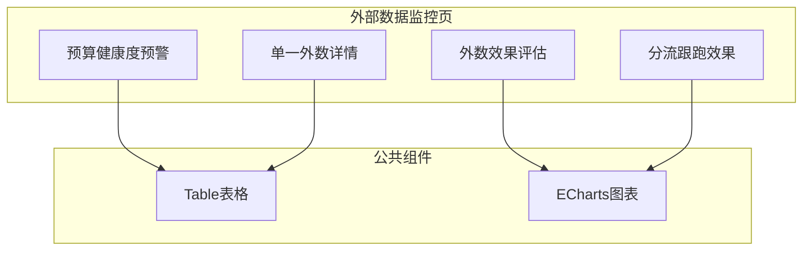
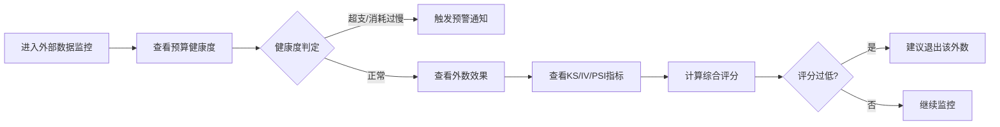

# Feature说明文档 - 外部数据监控

> **版本**: v1.0
> **日期**: 2026-04-28
> **作者**: Tony Stark

---

## 1. Feature 基本信息

| 字段 | 内容 |
|:---|:---|
| Feature ID | FEAT-RISK-EXT-MONITOR |
| Feature 名称 | 外部数据监控 |
| 所属 EPIC | EPIC-RISK-EXT |
| 所属产品域 | PD-RISK 数字风险 |
| 负责人 | Tony Stark |

---

## 2. Feature 概述

### 2.1 是什么
外部数据监控模块提供外数产品的效果监控和性价比评估，包括预算健康度预警和单外数分析。

### 2.2 解决什么问题
- 缺乏外数使用效果的可视化监控
- 无法评估外数性价比
- 尾部数源无法及时发现并退出

### 2.3 用户场景

| 场景 | 用户 | 描述 |
|:---|:---|:---|
| 效果监控 | 数据管理员 | 查看外数产品的KS、IV、PSI等指标 |
| 性价比评估 | 采购管理 | 通过综合评分评估外数性价比 |
| 异常预警 | 系统 | 预算异常时触发告警 |

---

## 3. 系统模块图

### 3.1 页面说明

| 页面 | 路由 | 组件 | 说明 |
|:---|:---|:---|:---|
| 外部数据监控 | /risk/external-data/monitor | ExternalMonitorPage | 默认首页 |
| 外数详情 | /risk/external-data/monitor/detail | ExternalDetailPage | 单一外数详情 |

### 3.2 组件说明

| 组件 | 类型 | 说明 |
|:---|:---|:---|
| HealthAlert | 业务 | 预算健康度预警组件 |
| EffectChart | 业务 | 效果评估图表组件(KS/IV/PSI) |
| ExternalDetail | 业务 | 单一外数详情组件 |
| SplitChart | 业务 | 分流跟跑图表组件 |

---

## 4. 功能说明

### 4.1 功能清单

| 功能点 | 类型 | 描述 |
|:---|:---|:---|
| FP-EXT-MON-001 | 页面 | 预算健康度预警展示。**判定规则**：正常=实际剩余/预估剩余∈[0.9,1.1]；超支>1.1；消耗过慢<0.9 |
| FP-EXT-MON-002 | 页面 | 外数效果评估，展示KS/IV/PSI/单价等核心指标。**综合评分计算**：KS权重30%、IV权重30%、(1-PSI)权重20%、Price权重20%；计算公式：综合评分=0.3*KS+0.3*IV+0.2*(1-PSI)+0.2*Price |
| FP-EXT-MON-003 | 页面 | 单一外数详情，展示成本/消耗/性能详情 |
| FP-EXT-MON-004 | 页面 | 分流跟跑效果评估，展示分流实验效果数据 |

### 4.2 综合评分计算规则

| 维度 | 指标 | 权重 | 计算公式 |
|:---|:---|:---:|:---|
| 效果类 | KS | 30% | KS*0.3 |
| 效果类 | IV | 30% | IV*0.3 |
| 性价比 | 1-PSI | 20% | (1-PSI)*0.2 |
| 价格 | Price | 20% | Price*0.2 |

**价格指标分段赋值**：
| 范围 | 赋值 |
|:---|:---|
| 0 | 5 |
| (0, 0.2] | 4 |
| (0.2, 0.4] | 3 |
| (0.4, 0.6) | 2 |
| (0.6, +∞) | 1 |

### 4.3 用户流程

---

## 5. 验收标准

| 验收项 | 标准 |
|:---|:---|
| 功能验收 | 展示KS、IV、PSI、单价等核心指标 |
| 功能验收 | 综合评分正确计算（KS30%+IV30%+(1-PSI)20%+Price20%） |
| 功能验收 | 健康度预警正确显示（正常/超支/消耗过慢） |
| 功能验收 | **预警触发**：综合评分低于X分时，触发外数性价比预警，发送通知到采购管理员 |
| 功能验收 | 支持切换时间维度（年/季/月） |
| 交互验收 | 外数产品点击跳转详情页 |

---

## 6. 依赖关系

| 依赖项 | 类型 | 说明 |
|:---|:---|
| adm.ext_data_effect | 数据 | 外数效果指标数据表（KS/IV/PSI） |
| adm.ext_data_price | 数据 | 外数价格数据表 |
| 预算监控模块 | 模块 | 获取健康度数据 |

---

## 7. 变更记录

| 日期 | 版本 | 变更内容 | 作者 |
|:---|:---:|:---|:---|
| 2026-04-28 | v1.0 | 初始版本，按模板v1.2重构 | Tony Stark |

---

🦍 *Feature说明文档 v1.0 | 外部数据监控*
