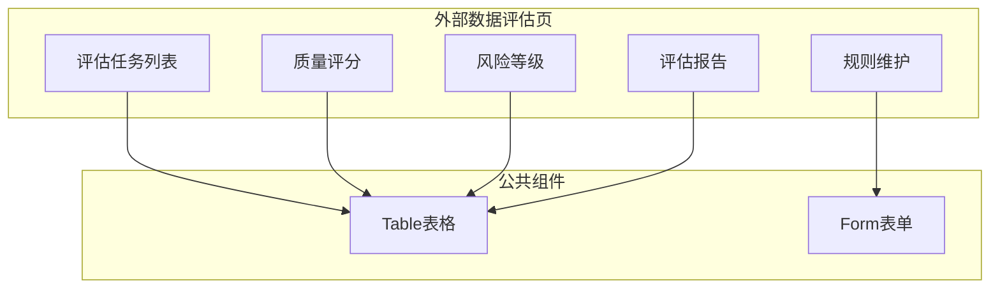
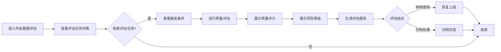

# Feature说明文档 - 外部数据评估

> **版本**: v1.0
> **日期**: 2026-04-28
> **作者**: Tony Stark

---

## 1. Feature 基本信息

| 字段 | 内容 |
|:---|:---|
| Feature ID | FEAT-RISK-EXT-EVALUATION |
| Feature 名称 | 外部数据评估 |
| 所属 EPIC | EPIC-RISK-EXT |
| 所属产品域 | PD-RISK 数字风险 |
| 负责人 | Tony Stark |

---

## 2. Feature 概述

### 2.1 是什么
外部数据评估模块负责对外数产品进行质量/风险评估，生成评估报告，支持规则维护和退出决策。

### 2.2 解决什么问题
- 外数质量缺乏系统性评估
- 尾部数源难以及时发现
- 缺乏标准化的评估报告

### 2.3 用户场景

| 场景 | 用户 | 描述 |
|:---|:---|:---|
| 质量评估 | 数据管理员 | 对上线外数进行效果和质量评估 |
| 报告生成 | 数据管理员 | 生成标准化评估报告 |
| 退出决策 | 数据管理员 | 根据评估结论选择继续使用或归档 |

---

## 3. 系统模块图

### 3.1 页面说明

| 页面 | 路由 | 组件 | 说明 |
|:---|:---|:---|:---|
| 评估任务列表 | /risk/external-data/evaluation | EvaluationListPage | 默认首页 |
| 评估报告 | /risk/external-data/evaluation/report | EvaluationReportPage | 生成评估报告 |
| 规则维护 | /risk/external-data/evaluation/rule | RuleConfigPage | 配置评估规则 |

### 3.2 组件说明

| 组件 | 类型 | 说明 |
|:---|:---|:---|
| EvaluationTable | 业务 | 评估任务列表组件 |
| QualityScore | 业务 | 质量评分展示组件 |
| RiskLevel | 业务 | 风险等级展示组件 |
| ReportViewer | 业务 | 评估报告查看组件 |
| RuleForm | 业务 | 规则配置表单组件 |

---

## 4. 功能说明

### 4.1 功能清单

| 功能点 | 类型 | 描述 |
|:---|:---|:---|
| FP-EXT-EVAL-001 | 页面 | 评估任务列表，支持按状态/外数名称筛选。**筛选器**：状态多选(待评估/评估中/已完成)、外数名称搜索 |
| FP-EXT-EVAL-002 | 页面 | 质量评分展示，展示外数产品的质量评分结果 |
| FP-EXT-EVAL-003 | 页面 | 风险等级展示，展示外数产品的风险等级（高/中/低） |
| FP-EXT-EVAL-004 | 页面 | 评估报告生成，生成标准化评估报告，支持下载/导出 |
| FP-EXT-EVAL-005 | 页面 | 规则维护，配置评估触发条件和阈值。**触发条件**：效果追踪指标连续3个周期未达标（系统自动触发）；业务反馈数据/效果异常（人工提交）；落库数据一致性问题（系统检测） |

### 4.2 评估触发规则

| 触发条件 | 类型 | 说明 |
|:---|:---|:---|
| 效果追踪指标连续3个周期未达标 | 系统自动 | 系统检测到效果指标连续3个周期未达到预设阈值 |
| 业务反馈数据/效果异常 | 人工提交 | 业务人员反馈外数数据或效果异常 |
| 落库数据一致性问题 | 系统检测 | 系统检测到落库数据与预期不一致 |

### 4.3 用户流程

---

## 5. 验收标准

| 验收项 | 标准 |
|:---|:---|
| 功能验收 | 评估任务状态正确展示（待评估/评估中/已完成） |
| 功能验收 | 质量评分、风险等级正确计算 |
| 功能验收 | 支持生成标准化评估报告，支持下载/导出 |
| 功能验收 | 评估结论支持"恢复上线"或"归档处理" |
| 功能验收 | **预警触发**：评估任务完成时，发送通知到数据管理员 |
| 交互验收 | 评估任务可下载或导出为PDF/Excel |

---

## 6. 依赖关系

| 依赖项 | 类型 | 说明 |
|:---|:---|
| adm.ext_evaluation | 数据 | 评估任务主数据表 |
| adm.ext_quality_score | 数据 | 质量评分数据表 |
| adm.ext_risk_level | 数据 | 风险等级数据表 |
| 外部数据监控模块 | 模块 | 获取效果指标数据 |
| 档案管理模块 | 模块 | 关联档案状态变更 |

---

## 7. 变更记录

| 日期 | 版本 | 变更内容 | 作者 |
|:---|:---:|:---|:---|
| 2026-04-28 | v1.0 | 初始版本，按模板v1.2重构 | Tony Stark |

---

🦍 *Feature说明文档 v1.0 | 外部数据评估*
