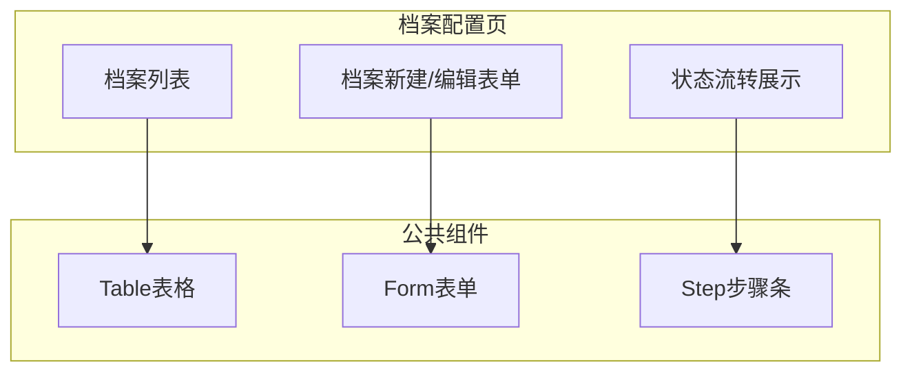
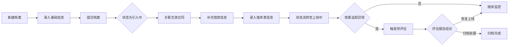

# Feature说明文档 - 档案配置

> **版本**: v1.0
> **日期**: 2026-04-28
> **作者**: Tony Stark

---

## 1. Feature 基本信息

| 字段 | 内容 |
|:---|:---|
| Feature ID | FEAT-RISK-EXT-ARCHIVE |
| Feature 名称 | 档案配置 |
| 所属 EPIC | EPIC-RISK-EXT |
| 所属产品域 | PD-RISK 数字风险 |
| 负责人 | Tony Stark |

---

## 2. Feature 概述

### 2.1 是什么
档案配置模块负责外数档案的创建、编辑和状态流转管理，是外数全生命周期管理的核心基础。

### 2.2 解决什么问题
- 档案信息不完整，支撑能力不足
- 缺少对账相关字段
- 未实现元数据规范化管理

### 2.3 用户场景

| 场景 | 用户 | 描述 |
|:---|:---|:---|
| 新建档案 | 数据管理员 | 采购新外数时录入基础信息 |
| 编辑档案 | 数据管理员 | 修改外数配置和关联信息 |
| 状态变更 | 系统 | 自动处理状态流转 |

---

## 3. 系统模块图

### 3.1 页面说明

| 页面 | 路由 | 组件 | 说明 |
|:---|:---|:---|:---|
| 档案列表 | /risk/external-data/archive | ArchiveListPage | 档案管理首页 |
| 档案新建/编辑 | /risk/external-data/archive/edit | ArchiveFormPage | 新建或编辑档案 |
| 档案详情 | /risk/external-data/archive/detail | ArchiveDetailPage | 查看档案详情 |

### 3.2 组件说明

| 组件 | 类型 | 说明 |
|:---|:---|:---|
| ArchiveTable | 业务 | 档案列表表格组件 |
| ArchiveForm | 业务 | 档案新建/编辑表单组件 |
| StatusStepper | 业务 | 状态流转步骤条组件 |

---

## 4. 功能说明

### 4.1 功能清单

| 功能点 | 类型 | 描述 |
|:---|:---|:---|
| FP-EXT-ARCH-001 | 页面 | 档案列表展示，支持筛选和搜索。**筛选器**：状态多选(引入中/上线中/待评估/已归档)、外数名称搜索 |
| FP-EXT-ARCH-002 | 页面 | 档案新建/编辑，录入外数基础信息（名称、渠道、供应商）。**默认值**：状态默认为"引入中"，新建档案并提交后生成初始档案 |
| FP-EXT-ARCH-003 | 页面 | 档案状态流转，按规则自动或手动变更状态。**流转规则**：引入中→上线中（关联生效合同+补充借款+落库表信息）；上线中→待评估（效果追踪未达标/业务反馈异常/数据问题）；待评估→上线中（完成评估报告，选择"恢复上线"）；待评估→已归档（完成评估报告，选择"归档处理"） |
| FP-EXT-ARCH-004 | 接口 | 档案元数据管理，提供元数据查询和更新接口 |

### 4.2 用户流程

---

## 5. 验收标准

| 验收项 | 标准 |
|:---|:---|
| 功能验收 | 支持录入外数基础信息（名称、渠道、供应商） |
| 功能验收 | 状态默认"引入中"，新建档案并提交后生成初始档案 |
| 功能验收 | 满足条件后状态可流转至"上线中"（关联生效合同+补充借款+落库表信息） |
| 功能验收 | 关联合同信息、借款信息完整 |
| 功能验收 | **预警触发**：档案状态变为"待评估"时，发送通知到数据管理员 |
| 交互验收 | 档案编辑保存后数据实时更新 |

---

## 6. 依赖关系

| 依赖项 | 类型 | 说明 |
|:---|:---|:---|
| 合同管理模块 | 模块 | 获取生效合同列表 |
| 外数服务模块 | 模块 | 调用权限控制 |
| adm.ext_data_archive | 数据 | 外数档案主数据表 |

---

## 7. 变更记录

| 日期 | 版本 | 变更内容 | 作者 |
|:---|:---:|:---|:---|
| 2026-04-28 | v1.0 | 初始版本，按模板v1.2重构 | Tony Stark |

---

🦍 *Feature说明文档 v1.0 | 档案配置*
