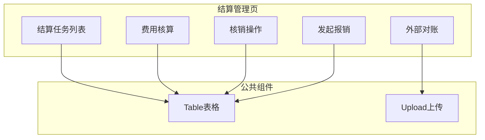
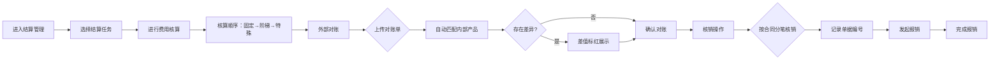

# Feature说明文档 - 结算管理

> **版本**: v1.0
> **日期**: 2026-04-28
> **作者**: Tony Stark

---

## 1. Feature 基本信息

| 字段 | 内容 |
|:---|:---|
| Feature ID | FEAT-RISK-EXT-SETTLEMENT |
| Feature 名称 | 结算管理 |
| 所属 EPIC | EPIC-RISK-EXT |
| 所属产品域 | PD-RISK 数字风险 |
| 负责人 | Tony Stark |

---

## 2. Feature 概述

### 2.1 是什么
结算管理模块负责外数费用核算、外部对账、确认核销和完成报销的完整流程管理。

### 2.2 解决什么问题
- 人工对账效率低，易出错
- 名称匹配错误、免费量统计遗漏
- 对账差异追溯困难

### 2.3 用户场景

| 场景 | 用户 | 描述 |
|:---|:---|:---|
| 费用核算 | 采购管理 | 按固定→阶梯→特殊顺序核算费用 |
| 外部对账 | 采购管理 | 上传对账单并匹对内部产品 |
| 核销操作 | 采购管理 | 按合同分笔核销费用 |
| 发起报销 | 财务 | 记录报销单据 |

---

## 3. 系统模块图

### 3.1 页面说明

| 页面 | 路由 | 组件 | 说明 |
|:---|:---|:---|:---|
| 结算任务列表 | /risk/external-data/settlement | SettlementListPage | 默认首页，支持状态筛选 |
| 费用核算 | /risk/external-data/settlement/calc | SettlementCalcPage | 费用核算页 |
| 外部对账 | /risk/external-data/settlement/reconcile | ReconcilePage | 上传对账单 |
| 核销操作 | /risk/external-data/settlement/writeoff | WriteOffPage | 核销费用 |
| 发起报销 | /risk/external-data/settlement/expense | ExpensePage | 记录报销单据 |

### 3.2 组件说明

| 组件 | 类型 | 说明 |
|:---|:---|:---|
| SettlementTable | 业务 | 结算任务列表组件 |
| SettlementCalc | 业务 | 费用核算组件 |
| ReconcileUpload | 业务 | 对账单上传组件 |
| WriteOffForm | 业务 | 核销表单组件 |
| ExpenseForm | 业务 | 报销表单组件 |

---

## 4. 功能说明

### 4.1 功能清单

| 功能点 | 类型 | 描述 |
|:---|:---|:---|
| FP-EXT-SETTLE-001 | 页面 | 结算任务列表，按状态筛选（待核算/待对账/待核销/待报销/已完成）。**筛选器**：结算状态多选、账单周期选择 |
| FP-EXT-SETTLE-002 | 页面 | 费用核算，按顺序处理三类产品。**核算顺序**：固定费用产品（系统自动计算，支持批量确认）；阶梯定价产品（按产品逐个处理，计算公式展示）；特殊计费产品（人工填写费用金额） |
| FP-EXT-SETTLE-003 | 页面 | 外部对账，上传对账单并自动匹对内部产品。**规则**：匹配外数名称（内部/我司名称）、核算清单展示字段（匹配外数名称、账单周期、核算单价、最终计费量、内部费用）、对账结果展示字段（账单周期、调用时间、外部计费量、内部-外部差值（差值标红）） |
| FP-EXT-SETTLE-004 | 页面 | 核销操作，按合同分笔核销费用。**规则**：按"外数产品"维度分产品核销；关联对应合同分笔完成费用抵扣；每次核销金额≤合同剩余可核销费用；支持补充备注信息；核销结果字段（单据编号、支付日期） |
| FP-EXT-SETTLE-005 | 页面 | 发起报销，记录报销单据信息 |
| FP-EXT-SETTLE-006 | 接口 | 数据下载，支持下载核算清单/对账结果/核销结果 |

### 4.2 用户流程

---

## 5. 验收标准

| 验收项 | 标准 |
|:---|:---|
| 功能验收 | 结算任务四阶段状态正确展示（待核算/待对账/待核销/待报销/已完成） |
| 功能验收 | 费用核算按顺序处理三类产品（固定→阶梯→特殊） |
| 功能验收 | 外部对账支持上传对账单并自动匹配内部产品 |
| 功能验收 | 核销支持按合同分笔，输入金额和减免量 |
| 功能验收 | 支持下载核算清单、对账结果、核销结果 |
| 功能验收 | **预警触发**：对账差异超过X%时，触发对账异常预警，发送通知到采购管理员 |
| 交互验收 | 内部-外部数据不一致时标红显示 |

---

## 6. 依赖关系

| 依赖项 | 类型 | 说明 |
|:---|:---|:---|
| adm.ext_settlement | 数据 | 结算主数据表 |
| adm.ext_reconcile | 数据 | 对账结果数据表 |
| adm.ext_writeoff | 数据 | 核销结果数据表 |
| 合同管理模块 | 模块 | 获取合同分笔信息 |

---

## 7. 变更记录

| 日期 | 版本 | 变更内容 | 作者 |
|:---|:---:|:---|:---|
| 2026-04-28 | v1.0 | 初始版本，按模板v1.2重构 | Tony Stark |

---

🦍 *Feature说明文档 v1.0 | 结算管理*
