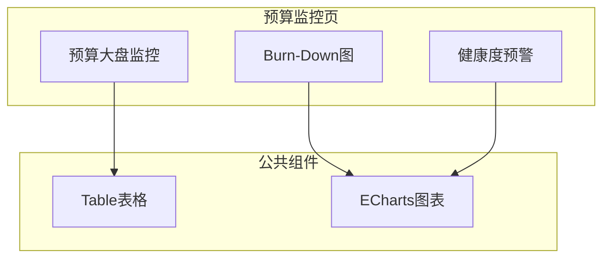
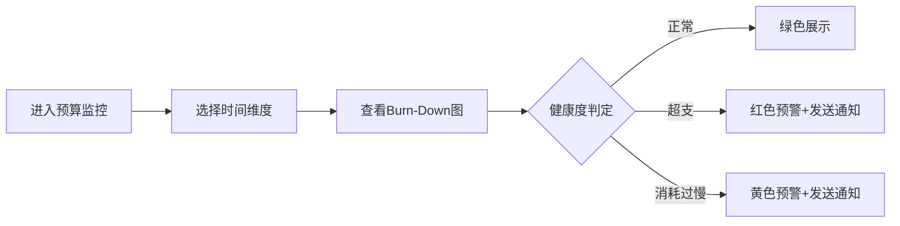

# Feature说明文档 - 预算监控

> **版本**: v1.0
> **日期**: 2026-04-28
> **作者**: Tony Stark

---

## 1. Feature 基本信息

| 字段 | 内容 |
|:---|:---|
| Feature ID | FEAT-RISK-EXT-BUDGET-MONITOR |
| Feature 名称 | 预算监控 |
| 所属 EPIC | EPIC-RISK-EXT |
| 所属产品域 | PD-RISK 数字风险 |
| 负责人 | Tony Stark |

---

## 2. Feature 概述

### 2.1 是什么
预算监控模块用于监控和分析整体预算消耗情况，支持按业务类型、平台产品、目标贷余筛选，展示Burn-Down图和预警信息。

### 2.2 解决什么问题
- 预算超支、消耗过慢等异常情况无法及时预警
- 没有打通预警通知的信息闭环
- 缺乏可视化的预算执行分析工具

### 2.3 用户场景

| 场景 | 用户 | 描述 |
|:---|:---|:---|
| 预算执行监控 | 采购管理 | 实时查看预算消耗进度 |
| 异常预警 | 系统 | 低于阈值时触发告警 |
| 归因分析 | 采购管理 | 分析预算差异原因 |

---

## 3. 系统模块图

### 3.1 页面说明

| 页面 | 路由 | 组件 | 说明 |
|:---|:---|:---|:---|
| 预算监控 | /risk/external-data/budget/monitor | BudgetMonitorPage | 默认首页 |
| Burn-Down详情 | /risk/external-data/budget/burndown | BurnDownChart | 可从大盘跳转 |

### 3.2 组件说明

| 组件 | 类型 | 说明 |
|:---|:---|:---|
| BudgetFilter | 业务 | 预算筛选器组件 |
| BurnDownChart | 公共 | Burn-Down图组件(ECharts) |
| AlertBadge | 公共 | 健康度状态徽章 |

---

## 4. 功能说明

### 4.1 功能清单

| 功能点 | 类型 | 描述 |
|:---|:---|:---|
| FP-EXT-MON-001 | 页面 | 预算大盘监控，展示实际使用量/总预算/当前进度。**筛选器**：业务类型多选(默认全选)、平台产品搜索(支持搜索)、目标贷余单选、时间维度支持年/季/月切换(默认月度) |
| FP-EXT-MON-002 | 页面 | Burn-Down图，区分预估剩余和实际剩余。**计算规则**：预估剩余=总预算-累计预算(按月)；实际剩余=总预算-累计实际消耗(按月) |
| FP-EXT-MON-003 | 页面 | 健康度预警模块。**判定规则**：正常=实际剩余/预估剩余∈[0.9,1.1]；超支>1.1；消耗过慢<0.9 |
| FP-EXT-MON-004 | 页面 | 详情分析，支持下钻实际消耗明细 |
| FP-EXT-MON-005 | 页面 | 业务过程比对，展示预估vs实际对比曲线 |

### 4.2 用户流程

---

## 5. 验收标准

| 验收项 | 标准 |
|:---|:---|
| 功能验收 | 展示实际使用量/总预算/当前进度 |
| 功能验收 | Burn-Down图区分预估和实际两条曲线 |
| 功能验收 | 健康度预警正确计算和显示（正常/超支/消耗过慢） |
| 功能验收 | **预警触发**：实际剩余预算低于预估剩余的X%时，触发预算超支风险预警，发送通知到采购管理员 |
| 交互验收 | 支持时间维度切换（年/季/月） |
| 交互验收 | 支持导出数据（Excel/CSV） |
| 性能验收 | 页面加载≤2s，数据刷新≤1s |

---

## 6. 依赖关系

| 依赖项 | 类型 | 说明 |
|:---|:---|:---|
| adm.ads_report_ws_prod_consuption_full | 数据 | 预算数据表，存储各业务类型/平台产品的预算配置 |
| adm.dws_ws_prod_consuption_full | 数据 | 实际消耗数据表，存储每日消耗明细 |
| 消息通知服务 | 接口 | 发送预警通知 |

---

## 7. 变更记录

| 日期 | 版本 | 变更内容 | 作者 |
|:---|:---:|:---|:---|
| 2026-04-28 | v1.0 | 初始版本，按模板v1.2重构 | Tony Stark |

---

🦍 *Feature说明文档 v1.0 | 预算监控*
