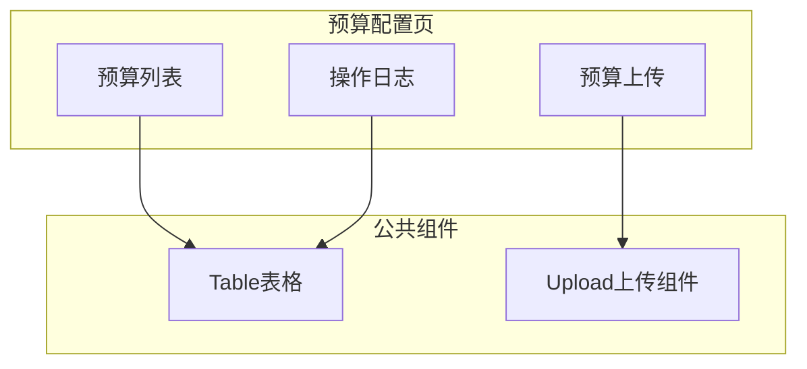
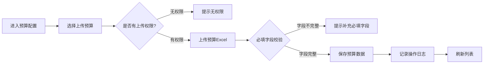

# Feature说明文档 - 预算配置

> **版本**: v1.0
> **日期**: 2026-04-28
> **作者**: Tony Stark

---

## 1. Feature 基本信息

| 字段 | 内容 |
|:---|:---|
| Feature ID | FEAT-RISK-EXT-BUDGET-CONFIG |
| Feature 名称 | 预算配置 |
| 所属 EPIC | EPIC-RISK-EXT |
| 所属产品域 | PD-RISK 数字风险 |
| 负责人 | Tony Stark |

---

## 2. Feature 概述

### 2.1 是什么
预算配置模块负责外数采购预算的录入和管理，为后续预算监控和消耗分析提供基础数据。

### 2.2 解决什么问题
- 预算数据分散，缺乏统一管理
- 上传预算数据缺乏权限控制和日志记录
- 计算口径调整依赖人工维护

### 2.3 用户场景

| 场景 | 用户 | 描述 |
|:---|:---|:---|
| 年度预算录入 | 采购管理 | 年初制定全年预算计划 |
| 预算调整 | 采购管理 | 根据业务变化调整预算分配 |
| 预算查看 | 数据管理员 | 查看预算录入历史 |

---

## 3. 系统模块图

### 3.1 页面说明

| 页面 | 路由 | 组件 | 说明 |
|:---|:---|:---|:---|
| 预算列表 | /risk/external-data/budget/config | BudgetListPage | 预算管理首页 |
| 预算上传 | /risk/external-data/budget/upload | BudgetUploadPage | 上传预算数据 |

### 3.2 组件说明

| 组件 | 类型 | 说明 |
|:---|:---|:---|
| BudgetTable | 业务 | 预算列表表格组件 |
| BudgetUpload | 业务 | 预算上传组件，支持Excel导入 |
| OperationLog | 业务 | 操作日志组件 |

---

## 4. 功能说明

### 4.1 功能清单

| 功能点 | 类型 | 描述 |
|:---|:---|:---|
| FP-EXT-BUDGET-001 | 页面 | 预算列表展示，支持按时间/业务类型筛选。**筛选器**：业务类型多选(直贷/助贷/融担)、时间范围选择 |
| FP-EXT-BUDGET-002 | 接口 | 预算数据上传，需校验必填字段。**必填字段**：业务类型、平台产品、目标贷余、预估放款、预估费用、年化数据成本、无风险收益、预算粒度、对应时间。**默认值**：预算粒度默认为"月度" |
| FP-EXT-BUDGET-003 | 接口 | 预算操作日志记录，记录上传时间、条数、操作人员 |
| FP-EXT-BUDGET-004 | 接口 | 预算权限控制，上传预算数据需独立权限 |

### 4.2 用户流程

---

## 5. 验收标准

| 验收项 | 标准 |
|:---|:---|
| 功能验收 | 必填字段校验（业务类型、平台产品、目标贷余、预估放款、预估费用、年化数据成本、无风险收益、预算粒度、对应时间），字段不完整不允许提交 |
| 功能验收 | 上传记录操作日志（上传时间、条数、操作人员） |
| 功能验收 | 上传预算数据需独立权限，无权限用户无法上传 |
| 功能验收 | 预算数据保存后可供预算监控模块使用 |
| 交互验收 | 列表展示清晰，数据分页加载 |
| 交互验收 | 上传成功后提示并刷新列表 |

---

## 6. 依赖关系

| 依赖项 | 类型 | 说明 |
|:---|:---|
| adm.ext_budget_config | 数据 | 预算配置主数据表，存储各业务类型/平台产品的预算配置 |
| 权限管理服务 | 接口 | 预算上传权限验证 |

---

## 7. 变更记录

| 日期 | 版本 | 变更内容 | 作者 |
|:---|:---:|:---|:---|
| 2026-04-28 | v1.0 | 初始版本，按模板v1.2重构 | Tony Stark |

---

🦍 *Feature说明文档 v1.0 | 预算配置*
