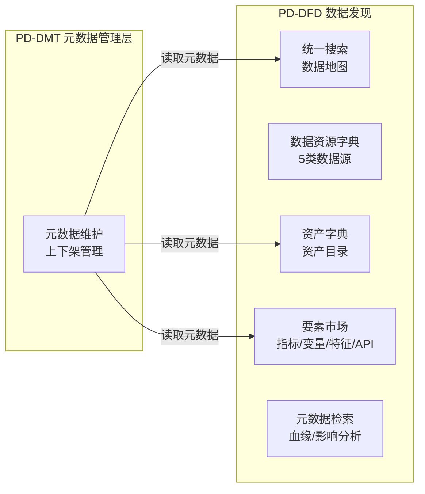
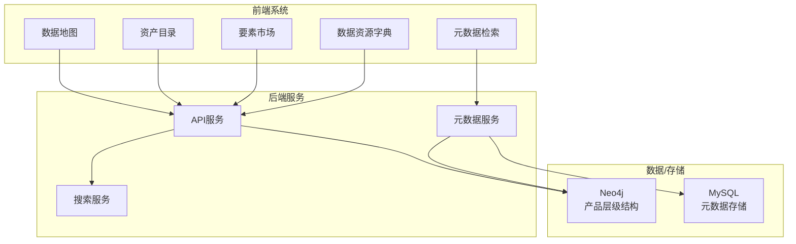

---
neo4j:
  productDomain: "PD-DFD"
feishu:
  wiki: "V8KEfpg1vlkCZld"
doc:
  title: "PD-DFD数据发现-产品域说明文档"
  version: "v1.0"
  type: "产品域说明文档"
  productDomain: "PD-DFD"
  author: "Tony Stark"
  createdAt: "2026-04-30"
  updatedAt: "2026-04-30"
---

# PD-DFD 数据发现 - 产品域说明文档

> **版本**: v1.0
> **日期**: 2026-04-30
> **作者**: Tony Stark
> **状态**: 已完成

---

## 1. 产品域概述

### 1.1 基本信息

| 字段 | 内容 |
|:---|:---|
| 产品域 ID | PD-DFD |
| 产品域名称 | 数据发现 |
| 英文名 | Data Discovery |
| 所属业务线 | 数字社区 |
| 产品负责人 | Tony Stark |
| 创建日期 | 2026-04-24 |

### 1.2 产品域定位

**展示层** - 数据资产/要素的统一发现和检索平台

PD-DFD 是面向消费金融业务场景的数据消费平台，为用户提供找数据、理解数据、使用数据的完整能力。

### 1.3 核心价值

| 价值维度 | 说明 |
|:---|:---|
| 用户价值 | 快速定位所需数据资产，降低数据寻找成本 |
| 业务价值 | 建立统一的数据发现入口，提升数据资产复用率 |
| 技术价值 | 统一的数据检索和血缘分析能力，支持数据治理 |

---

## 2. 逻辑架构图（业务流程）

### 2.1 逻辑层级说明

| 层级 | Epic/模块 | 业务流程 | 说明 |
|:---|:---|:---|:---|
| 入口层 | 统一搜索 | 用户通过数据地图快速搜索目标数据 | 无明确目的的导航 |
| 资产层 | 数据资产字典 | 用户通过资产目录精确查找数据表 | 有明确目的的检索 |
| 要素层 | 数据要素市场 | 用户查找指标、变量、特征、API | 数据要素检索 |
| 资源层 | 数据资源字典 | 用户检索发现5类数据源 | 数据源发现 |
| 分析层 | 元数据检索 | 用户分析血缘和影响 | 数据关系分析 |

---

## 3. 物理架构图（系统模块）

### 3.1 系统模块说明

| 模块 | 类型 | 说明 |
|:---|:---|:---|
| 数据地图 | 前端 | 统一搜索入口，支持关键词和高级筛选 |
| 资产目录 | 前端 | 数据资产列表，支持多维度检索 |
| 要素市场 | 前端 | 指标/变量/特征/API地图 |
| 数据资源字典 | 前端 | 5类数据源发现检索 |
| 元数据检索 | 前端 | 血缘分析和影响分析 |
| API服务 | 后端 | 统一API网关 |
| 搜索服务 | 后端 | 搜索引擎服务 |
| 元数据服务 | 后端 | 元数据管理和血缘计算 |

---

## 4. Epic 列表

| 序号 | Epic ID | Epic 名称 | Feature 数量 |
|:---:|:---|:---|:---:|
| 1 | EPIC-DFD-SEARCH | 统一搜索（数据地图） | 1 |
| 2 | EPIC-DFD-RESOURCE | 数据资源字典 | 5 |
| 3 | EPIC-DFD-ASSET | 数据资产字典 | 2 |
| 4 | EPIC-DFD-ELEMENT | 数据要素市场 | 4 |
| 5 | EPIC-DFD-METADATA | 元数据检索 | 2 |

**合计**: 5 Epic，14 Feature，60 FP

### 4.1 Epic 详细

#### EPIC-DFD-SEARCH 统一搜索（数据地图）

| 属性 | 值 |
|:---|:---|
| Epic ID | EPIC-DFD-SEARCH |
| Epic 名称 | 统一搜索（数据地图） |
| 目标 | 提供统一的数据发现入口，支持快速导航和检索 |
| 负责人 | Tony Stark |

**Feature 列表**：
| Feature | 名称 | 优先级 |
|:---|:---|:---:|
| FEAT-DFD-SEARCH-MAP | 数据地图 | P0 |

#### EPIC-DFD-RESOURCE 数据资源字典

| 属性 | 值 |
|:---|:---|
| Epic ID | EPIC-DFD-RESOURCE |
| Epic 名称 | 数据资源字典 |
| 目标 | 发现和检索5类数据源（业务系统/文件/外部/实时/日志） |
| 负责人 | Tony Stark |

**Feature 列表**：
| Feature | 名称 | 优先级 |
|:---|:---|:---:|
| FEAT-DFD-RES-SYSTEM | 业务系统数据源 | P0 |
| FEAT-DFD-RES-FILE | 文件资源 | P0 |
| FEAT-DFD-RES-EXTERNAL | 外部数据源 | P0 |
| FEAT-DFD-RES-REALTIME | 实时数据源 | P1 |
| FEAT-DFD-RES-LOG | 日志数据源 | P1 |

#### EPIC-DFD-ASSET 数据资产字典

| 属性 | 值 |
|:---|:---|
| Epic ID | EPIC-DFD-ASSET |
| Epic 名称 | 数据资产字典 |
| 目标 | 提供数据表的统一检索和详情查看 |
| 负责人 | Tony Stark |

**Feature 列表**：
| Feature | 名称 | 优先级 |
|:---|:---|:---:|
| FEAT-DFD-ASSET-LIST | 资产列表 | P0 |
| FEAT-DFD-ASSET-DETAIL | 数据表详情 | P0 |

#### EPIC-DFD-ELEMENT 数据要素市场

| 属性 | 值 |
|:---|:---|
| Epic ID | EPIC-DFD-ELEMENT |
| Epic 名称 | 数据要素市场 |
| 目标 | 提供指标、变量、特征、API的统一发现 |
| 负责人 | Tony Stark |

**Feature 列表**：
| Feature | 名称 | 优先级 |
|:---|:---|:---:|
| FEAT-DFD-INDEX-LIST | 指标地图 | P0 |
| FEAT-DFD-VARIABLE-LIST | 变量地图 | P1 |
| FEAT-DFD-CHARACTER-LIST | 特征地图 | P1 |
| FEAT-DFD-API-LIST | API市场 | P1 |

#### EPIC-DFD-METADATA 元数据检索

| 属性 | 值 |
|:---|:---|
| Epic ID | EPIC-DFD-METADATA |
| Epic 名称 | 元数据检索 |
| 目标 | 提供血缘分析和影响分析能力 |
| 负责人 | Tony Stark |

**Feature 列表**：
| Feature | 名称 | 优先级 |
|:---|:---|:---:|
| FEAT-DFD-LINEAGE-ANALYSIS | 全链路血缘 | P0 |
| FEAT-DFD-IMPACT-ANALYSIS | 影响分析 | P0 |

---

## 5. 能力地图

> **用途**：描述产品核心能力矩阵，含关键能力子项、业务价值、建设情况
> **关注点**：能力项与业务价值对应，建设阶段清晰

### 5.1 多维度资产检索能力

| 关键能力 | 能力子项 | 业务价值 | 建设情况 |
|:---|:---|:---|:---:|
| 多维度资产检索能力 | 精确检索 | 满足已知资产条件下的快速直达，减少筛选成本 | 🟢已实现 |
| 多维度资产检索能力 | 模糊检索 | 适配信息不全场景，提升找数成功率 | 🟡部分实现，建设中 |
| 多维度资产检索能力 | 标签检索 | 按业务维度聚合资产，检索更聚焦 | 🟡部分实现，建设中 |
| 多维度资产检索能力 | 血缘检索 | 快速厘清数据来源与依赖关系 | ⏸️已规划，Q3实现 |
| 多维度资产检索能力 | 语义检索 | 降低技术门槛，业务人员自助找数 | ⏸️已规划，后期实现 |

### 5.2 数据详情可视化能力

| 关键能力 | 能力子项 | 业务价值 | 建设情况 |
|:---|:---|:---|:---:|
| 数据详情可视化能力 | 数据概览 | 快速甄别数据内容可用性与维护主体 | 🟢已实现 |
| 数据详情可视化能力 | 字段详情 | 避免字段误用、口径偏差 | 🟡已实现，部分内容待维护 |
| 数据详情可视化能力 | 口径说明 | 保障数据分析结果统一可信 | 🟡已实现，部分内容待维护 |
| 数据详情可视化能力 | 关联资产 | 减少跨页面反复查找 | ⏸️已规划，Q3实现 |

### 5.3 资产自助使用能力

| 关键能力 | 能力子项 | 业务价值 | 建设情况 |
|:---|:---|:---|:---:|
| 资产自助使用能力 | 数据预览 | 前置校验，降低无效取数 | 🟢数据资产已实现 |
| 资产自助使用能力 | 收藏与分享 | 提升复用效率，沉淀团队资产 | 🟡部分实现，建设中 |
| 资产自助使用能力 | 权限申请 | 缩短用数开通周期 | 🟡建设中 |
| 资产自助使用能力 | 历史记录 | 便于复盘与重复使用 | ⏸️待规划 |

### 5.4 资产运营反馈能力

| 关键能力 | 能力子项 | 业务价值 | 建设情况 |
|:---|:---|:---|:---:|
| 资产运营反馈能力 | 常用表集合 | 提高单一场景内的数据共享，提高复用效率 | 🟢已实现 |
| 资产运营反馈能力 | 反馈机制 | 反向推动资产治理优化 | ⏸️已规划，后期实现 |

### 5.5 能力地图汇总

| 能力域 | 🟢已实现 | 🟡部分实现 | ⏸️已规划 | 合计 |
|:---|:---:|:---:|:---:|:---:|
| 多维度资产检索 | 1 | 2 | 2 | 5 |
| 数据详情可视化 | 1 | 2 | 1 | 4 |
| 资产自助使用 | 1 | 2 | 1 | 4 |
| 资产运营反馈 | 1 | 0 | 1 | 2 |
| **合计** | **4** | **6** | **5** | **15** |

---

## 6. 菜单结构与功能映射

### 5.1 顶部导航栏（全角色可见）

**入口**：数据发现

| 序号 | 菜单名称 | 功能说明 | 权限说明 |
|:---:|:---|:---|:---|
| 1 | 数据发现 | 数据发现平台入口 | 全部角色 |

### 5.2 左侧菜单栏

#### （一）数据发现

| 一级菜单 | 二级菜单 | 功能说明 | 权限说明 |
|:---|:---|:---|:---|
| 首页 | - | 探索首页 | 全部角色 |
| 数据地图 | - | 统一搜索入口 | 全部角色 |
| 数据资源发现 | - | 数据资源字典入口 | 全部角色 |
| | 业务系统数据源 | 业务系统元数据 | 全部角色 |
| | 文件资源 | 文件资源管理 | 全部角色 |
| | 外部数据源 | 外部数据源管理 | 全部角色 |
| | 实时数据源 | 实时数据流管理 | 全部角色 |
| | 日志数据源 | 日志数据管理 | 全部角色 |
| 数据资产发现 | 资产目录 | 数据资产列表 | 全部角色 |
| 数据要素发现 | - | 要素市场入口 | 全部角色 |
| | 指标地图 | 指标检索 | 全部角色 |
| | 变量地图 | 变量检索 | 全部角色 |
| | 特征地图 | 特征检索 | 全部角色 |
| | API市场 | API检索 | 全部角色 |
| 数据资产运营工具 | - | 运营工具入口 | 全部角色 |
| | 全链路血缘 | 血缘分析 | 全部角色 |
| | 影响分析 | 影响分析 | 全部角色 |

### 5.3 路由与组件映射

| 菜单路径 | 路由 | 组件 | 说明 |
|:---|:---|:---|:---|
| 数据发现首页 | /discovery | index.vue | 探索首页 |
| 数据地图 | /discovery/data-map | data-map/index.vue | 统一搜索 |
| 资产目录 | /discovery/data-map/table-list | TableList.vue | 资产列表 |
| 数据表详情 | /discovery/data-map/detail/:id | TableDetailPage.vue | 表详情 |
| 业务系统数据源 | /discovery/data-resources/business-system | BusinessSystem.vue | 业务系统 |
| 文件资源 | /discovery/data-resources/file-import | FileImport.vue | 文件资源 |
| 外部数据源 | /discovery/data-resources/external-data | ExternalData.vue | 外部数据源 |
| 实时数据源 | /discovery/data-resources/real-time-data | RealTimeData.vue | 实时数据源 |
| 日志数据源 | /discovery/data-resources/log-data | LogData.vue | 日志数据源 |
| 指标地图 | /discovery/metrics-map | metrics-map/index.vue | 指标地图 |
| 变量地图 | /discovery/variable-map | variable-map/index.vue | 变量地图 |
| 特征地图 | /discovery/feature-map | feature-map/index.vue | 特征地图 |
| API市场 | /discovery/api-market | api-market/index.vue | API市场 |
| 全链路血缘 | /discovery/lineage | lineage/index.vue | 血缘分析 |
| 影响分析 | /discovery/impact-analysis | impact-analysis/index.vue | 影响分析 |

### 5.4 权限说明

| 角色 | 可访问菜单 |
|:---|:---|
| 管理员 | 全部 |
| 普通用户 | 全部（只读） |

---

## 7. 依赖关系

### 6.1 依赖的其他产品域

| 产品域    | 依赖类型 | 说明                                         |
| :----- | :--- | :----------------------------------------- |
| PD-DMT | 数据依赖 | PD-DFD 读取 PD-DMT 维护的元数据进行展示，包括上下架状态、数据资产信息 |

### 6.2 依赖的外部系统

| 系统 | 依赖类型 | 接口地址 | 说明 |
|:---|:---|:---|:---|
| Neo4j | 数据存储 | localhost:7687 | 存储产品层级结构和血缘关系 |
| MySQL | 数据存储 | - | 存储元数据和配置信息 |

---

## 8. 变更记录

| 日期 | 版本 | 变更内容 | 作者 |
|:---|:---:|:---|:---|
| 2026-05-06 | v1.1 | 新增能力地图模块；同步数据资源字典更名 | Tony Stark |
| 2026-04-30 | v1.0 | 初始版本，基于功能清单走查重构 | Tony Stark |

---

🦾 *PD-DFD 数据发现产品域说明文档 v1.1 - 2026-05-06*