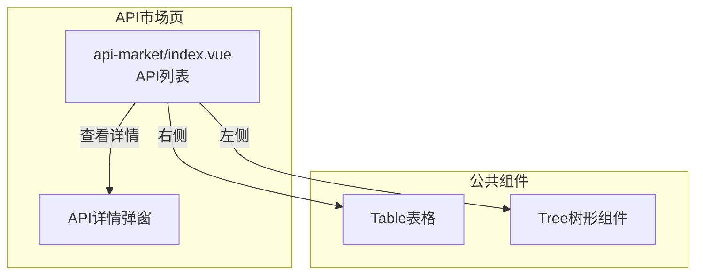
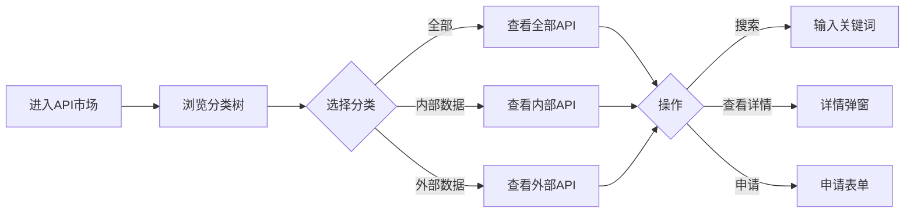

---
neo4j:
  feature: "FEAT-DFD-API-MARKET"
feishu:
  wiki: "V8KEfpg1vlkCZld"
doc:
  title: "FEAT-DFD-API-MARKET API市场-Feature说明文档"
  version: "v1.0"
  type: "Feature说明文档"
  productDomain: "PD-DFD"
  epicKey: "Epic:EPIC-DFD-ELEMENT"
  featureKey: "FEAT-DFD-API-MARKET"
  author: "Tony Stark"
  createdAt: "2026-04-30"
  updatedAt: "2026-04-30"
---

# FEAT-DFD-API-MARKET - API市场

> **版本**: v1.0
> **日期**: 2026-04-30
> **作者**: Tony Stark
> **状态**: 已完成

---

## 1. Feature 基本信息

| 字段 | 内容 |
|:---|:---|
| Feature ID | FEAT-DFD-API-MARKET |
| Feature 名称 | API市场 |
| 所属 EPIC | EPIC-DFD-ELEMENT 数据要素市场 |
| 所属产品域 | PD-DFD 数据发现 |
| 负责人 | Tony Stark |

---

## 2. Feature 概述

### 2.1 是什么
API市场提供内部和外部数据API的统一入口，支持分类浏览和接口详情查看，帮助用户快速找到所需API。

### 2.2 解决什么问题
- 不知道有哪些可用的API接口
- API信息分散，难以集中检索
- 申请调用流程不清晰

### 2.3 用户场景

| 场景 | 用户 | 描述 |
|:---|:---|:---|
| API检索 | 数据开发者 | 通过名称搜索目标API |
| 分类浏览 | 数据分析师 | 按分类树浏览API |
| 申请调用 | 数据工程师 | 申请使用API接口 |

---

## 3. 系统模块图

### 3.1 页面说明

| 页面 | 路由 | 组件 | 说明 |
|:---|:---|:---|:---|
| API市场 | /discovery/api-market | api-market/index.vue | API检索和申请页 |

### 3.2 组件说明

| 组件 | 类型 | 说明 |
|:---|:---|:---|
| Table | 公共 | API列表组件 |
| Tree | 业务 | 分类树组件 |

---

## 4. 功能说明

### 4.1 功能清单

| 功能点 | 类型 | 描述 |
|:---|:---|:---|
| FP-001 | 页面 | API搜索，按名称模糊匹配。**筛选器**：API名称文本(模糊匹配) |
| FP-002 | 页面 | 分类浏览，按分类树筛选。**分类结构**：全部/内部数据(核心交易/信贷风控/营销中心)/外部数据(外部征信/运营商数据/学信网) |
| FP-003 | 页面 | 查看详情，查看API详细信息。**数据字段**：API名称、数据提供方、所属项目、负责人、最大QPS、更新时间、状态 |
| FP-004 | 页面 | 申请调用，申请使用API。**交互**：点击"申请"按钮弹出申请表单，**流程**：申请→审批→开通 |

### 4.2 用户流程

---

## 5. 验收标准

| 验收项 | 标准 |
|:---|:---|
| 功能验收 | API搜索支持名称模糊匹配 |
| 功能验收 | 分类树正确展示分类结构（全部/内部数据/外部数据） |
| 功能验收 | 详情弹窗正确展示API信息 |
| 功能验收 | 申请调用流程正确（申请→审批→开通） |
| 功能验收 | 列表支持分页 |
| 交互验收 | 分类切换后列表自动刷新 |
| 性能验收 | 页面加载时间≤2s |

---

## 6. 依赖关系

| 依赖项 | 类型 | 说明 |
|:---|:---|:---|
| PD-DMT | 数据依赖 | API的元数据在 PD-DMT 数据服务管理模块维护 |

---

## 7. 变更记录

| 日期 | 版本 | 变更内容 | 作者 |
|:---|:---:|:---|:---|
| 2026-04-30 | v1.0 | 初始版本，基于功能清单走查重构，符合模板v1.2 | Tony Stark |

---

🦾 *Feature说明文档 v1.0 - API市场*