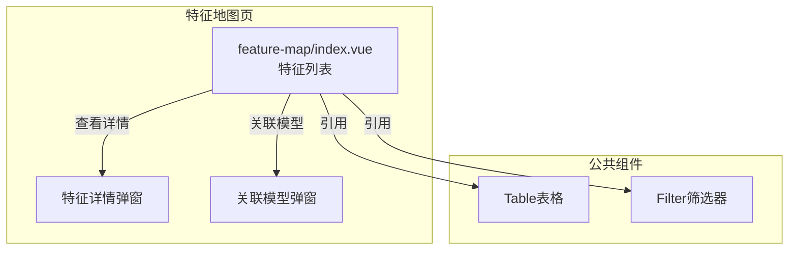
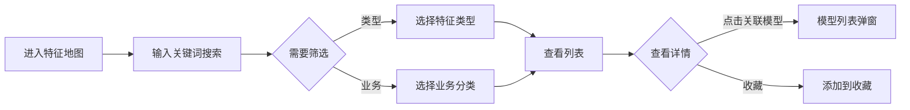

---
neo4j:
  feature: "FEAT-DFD-CHARACTER-LIST"
feishu:
  wiki: "V8KEfpg1vlkCZld"
doc:
  title: "FEAT-DFD-CHARACTER-LIST特征地图-Feature说明文档"
  version: "v1.0"
  type: "Feature说明文档"
  productDomain: "PD-DFD"
  epicKey: "Epic:EPIC-DFD-ELEMENT"
  featureKey: "FEAT-DFD-CHARACTER-LIST"
  author: "Tony Stark"
  createdAt: "2026-04-30"
  updatedAt: "2026-04-30"
---

# FEAT-DFD-CHARACTER-LIST - 特征地图

> **版本**: v1.0
> **日期**: 2026-04-30
> **作者**: Tony Stark
> **状态**: 已完成

---

## 1. Feature 基本信息

| 字段 | 内容 |
|:---|:---|
| Feature ID | FEAT-DFD-CHARACTER-LIST |
| Feature 名称 | 特征地图 |
| 所属 EPIC | EPIC-DFD-ELEMENT 数据要素市场 |
| 所属产品域 | PD-DFD 数据发现 |
| 负责人 | Tony Stark |

---

## 2. Feature 概述

### 2.1 是什么
特征地图展示和管理机器学习特征工程，支持特征的分类检索和模型关联分析，帮助数据科学家快速找到所需特征。

### 2.2 解决什么问题
- 特征数量多，难以快速找到特定特征
- 不知道特征被哪些模型使用
- 缺乏特征重要性评分参考

### 2.3 用户场景

| 场景 | 用户 | 描述 |
|:---|:---|:---|
| 特征检索 | 数据科学家 | 通过关键词搜索目标特征 |
| 特征筛选 | 数据开发者 | 按类型（数值/分类/文本）和业务分类筛选 |
| 模型关联 | 数据科学家 | 查看使用该特征的模型列表 |

---

## 3. 系统模块图

### 3.1 页面说明

| 页面 | 路由 | 组件 | 说明 |
|:---|:---|:---|:---|
| 特征地图 | /discovery/feature-map | feature-map/index.vue | 特征检索和管理页 |

### 3.2 组件说明

| 组件 | 类型 | 说明 |
|:---|:---|:---|
| Table | 公共 | 特征列表组件 |
| Filter | 业务 | 筛选器组件 |

---

## 4. 功能说明

### 4.1 功能清单

| 功能点 | 类型 | 描述 |
|:---|:---|:---|
| FP-001 | 页面 | 特征搜索，按名称模糊匹配。**筛选器**：特征名称文本(模糊匹配) |
| FP-002 | 页面 | 类型筛选，按特征类型筛选。**筛选规则**：特征类型下拉(数值型/分类型/文本型/时间型)，**说明**：数值型(连续数值)、分类型(有限类别)、文本型(文本描述)、时间型(时间戳) |
| FP-003 | 页面 | 业务分类筛选，按业务类型筛选。**筛选规则**：业务类型下拉(征信变量/行为变量)、一级分类下拉(征信报告/信贷记录/交易行为/活跃度/模型输出) |
| FP-004 | 页面 | 关联模型，查看使用该特征的模型列表。**交互**：点击"关联模型"按钮弹出模型列表弹窗，**数据**：关联模型数量、模型名称 |
| FP-005 | 页面 | 收藏功能，收藏特征。**交互**：点击收藏按钮即时生效 |

### 4.2 用户流程

---

## 5. 验收标准

| 验收项 | 标准 |
|:---|:---|
| 功能验收 | 特征搜索支持名称模糊匹配 |
| 功能验收 | 类型筛选正确区分数值/分类/文本/时间型特征 |
| 功能验收 | 业务分类筛选支持多维度筛选（业务类型+一级分类） |
| 功能验收 | 关联模型弹窗正确展示使用该特征的所有模型 |
| 功能验收 | 收藏功能点击即时生效 |
| 功能验收 | 列表支持分页 |
| 交互验收 | 筛选条件变更后自动刷新列表 |
| 性能验收 | 页面加载时间≤2s |

---

## 6. 依赖关系

| 依赖项 | 类型 | 说明 |
|:---|:---|:---|
| PD-RISK | 数据依赖 | 特征的元数据和模型关联在 PD-RISK 模型回溯模块管理 |

---

## 7. 变更记录

| 日期 | 版本 | 变更内容 | 作者 |
|:---|:---:|:---|:---|
| 2026-04-30 | v1.0 | 初始版本，基于功能清单走查重构，符合模板v1.2 | Tony Stark |

---

🦾 *Feature说明文档 v1.0 - 特征地图*