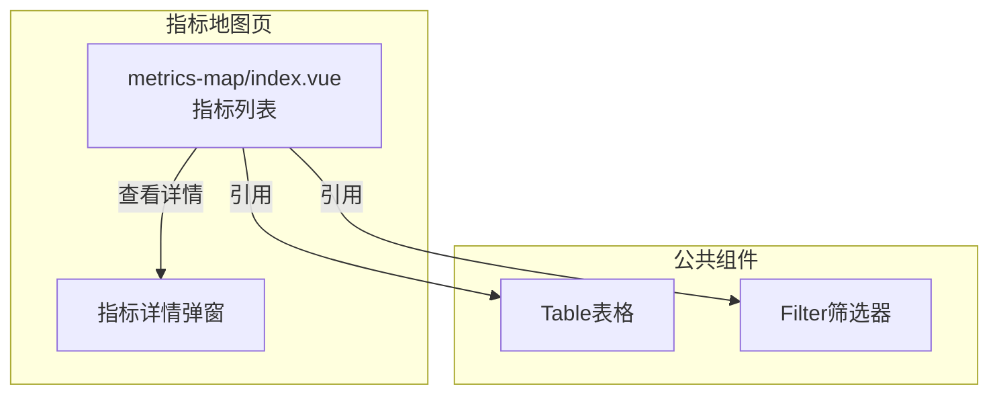
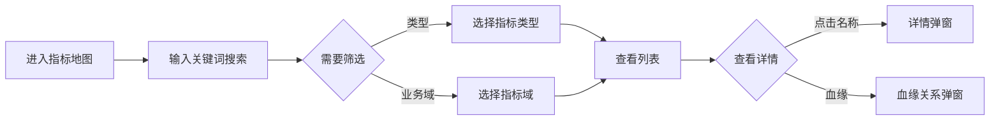

---
neo4j:
  feature: "FEAT-DFD-INDEX-LIST"
feishu:
  wiki: "V8KEfpg1vlkCZld"
doc:
  title: "FEAT-DFD-INDEX-LIST指标地图-Feature说明文档"
  version: "v1.0"
  type: "Feature说明文档"
  productDomain: "PD-DFD"
  epicKey: "Epic:EPIC-DFD-ELEMENT"
  featureKey: "FEAT-DFD-INDEX-LIST"
  author: "Tony Stark"
  createdAt: "2026-04-30"
  updatedAt: "2026-04-30"
---

# FEAT-DFD-INDEX-LIST - 指标地图

> **版本**: v1.0
> **日期**: 2026-04-30
> **作者**: Tony Stark
> **状态**: 已完成

---

## 1. Feature 基本信息

| 字段 | 内容 |
|:---|:---|
| Feature ID | FEAT-DFD-INDEX-LIST |
| Feature 名称 | 指标地图 |
| 所属 EPIC | EPIC-DFD-ELEMENT 数据要素市场 |
| 所属产品域 | PD-DFD 数据发现 |
| 负责人 | Tony Stark |

---

## 2. Feature 概述

### 2.1 是什么
指标地图展示和管理业务指标体系，支持指标的分类浏览、关键词搜索和详情查看，帮助用户快速找到所需指标。

### 2.2 解决什么问题
- 缺乏统一的指标检索入口，用户不知道去哪里找指标
- 指标定义不清晰，不知道计算口径是什么
- 缺乏指标血缘关系，不知道指标的数据来源

### 2.3 用户场景

| 场景 | 用户 | 描述 |
|:---|:---|:---|
| 指标检索 | 数据分析师 | 通过关键词搜索目标指标 |
| 指标筛选 | 数据开发者 | 按类型（原子/派生/复合）和业务域筛选 |
| 指标详情 | 数据分析师 | 查看指标详细信息和计算口径 |

---

## 3. 系统模块图

### 3.1 页面说明

| 页面 | 路由 | 组件 | 说明 |
|:---|:---|:---|:---|
| 指标地图 | /discovery/metrics-map | metrics-map/index.vue | 指标检索和管理页 |

### 3.2 组件说明

| 组件 | 类型 | 说明 |
|:---|:---|:---|
| Table | 公共 | 指标列表组件 |
| Filter | 业务 | 筛选器组件 |

---

## 4. 功能说明

### 4.1 功能清单

| 功能点 | 类型 | 描述 |
|:---|:---|:---|
| FP-001 | 页面 | 指标搜索，按名称模糊匹配。**筛选器**：指标名称文本(模糊匹配) |
| FP-002 | 页面 | 类型筛选，按指标类型筛选。**筛选规则**：指标类型下拉(原子指标/派生指标/复合指标)，**说明**：原子指标(不可拆分最小指标)、派生指标(基于原子计算)、复合指标(多指标组合) |
| FP-003 | 页面 | 指标域筛选，按业务域筛选。**筛选规则**：指标域下拉(资本监管/流动性监管/信贷风险监管) |
| FP-004 | 页面 | 查看详情，查看指标详细信息。**数据字段**：指标编码、指标名称、指标类型、指标域、计算口径、更新频率、状态(上线/下线/草稿)、负责人，**状态标签**：上线(green)、下线(gray)、草稿(orange) |
| FP-005 | 页面 | 血缘查看，查看指标血缘关系。**交互**：点击"血缘"按钮展示指标的数据来源和下游依赖 |

### 4.2 用户流程

---

## 5. 验收标准

| 验收项 | 标准 |
|:---|:---|
| 功能验收 | 指标搜索支持名称模糊匹配 |
| 功能验收 | 类型筛选正确区分原子/派生/复合指标，状态标签颜色正确（上线green、下线gray、草稿orange） |
| 功能验收 | 业务域筛选支持多选 |
| 功能验收 | 详情弹窗正确展示指标信息，包括计算口径 |
| 功能验收 | 血缘查看正确展示指标的数据来源和下游依赖 |
| 功能验收 | 列表支持分页 |
| 交互验收 | 筛选条件变更后自动刷新列表 |
| 性能验收 | 页面加载时间≤2s |

---

## 6. 依赖关系

| 依赖项 | 类型 | 说明 |
|:---|:---|:---|
| PD-DMT | 数据依赖 | 指标的定义和元数据在 PD-DMT 数据标准管理模块维护 |

---

## 7. 变更记录

| 日期 | 版本 | 变更内容 | 作者 |
|:---|:---:|:---|:---|
| 2026-04-30 | v1.0 | 初始版本，基于功能清单走查重构，符合模板v1.2 | Tony Stark |

---

🦾 *Feature说明文档 v1.0 - 指标地图*