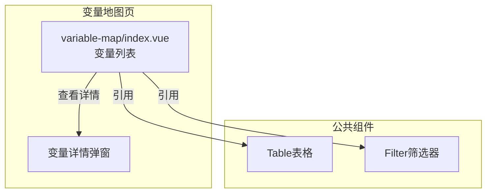
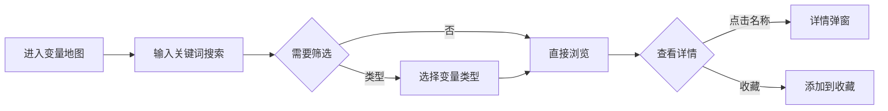

---
neo4j:
  feature: "FEAT-DFD-VARIABLE-LIST"
feishu:
  wiki: "V8KEfpg1vlkCZld"
doc:
  title: "FEAT-DFD-VARIABLE-LIST变量地图-Feature说明文档"
  version: "v1.0"
  type: "Feature说明文档"
  productDomain: "PD-DFD"
  epicKey: "Epic:EPIC-DFD-ELEMENT"
  featureKey: "FEAT-DFD-VARIABLE-LIST"
  author: "Tony Stark"
  createdAt: "2026-04-30"
  updatedAt: "2026-04-30"
---

# FEAT-DFD-VARIABLE-LIST - 变量地图

> **版本**: v1.0
> **日期**: 2026-04-30
> **作者**: Tony Stark
> **状态**: 已完成

---

## 1. Feature 基本信息

| 字段 | 内容 |
|:---|:---|
| Feature ID | FEAT-DFD-VARIABLE-LIST |
| Feature 名称 | 变量地图 |
| 所属 EPIC | EPIC-DFD-ELEMENT 数据要素市场 |
| 所属产品域 | PD-DFD 数据发现 |
| 负责人 | Tony Stark |

---

## 2. Feature 概述

### 2.1 是什么
变量地图展示和管理业务变量体系，支持变量的分类检索和详情查看，帮助用户快速找到所需变量。

### 2.2 解决什么问题
- 缺乏统一的变量检索入口
- 不知道变量的数据类型和来源表
- 缺乏变量血缘关系，不知道变量的上下游依赖

### 2.3 用户场景

| 场景 | 用户 | 描述 |
|:---|:---|:---|
| 变量检索 | 数据分析师 | 通过关键词搜索目标变量 |
| 变量筛选 | 数据开发者 | 按类型（原始/加工/衍生）筛选 |
| 变量详情 | 数据分析师 | 查看变量详细信息和数据来源 |

---

## 3. 系统模块图

### 3.1 页面说明

| 页面 | 路由 | 组件 | 说明 |
|:---|:---|:---|:---|
| 变量地图 | /discovery/variable-map | variable-map/index.vue | 变量检索和管理页 |

### 3.2 组件说明

| 组件 | 类型 | 说明 |
|:---|:---|:---|
| Table | 公共 | 变量列表组件 |
| Filter | 业务 | 筛选器组件 |

---

## 4. 功能说明

### 4.1 功能清单

| 功能点 | 类型 | 描述 |
|:---|:---|:---|
| FP-001 | 页面 | 变量搜索，按名称模糊匹配。**筛选器**：变量名称文本(模糊匹配) |
| FP-002 | 页面 | 类型筛选，按变量类型筛选。**筛选规则**：变量类型下拉(原始变量/加工变量/衍生变量) |
| FP-003 | 页面 | 收藏功能，收藏变量。**交互**：点击收藏按钮即时生效，支持在我的收藏中快速筛选 |

### 4.2 用户流程

---

## 5. 验收标准

| 验收项 | 标准 |
|:---|:---|
| 功能验收 | 变量搜索支持名称模糊匹配 |
| 功能验收 | 类型筛选正确区分原始/加工/衍生变量 |
| 功能验收 | 收藏功能点击即时生效 |
| 功能验收 | 列表支持分页 |
| 交互验收 | 筛选条件变更后自动刷新列表 |
| 性能验收 | 页面加载时间≤2s |

---

## 6. 依赖关系

| 依赖项 | 类型 | 说明 |
|:---|:---|:---|
| PD-DMT | 数据依赖 | 变量的定义和元数据在 PD-DMT 数据标准管理模块维护 |

---

## 7. 变更记录

| 日期 | 版本 | 变更内容 | 作者 |
|:---|:---:|:---|:---|
| 2026-04-30 | v1.0 | 初始版本，基于功能清单走查重构，符合模板v1.2 | Tony Stark |

---

🦾 *Feature说明文档 v1.0 - 变量地图*