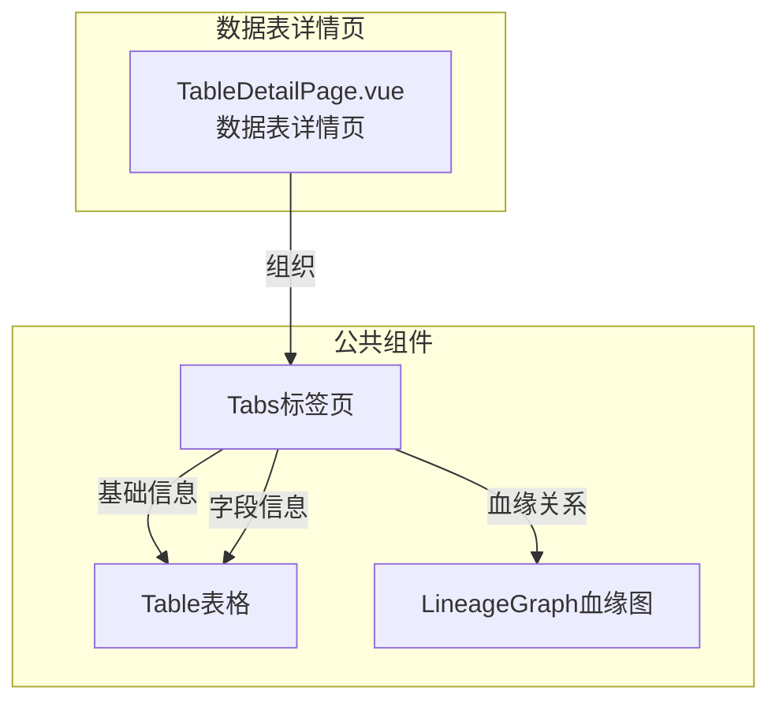

---
neo4j:
  feature: "FEAT-DFD-ASSET-DETAIL"
feishu:
  wiki: "V8KEfpg1vlkCZld"
doc:
  title: "FEAT-DFD-ASSET-DETAIL数据表详情-Feature说明文档"
  version: "v1.0"
  type: "Feature说明文档"
  productDomain: "PD-DFD"
  epicKey: "Epic:EPIC-DFD-ASSET"
  featureKey: "FEAT-DFD-ASSET-DETAIL"
  author: "Tony Stark"
  createdAt: "2026-04-30"
  updatedAt: "2026-04-30"
---

# FEAT-DFD-ASSET-DETAIL - 数据表详情

> **版本**: v1.0
> **日期**: 2026-04-30
> **作者**: Tony Stark
> **状态**: 已完成

---

## 1. Feature 基本信息

| 字段 | 内容 |
|:---|:---|
| Feature ID | FEAT-DFD-ASSET-DETAIL |
| Feature 名称 | 数据表详情 |
| 所属 EPIC | EPIC-DFD-ASSET 数据资产字典 |
| 所属产品域 | PD-DFD 数据发现 |
| 负责人 | Tony Stark |

---

## 2. Feature 概述

### 2.1 是什么
数据表详情页展示数据表的完整信息，包括基础信息、字段信息、血缘关系、使用说明等，帮助用户全面了解数据表的结构和用途。

### 2.2 解决什么问题
- 用户需要了解数据表的详细结构和含义
- 缺乏字段级别的说明，用户不知道字段的业务含义
- 缺乏血缘关系展示，用户不知道数据的上下游依赖

### 2.3 用户场景

| 场景 | 用户 | 描述 |
|:---|:---|:---|
| 表结构了解 | 数据分析师 | 查看数据表的字段列表和类型 |
| 血缘分析 | 数据开发者 | 查看数据表的上游和下游依赖关系 |
| SQL编写 | 数据工程师 | 查看SQL使用示例，快速编写查询 |

---

## 3. 系统模块图

### 3.1 页面说明

| 页面 | 路由 | 组件 | 说明 |
|:---|:---|:---|:---|
| 数据表详情 | /discovery/data-map/detail/:id | TableDetailPage.vue | 数据表详情页，支持多标签页展示 |

### 3.2 组件说明

| 组件 | 类型 | 说明 |
|:---|:---|:---|
| Tabs | 公共 | 标签页切换组件 |
| Table | 公共 | 表格展示组件，支持字段列表 |
| LineageGraph | 业务 | 血缘关系图组件 |

---

## 4. 功能说明

### 4.1 功能清单

| 功能点 | 类型 | 描述 |
|:---|:---|:---|
| FP-001 | 页面 | 基础信息展示，展示表ID、类型、业务域、负责人、更新频率等。**数据字段**：表名称、表ID、类型(维度表/事实表/汇总表)、业务域、负责人、更新频率、创建时间、最后更新时间、描述 |
| FP-002 | 页面 | 字段信息展示，展示字段列表、类型、描述、主键标识、分区标识。**数据字段**：字段名称(string)、字段类型(string)、字段描述(string)、主键标识(boolean)、分区标识(boolean) |
| FP-003 | 页面 | 血缘关系展示，展示上游表/下游表关系图。**交互**：支持缩放和拖拽查看 |
| FP-004 | 页面 | 使用说明展示，展示SQL使用示例、使用场景。**交互**：支持复制SQL |
| FP-005 | 页面 | 收藏功能，添加/取消收藏。**交互**：点击收藏按钮即时生效 |
| FP-006 | 页面 | 添加到集合，将数据表添加到数据集合。**交互**：点击"添加到集合"按钮弹出集合选择框 |

### 4.2 用户流程

---

## 5. 验收标准

| 验收项 | 标准 |
|:---|:---|
| 功能验收 | 基础信息Tab正确展示表ID、类型、业务域、负责人、更新频率等 |
| 功能验收 | 字段信息Tab正确展示字段列表，支持按名称/类型筛选 |
| 功能验收 | 血缘关系Tab正确展示上下游依赖图，支持缩放和拖拽 |
| 功能验收 | 使用说明Tab正确展示SQL示例，支持一键复制 |
| 功能验收 | 收藏功能点击即时生效 |
| 功能验收 | 添加到集合功能点击弹出集合选择框 |
| 交互验收 | Tab切换流畅，无卡顿 |
| 性能验收 | 页面加载时间≤2s |

---

## 6. 依赖关系

| 依赖项 | 类型 | 说明 |
|:---|:---|:---|
| PD-DMT | 数据依赖 | 数据表详情展示的数据来自 PD-DMT 的元数据管理 |
| Neo4j | 数据 | 血缘关系数据存储在 Neo4j 中 |

---

## 7. 变更记录

| 日期 | 版本 | 变更内容 | 作者 |
|:---|:---:|:---|:---|
| 2026-04-30 | v1.0 | 初始版本，基于功能清单走查重构，符合模板v1.2 | Tony Stark |

---

🦾 *Feature说明文档 v1.0 - 数据表详情*