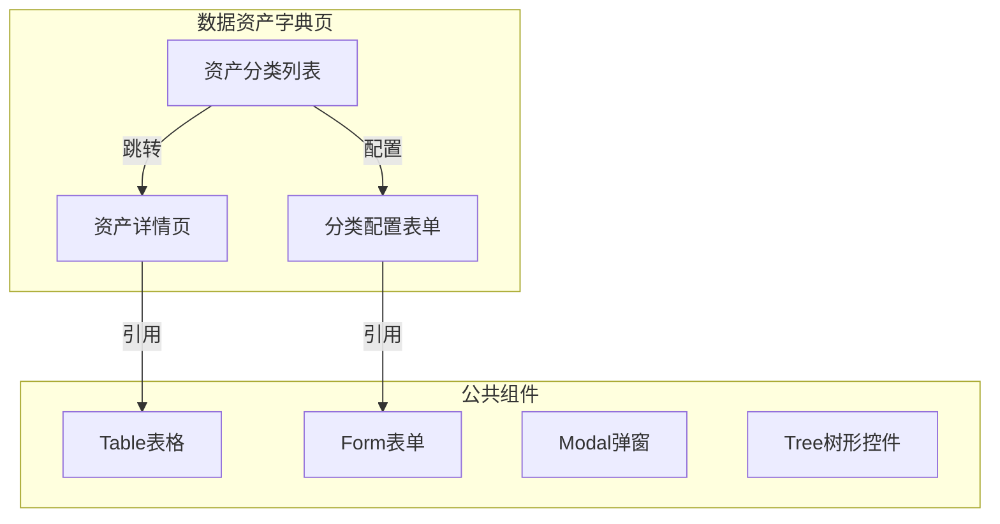
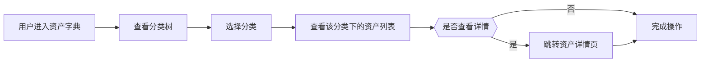

---
neo4j:
  epic: "Epic:EPIC-DFD_DATA_ASSET"
  feature: "FEAT-DFD-ASSET-DICT"
feishu:
  wiki: "V8KEfpg1vlkCZld"
doc:
  title: "FEAT-DFD-ASSET-DICT Feature说明文档"
  version: "v3.3"
  type: "Feature说明文档"
  productDomain: "PD-DFD"
  epicKey: "Epic:EPIC-DFD_DATA_ASSET"
  author: "Tony Stark"
  createdAt: "2026-04-28"
  updatedAt: "2026-04-29"
---

# FEAT-DFD-ASSET-DICT - Feature说明文档

> **版本**: v1.0
> **日期**: 2026-04-27
> **作者**: Tony Stark
> **状态**: 待开发
> **数据来源**: Neo4j

---

## 1. Feature 基本信息

| 字段 | 内容 |
|:---|:---|
| Feature ID | FEAT-DFD-ASSET-DICT |
| Feature 名称 | 数据资产字典 |
| 所属 EPIC | EPIC-DFD_DATA_ASSET 数据资产字典 |
| 优先级 | P0 |
| 状态 | 待开发 |

---

## 2. Feature 概述

### 2.1 是什么
数据资产字典是数据发现平台中用于管理数据资产元数据信息的核心模块，支持用户对数据资产进行分类、检索和管理操作。

### 2.2 解决什么问题
- 数据资产信息分散，难以统一管理
- 缺乏统一的资产分类和检索能力
- 资产元数据信息不完整，缺乏可视化展示

### 2.3 用户场景

| 场景 | 用户 | 描述 |
|:---|:---|:---|
| 资产分类管理 | 数据管理员 | 对数据资产进行分类和标签管理 |
| 资产检索 | 数据分析师 | 通过分类和关键词快速找到目标资产 |
| 资产详情查看 | 数据开发者 | 查看资产的详细信息和关联信息 |

---

## 3. 系统模块图（页面/组件结构）

### 3.1 页面说明

| 页面 | 路由 | 组件 | 说明 |
|:---|:---|:---|:---|
| 数据资产字典 | /dfd/asset/dict | AssetDictPage | 资产字典主页面，支持分类树和资产列表 |
| 资产详情 | /dfd/asset/dict/detail | AssetDictDetail | 资产详情查看页面 |

### 3.2 组件说明

| 组件 | 类型 | 说明 |
|:---|:---|:---|
| Table表格 | 公共 | 列表展示组件，支持分页和排序 |
| Tree树形控件 | 业务 | 资产分类树形结构展示 |
| Form表单 | 公共 | 表单录入组件 |
| Modal弹窗 | 公共 | 弹窗确认组件 |

---

## 4. 功能说明

### 4.1 功能清单（Feature ID映射）

> **⚠️ 重要**：业务规则（筛选器默认值、计算公式、判定逻辑、状态流转）直接写在 FP 描述里，不要单独建章节。

| 功能点 | 类型 | 描述 |
|:---|:---|:---|
| FP-001 | 页面 | 资产分类管理，支持树形结构展示和配置 |
| FP-002 | 页面 | 资产字典列表，展示所有数据资产 |
| FP-003 | 页面 | 资产详情查看，展示资产元数据信息 |

### 4.2 用户流程

---

## 5. 验收标准

| 验收项 | 标准 |
|:---|:---|
| 功能验收 | 资产分类管理功能完整，支持增删改查操作 |
| 操作验收 | 操作流畅无卡顿，响应时间≤2s |
| 数据验收 | 数据准确无误，与数据源保持一致 |
| 交互验收 | 符合UI设计规范，交互反馈及时 |

---

## 6. 依赖关系

| 依赖项 | 类型 | 说明 |
|:---|:---|:---|
| 后端数据接口 | 接口 | 提供资产分类和字典数据服务 |
| Neo4j图数据库 | 数据 | 存储资产分类结构数据 |

---

## 2. 功能描述

数据资产字典功能，管理数据资产的元数据信息。

---

## 3. 验收标准

| 验收项 | 标准 |
|:---|:---|
| 功能验收 | 资产字典管理功能完整 |
| 操作验收 | 操作流畅 |
| 数据验收 | 数据准确 |
| 交互验收 | 符合UI规范 |

---

🦈 *Feature 说明文档 v1.0*
