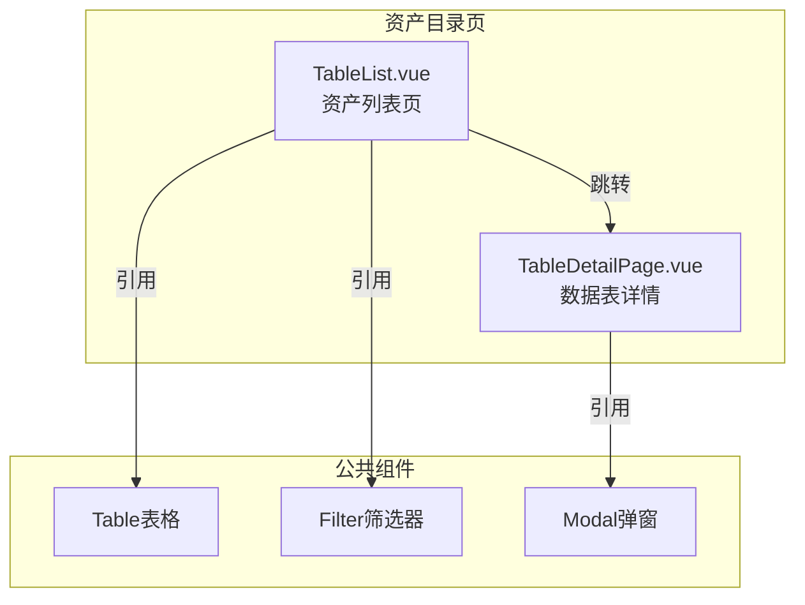
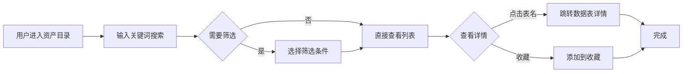

---
neo4j:
  feature: "FEAT-DFD-ASSET-LIST"
feishu:
  wiki: "V8KEfpg1vlkCZld"
doc:
  title: "FEAT-DFD-ASSET-LIST资产目录-Feature说明文档"
  version: "v1.0"
  type: "Feature说明文档"
  productDomain: "PD-DFD"
  epicKey: "Epic:EPIC-DFD-ASSET"
  featureKey: "FEAT-DFD-ASSET-LIST"
  author: "Tony Stark"
  createdAt: "2026-04-30"
  updatedAt: "2026-04-30"
---

# FEAT-DFD-ASSET-LIST - 资产目录

> **版本**: v1.0
> **日期**: 2026-04-30
> **作者**: Tony Stark
> **状态**: 已完成

---

## 1. Feature 基本信息

| 字段 | 内容 |
|:---|:---|
| Feature ID | FEAT-DFD-ASSET-LIST |
| Feature 名称 | 资产目录 |
| 所属 EPIC | EPIC-DFD-ASSET 数据资产字典 |
| 所属产品域 | PD-DFD 数据发现 |
| 负责人 | Tony Stark |

---

## 2. Feature 概述

### 2.1 是什么
资产目录是数据资产发现的核心功能，提供数据资产的多维度检索和列表展示能力，支持用户快速查找和筛选所需的数据资产。

### 2.2 解决什么问题
- 数据资产分散，缺乏统一的检索入口
- 无法按业务域、类型等维度快速筛选
- 数据资产信息不完整，缺乏可视化展示

### 2.3 用户场景

| 场景 | 用户 | 描述 |
|:---|:---|:---|
| 资产检索 | 数据分析师 | 通过关键词快速搜索目标数据资产 |
| 资产筛选 | 数据开发者 | 按业务域、类型等维度筛选数据资产 |
| 资产管理 | 数据管理员 | 管理和维护数据资产信息 |

---

## 3. 系统模块图

### 3.1 页面说明

| 页面 | 路由 | 组件 | 说明 |
|:---|:---|:---|:---|
| 资产目录 | /discovery/data-map/table-list | TableList.vue | 数据资产列表主页面 |

### 3.2 组件说明

| 组件 | 类型 | 说明 |
|:---|:---|:---|
| Table | 公共 | 列表展示组件，支持分页和排序 |
| Filter | 业务 | 筛选条件组件 |
| Modal | 公共 | 弹窗确认组件 |

---

## 4. 功能说明

### 4.1 功能清单

| 功能点 | 类型 | 描述 |
|:---|:---|:---|
| FP-001 | 页面 | 资产搜索，支持关键词模糊匹配表名/描述。**筛选器**：关键词文本(表名/描述)、业务域下拉(所属业务域)、表类型下拉(维度表/事实表/汇总表)、更新频率下拉(实时/日更新/周更新)、状态下拉(上线/下线/维护中) |
| FP-002 | 页面 | 业务域筛选，按所属业务域筛选数据资产。**筛选规则**：支持多选 |
| FP-003 | 页面 | 类型筛选，按表类型筛选。**筛选规则**：维度表/事实表/汇总表 |
| FP-004 | 页面 | 收藏功能，收藏数据资产。**交互**：点击收藏按钮即时生效，支持在我的收藏中快速筛选 |
| FP-005 | 页面 | 权限申请，申请数据资产的使用权限。**交互**：点击"申请权限"按钮弹出申请表单 |

### 4.2 用户流程

---

## 5. 验收标准

| 验收项 | 标准 |
|:---|:---|
| 功能验收 | 关键词搜索支持表名/描述模糊匹配 |
| 功能验收 | 业务域筛选支持下拉多选 |
| 功能验收 | 表类型筛选支持维度表/事实表/汇总表单选 |
| 功能验收 | 收藏功能点击即时生效 |
| 功能验收 | 权限申请点击弹出申请表单 |
| 功能验收 | 列表支持分页（10/20/50/100条） |
| 功能验收 | 导出列表支持CSV格式 |
| 交互验收 | 筛选条件变更后自动刷新列表 |
| 性能验收 | 页面加载时间≤2s |

---

## 6. 依赖关系

| 依赖项 | 类型 | 说明 |
|:---|:---|:---|
| PD-DMT | 数据依赖 | 资产目录展示的数据来自 PD-DMT 的元数据管理，包括资产的基础信息、上下架状态 |

---

## 7. 变更记录

| 日期 | 版本 | 变更内容 | 作者 |
|:---|:---:|:---|:---|
| 2026-04-30 | v1.0 | 初始版本，基于功能清单走查重构，符合模板v1.2 | Tony Stark |

---

🦾 *Feature说明文档 v1.0 - 资产目录*