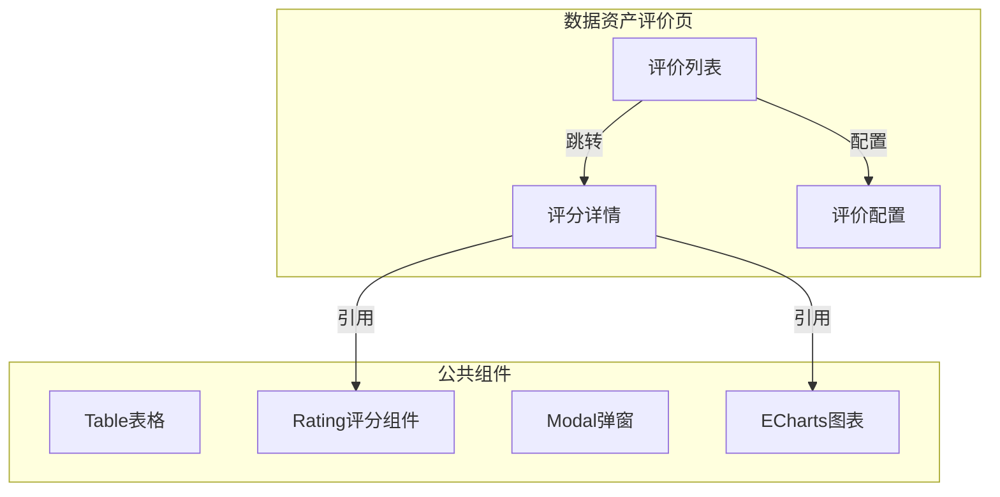
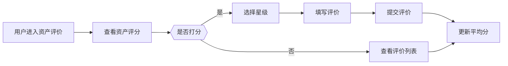

---
neo4j:
  epic: "Epic:EPIC-DFD_ASSET_OPERATE_TOOL"
  feature: "FEAT-DFD-ASSET-EVALUATION"
feishu:
  wiki: "V8KEfpg1vlkCZld"
doc:
  title: "FEAT-DFD-ASSET-EVALUATION Feature说明文档"
  version: "v3.3"
  type: "Feature说明文档"
  productDomain: "PD-DFD"
  epicKey: "Epic:EPIC-DFD_ASSET_OPERATE_TOOL"
  author: "Tony Stark"
  createdAt: "2026-04-28"
  updatedAt: "2026-04-29"
---

# FEAT-DFD-ASSET-EVALUATION - Feature说明文档

> **版本**: v1.0
> **日期**: 2026-04-27
> **作者**: Tony Stark
> **状态**: 待开发
> **数据来源**: PRD v1.2 + Neo4j

---

## 1. Feature 基本信息

| 字段 | 内容 |
|:---|:---|
| Feature ID | FEAT-DFD-ASSET-EVALUATION |
| Feature 名称 | 资产评价体系 |
| 所属 EPIC | EPIC-DFD_ASSET_TOOL 数据资产运营工具 |
| 优先级 | P0 |
| 状态 | 待开发 |

---

## 2. Feature 概述

### 2.1 是什么
数据资产评价是数据发现平台中用于构建多维度数据资产质量评价体系的功能模块，对数据资产进行综合评分，帮助用户发现高质量资产。

### 2.2 解决什么问题
- 缺乏统一的资产质量评价标准
- 难以识别高质量数据资产
- 用户无法对资产进行主观评价和反馈

### 2.3 用户场景

| 场景 | 用户 | 描述 |
|:---|:---|:---|
| 资产评分 | 数据分析师 | 对使用的数据资产进行1-5星评价 |
| 评价查看 | 数据开发者 | 查看资产的整体评分和评价分布 |
| 质量分析 | 数据管理员 | 通过评分发现低质量资产并改进 |

---

## 3. 系统模块图（页面/组件结构）



### 3.1 页面说明

| 页面 | 路由 | 组件 | 说明 |
|:---|:---|:---|:---|
| 数据资产评价 | /dfd/asset/evaluation | AssetEvalPage | 评价主页面 |
| 评分详情 | /dfd/asset/evaluation/detail | RatingDetail | 评分详情页 |
| 评价配置 | /dfd/asset/evaluation/config | EvalConfig | 评价体系配置页 |

### 3.2 组件说明

| 组件 | 类型 | 说明 |
|:---|:---|:---|
| Rating评分组件 | 业务 | 星级评分组件 |
| ECharts图表 | 公共 | 评分分布图表展示 |
| Table表格 | 公共 | 评价列表展示 |
| Modal弹窗 | 公共 | 评价输入弹窗 |

---

## 4. 功能说明

### 4.1 功能清单（Feature ID映射）

> **⚠️ 重要**：业务规则（筛选器默认值、计算公式、判定逻辑、状态流转）直接写在 FP 描述里，不要单独建章节。

| 功能点 | 类型 | 描述 |
|:---|:---|:---|
| FP-001 | 页面 | 评价体系配置，支持多维度权重设置 |
| FP-002 | 页面 | 用户打分，支持1-5星评价 |
| FP-003 | 页面 | 评价统计，展示评分分布和列表 |

### 4.2 用户流程



---

## 5. 验收标准

| 验收项 | 标准 |
|:---|:---|
| 功能验收 | 评价体系配置、多维度评分计算、用户打分、评价统计功能完整 |
| 操作验收 | 评分交互流畅，提交反馈及时，响应时间≤2s |
| 数据验收 | 评分计算准确，评价数据正确存储和展示 |
| 交互验收 | 符合UI规范，评分组件交互友好 |

---

## 6. 依赖关系

| 依赖项 | 类型 | 说明 |
|:---|:---|:---|
| 后端评价接口 | 接口 | 提供评价数据和评分计算服务 |
| Redis缓存 | 数据 | 缓存综合评分数据 |
| MySQL数据库 | 数据 | 存储用户评价数据 |

---

## 2. 功能描述

构建多维度数据资产质量评价体系，对数据资产进行综合评分，帮助用户发现高质量资产。包含评价体系配置、用户打分、评价统计三个子功能。

---

## 3. 路由信息

| 字段 | 内容 |
|:---|:---|
| 前端路由 | /discovery/asset-evaluation |
| 后端接口前缀 | /api/v1/asset-evaluation |

---

## 4. FP 清单

### FP-EVA-001 评价体系

| 字段 | 内容 |
|:---|:---|
| FP ID | FP-EVA-001 |
| 功能点名称 | 评价体系 |
| 功能描述 | 评价维度（质量/覆盖率/使用率）权重可配置，综合评分计算，评分展示 |
| 优先级 | P0 |
| 状态 | 待开发 |

### FP-EVA-002 评价打分

| 字段 | 内容 |
|:---|:---|
| FP ID | FP-EVA-002 |
| 功能点名称 | 评价打分 |
| 功能描述 | 用户对资产进行1-5星主观评价，填写文字评价，实时更新平均分 |
| 优先级 | P0 |
| 状态 | 待开发 |

### FP-EVA-003 评价统计

| 字段 | 内容 |
|:---|:---|
| FP ID | FP-EVA-003 |
| 功能点名称 | 评价统计 |
| 功能描述 | 评分分布展示，评价列表，按评分/时间排序筛选 |
| 优先级 | P0 |
| 状态 | 待开发 |

---

## 5. 关联 Story

| Story ID | Story 名称 | 优先级 | 状态 |
|:---|:---|:---:|:---:|
| Story-EVA-001 | 评价体系 | P0 | 待开发 |
| Story-EVA-002 | 评价打分 | P0 | 待开发 |
| Story-EVA-003 | 评价统计 | P0 | 待开发 |

---

## 6. 验收标准

| 验收项 | 标准 |
|:---|:---|
| 功能验收 | 评价体系维度配置、多维度评分计算、用户打分、评价统计功能完整 |
| 操作验收 | 评分交互流畅，提交反馈及时 |
| 数据验收 | 评分计算准确，评价数据正确存储和展示 |
| 交互验收 | 符合UI规范，评分组件交互友好 |

---

## 7. 数据流向

```
用户评价 → 评价服务 → 评价库（MySQL）
                     ↓
              综合评分计算 → 缓存（Redis）
                                ↓
                         评分展示 → 前端展示
```

---

## 8. 备注

- 评价体系从 Feature 1（血缘分析）中独立拆出，作为独立的 Feature 3
- Story ID 前缀 EVA- 与 Feature ID 前缀一致
- 综合评分公式：综合分 = 质量分×60% + 覆盖率×20% + 使用率×20%

---

🦈 *Feature 说明文档 v1.0 | Tony Stark*
