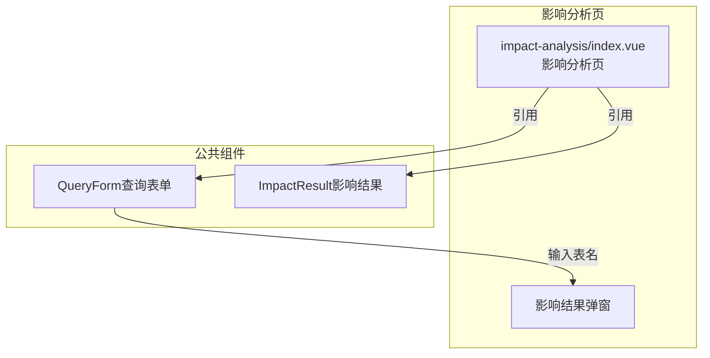
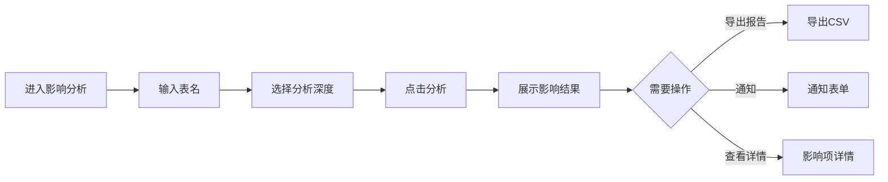

---
neo4j:
  feature: "FEAT-DFD-IMPACT"
feishu:
  wiki: "V8KEfpg1vlkCZld"
doc:
  title: "FEAT-DFD-IMPACT影响分析-Feature说明文档"
  version: "v1.0"
  type: "Feature说明文档"
  productDomain: "PD-DFD"
  epicKey: "Epic:EPIC-DFD-METADATA"
  featureKey: "FEAT-DFD-IMPACT"
  author: "Tony Stark"
  createdAt: "2026-04-30"
  updatedAt: "2026-04-30"
---

# FEAT-DFD-IMPACT - 影响分析

> **版本**: v1.0
> **日期**: 2026-04-30
> **作者**: Tony Stark
> **状态**: 已完成

---

## 1. Feature 基本信息

| 字段 | 内容 |
|:---|:---|
| Feature ID | FEAT-DFD-IMPACT |
| Feature 名称 | 影响分析 |
| 所属 EPIC | EPIC-DFD-METADATA 元数据检索 |
| 所属产品域 | PD-DFD 数据发现 |
| 负责人 | Tony Stark |

---

## 2. Feature 概述

### 2.1 是什么
影响分析评估数据变更对下游业务的影响范围，帮助用户了解变更数据可能带来的风险。

### 2.2 解决什么问题
- 数据变更前不知道会影响哪些下游系统
- 无法量化影响范围的大小
- 缺乏通知下游负责人的机制

### 2.3 用户场景

| 场景 | 用户 | 描述 |
|:---|:---|:---|
| 影响评估 | 数据工程师 | 评估表变更对下游的影响 |
| 风险评估 | 数据管理员 | 判断变更风险等级 |
| 通知下游 | 数据负责人 | 通知下游负责人变更情况 |

---

## 3. 系统模块图

### 3.1 页面说明

| 页面 | 路由 | 组件 | 说明 |
|:---|:---|:---|:---|
| 影响分析 | /discovery/impact-analysis | impact-analysis/index.vue | 影响分析页 |

### 3.2 组件说明

| 组件 | 类型 | 说明 |
|:---|:---|:---|
| QueryForm | 业务 | 影响分析查询表单组件 |
| ImpactResult | 业务 | 影响结果展示组件 |

---

## 4. 功能说明

### 4.1 功能清单

| 功能点 | 类型 | 描述 |
|:---|:---|:---|
| FP-001 | 页面 | 影响查询，分析表的影响范围。**筛选器**：表名文本输入、分析深度下拉(影响范围深度) |
| FP-002 | 页面 | 影响分级，展示高/中/低影响等级。**影响等级**：高影响(红色，影响核心业务流程)、中影响(橙色，影响一般业务流程)、低影响(黄色，影响边缘业务流程)、无影响(绿色，不影响) |
| FP-003 | 页面 | 影响报告，导出影响分析报告。**交互**：点击"导出"按钮导出CSV格式报告，**内容**：影响项列表、影响等级、影响原因 |
| FP-004 | 页面 | 通知功能，通知下游负责人。**交互**：点击"通知"按钮弹出通知表单，**内容**：变更说明、影响范围、建议措施 |

### 4.2 用户流程

---

## 5. 验收标准

| 验收项 | 标准 |
|:---|:---|
| 功能验收 | 影响查询正确返回影响范围 |
| 功能验收 | 影响分级正确显示高(红色)/中(橙色)/低(黄色)/无(绿色)影响等级 |
| 功能验收 | 导出报告包含影响项列表、影响等级、影响原因 |
| 功能验收 | 通知功能包含变更说明、影响范围、建议措施 |
| 交互验收 | 影响结果支持点击查看详情 |
| 性能验收 | 页面加载时间≤2s，影响分析≤5s |

---

## 6. 依赖关系

| 依赖项 | 类型 | 说明 |
|:---|:---|:---|
| Neo4j | 数据 | 影响分析依赖血缘关系数据 |
| PD-DMT | 数据依赖 | 影响分析依赖 PD-DMT 的元数据采集 |

---

## 7. 变更记录

| 日期 | 版本 | 变更内容 | 作者 |
|:---|:---:|:---|:---|
| 2026-04-30 | v1.0 | 初始版本，基于功能清单走查重构，符合模板v1.2 | Tony Stark |

---

🦾 *Feature说明文档 v1.0 - 影响分析*