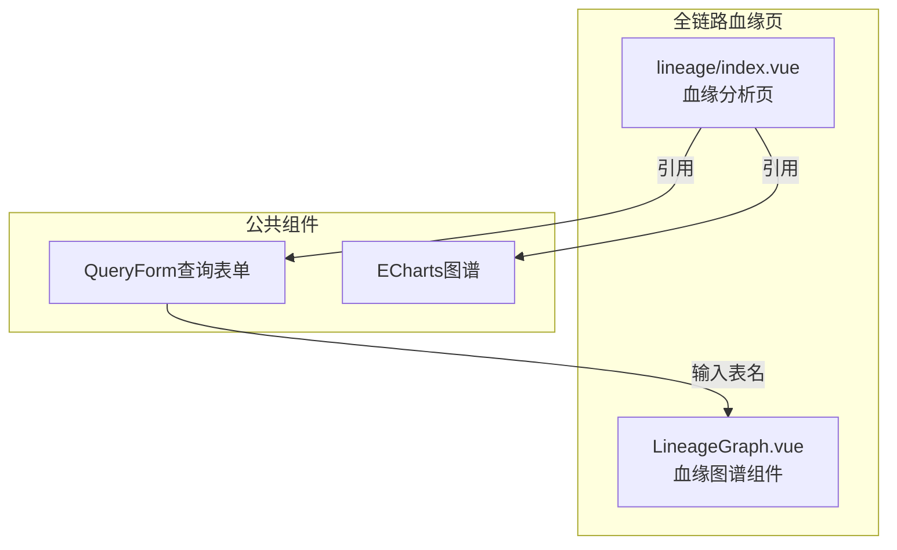
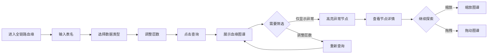

---
neo4j:
  feature: "FEAT-DFD-LINEAGE"
feishu:
  wiki: "V8KEfpg1vlkCZld"
doc:
  title: "FEAT-DFD-LINEAGE全链路血缘-Feature说明文档"
  version: "v1.0"
  type: "Feature说明文档"
  productDomain: "PD-DFD"
  epicKey: "Epic:EPIC-DFD-METADATA"
  featureKey: "FEAT-DFD-LINEAGE"
  author: "Tony Stark"
  createdAt: "2026-04-30"
  updatedAt: "2026-04-30"
---

# FEAT-DFD-LINEAGE - 全链路血缘

> **版本**: v1.0
> **日期**: 2026-04-30
> **作者**: Tony Stark
> **状态**: 已完成

---

## 1. Feature 基本信息

| 字段 | 内容 |
|:---|:---|
| Feature ID | FEAT-DFD-LINEAGE |
| Feature 名称 | 全链路血缘 |
| 所属 EPIC | EPIC-DFD-METADATA 元数据检索 |
| 所属产品域 | PD-DFD 数据发现 |
| 负责人 | Tony Stark |

---

## 2. Feature 概述

### 2.1 是什么
全链路血缘分析支持查看数据表、指标、API、变量等多种数据资产的血缘关系，帮助用户了解数据的上下游依赖。

### 2.2 解决什么问题
- 不知道数据的来源，无法追溯数据链路
- 变更数据时不知道会影响哪些下游
- 缺乏可视化的血缘图展示

### 2.3 用户场景

| 场景 | 用户 | 描述 |
|:---|:---|:---|
| 血缘查询 | 数据分析师 | 查询特定表的上下游血缘 |
| 影响评估 | 数据工程师 | 评估表变更对下游的影响 |
| 数据溯源 | 数据管理员 | 追溯数据来源链路 |

---

## 3. 系统模块图

### 3.1 页面说明

| 页面 | 路由 | 组件 | 说明 |
|:---|:---|:---|:---|
| 全链路血缘 | /discovery/lineage | lineage/index.vue | 血缘分析页 |

### 3.2 组件说明

| 组件 | 类型 | 说明 |
|:---|:---|:---|
| QueryForm | 业务 | 血缘查询表单组件 |
| LineageGraph | 业务 | 血缘图谱组件（ECharts） |

---

## 4. 功能说明

### 4.1 功能清单

| 功能点 | 类型 | 描述 |
|:---|:---|:---|
| FP-001 | 页面 | 血缘查询，查询指定表的上下游血缘。**筛选器**：表名文本输入、数据类型多选(数据表/指标/API/变量)、层数数字输入(1-3层) |
| FP-002 | 页面 | 层数调整，切换上下游查询层数。**交互**：修改层数字段后点击查询，**规则**：支持1-3层切换 |
| FP-003 | 页面 | 类型筛选，按数据类型筛选节点。**交互**：选择数据类型后点击查询，**节点颜色**：数据表(蓝色)、指标(绿色)、API(紫色)、变量(橙色) |
| FP-004 | 页面 | 异常标记，高亮显示异常节点。**交互**：勾选"仅显示异常"复选框，**规则**：异常节点红色高亮 |
| FP-005 | 页面 | 节点交互，查看节点详细信息。**交互**：点击节点弹出节点详情弹窗，**图谱交互**：支持缩放（鼠标滚轮）和拖拽（按住拖动） |

### 4.2 用户流程

---

## 5. 验收标准

| 验收项 | 标准 |
|:---|:---|
| 功能验收 | 血缘查询正确返回上下游血缘关系 |
| 功能验收 | 层数调整支持1-3层切换 |
| 功能验收 | 类型筛选正确显示不同颜色节点（数据表blue、指标green、APIpurple、变量orange） |
| 功能验收 | 异常标记正确高亮显示异常节点 |
| 功能验收 | 节点点击弹出详情弹窗 |
| 功能验收 | 图谱支持缩放（鼠标滚轮）和拖拽 |
| 性能验收 | 页面加载时间≤2s，血缘查询≤3s |

---

## 6. 依赖关系

| 依赖项 | 类型 | 说明 |
|:---|:---|:---|
| Neo4j | 数据 | 血缘关系数据存储在 Neo4j 图数据库中 |
| PD-DMT | 数据依赖 | 血缘分析依赖 PD-DMT 的元数据采集 |

---

## 7. 变更记录

| 日期 | 版本 | 变更内容 | 作者 |
|:---|:---:|:---|:---|
| 2026-04-30 | v1.0 | 初始版本，基于功能清单走查重构，符合模板v1.2 | Tony Stark |

---

🦾 *Feature说明文档 v1.0 - 全链路血缘*