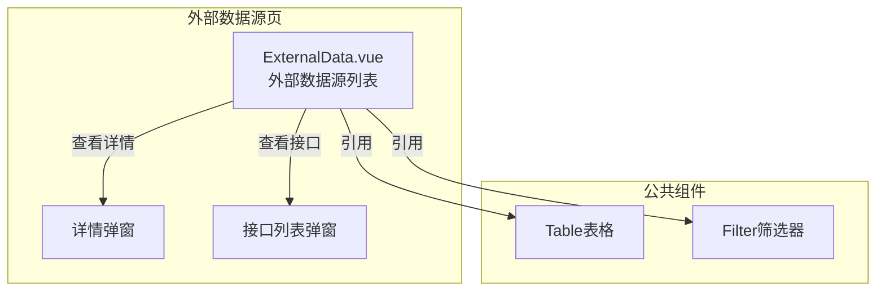
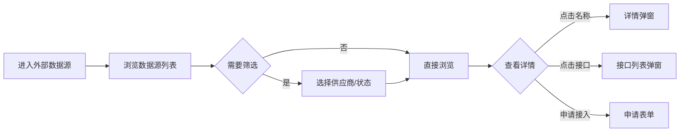

---
neo4j:
  feature: "FEAT-DFD-RES-EXTERNAL"
feishu:
  wiki: "V8KEfpg1vlkCZld"
doc:
  title: "FEAT-DFD-RES-EXTERNAL外部数据源-Feature说明文档"
  version: "v1.0"
  type: "Feature说明文档"
  productDomain: "PD-DFD"
  epicKey: "Epic:EPIC-DFD-RESOURCE"
  featureKey: "FEAT-DFD-RES-EXTERNAL"
  author: "Tony Stark"
  createdAt: "2026-04-30"
  updatedAt: "2026-04-30"
---

# FEAT-DFD-RES-EXTERNAL - 外部数据源

> **版本**: v1.0
> **日期**: 2026-04-30
> **作者**: Tony Stark
> **状态**: 已完成

---

## 1. Feature 基本信息

| 字段 | 内容 |
|:---|:---|
| Feature ID | FEAT-DFD-RES-EXTERNAL |
| Feature 名称 | 外部数据源 |
| 所属 EPIC | EPIC-DFD-RESOURCE 数据资源字典 |
| 所属产品域 | PD-DFD 数据发现 |
| 负责人 | Tony Stark |

---

## 2. Feature 概述

### 2.1 是什么
外部数据源管理和展示外部供应商提供的数据资源，支持查看数据源信息、接口列表和申请接入。

### 2.2 解决什么问题
- 缺乏统一的外部数据源管理平台
- 不知道有哪些外部数据可用
- 申请接入流程繁琐

### 2.3 用户场景

| 场景 | 用户 | 描述 |
|:---|:---|:---|
| 数据源检索 | 数据分析师 | 搜索和浏览可用的外部数据源 |
| 接口查看 | 数据开发者 | 查看数据源提供的接口列表 |
| 申请接入 | 数据工程师 | 申请使用外部数据源 |

---

## 3. 系统模块图

### 3.1 页面说明

| 页面 | 路由 | 组件 | 说明 |
|:---|:---|:---|:---|
| 外部数据源 | /discovery/data-resources/external-data | ExternalData.vue | 外部数据源管理页 |

### 3.2 组件说明

| 组件 | 类型 | 说明 |
|:---|:---|:---|
| Table | 公共 | 列表展示组件 |
| Filter | 业务 | 筛选器组件 |

---

## 4. 功能说明

### 4.1 功能清单

| 功能点 | 类型 | 描述 |
|:---|:---|:---|
| FP-001 | 页面 | 数据源管理，外部数据源列表展示。**数据字段**：数据源名称、供应商、数据类型、接口数量、日调用量、状态(正常/暂停/下线)、创建时间、描述 |
| FP-002 | 页面 | 接口管理，查看数据源提供的接口列表。**交互**：点击"接口"按钮弹出接口列表弹窗 |
| FP-003 | 页面 | 申请接入，申请使用数据源。**交互**：点击"申请接入"按钮弹出申请表单，**状态**：申请待审批 |
| FP-004 | 页面 | 状态切换，启用或禁用数据源。**交互**：切换状态开关，**规则**：禁用后不可申请接入 |

### 4.2 用户流程

---

## 5. 验收标准

| 验收项 | 标准 |
|:---|:---|
| 功能验收 | 数据源列表正确展示数据源信息 |
| 功能验收 | 接口列表弹窗正确展示接口列表 |
| 功能验收 | 申请接入表单包含必填字段，提交后状态为待审批 |
| 功能验收 | 状态切换即时生效，禁用后不可申请 |
| 功能验收 | 列表支持分页 |
| 交互验收 | 筛选条件变更后自动刷新列表 |
| 性能验收 | 页面加载时间≤2s |

---

## 6. 依赖关系

| 依赖项 | 类型 | 说明 |
|:---|:---|:---|
| PD-RISK | 数据依赖 | 外部数据源的供应商信息和定价在 PD-RISK 外数生命周期模块管理 |

---

## 7. 变更记录

| 日期 | 版本 | 变更内容 | 作者 |
|:---|:---:|:---|:---|
| 2026-04-30 | v1.0 | 初始版本，基于功能清单走查重构，符合模板v1.2 | Tony Stark |

---

🦾 *Feature说明文档 v1.0 - 外部数据源*