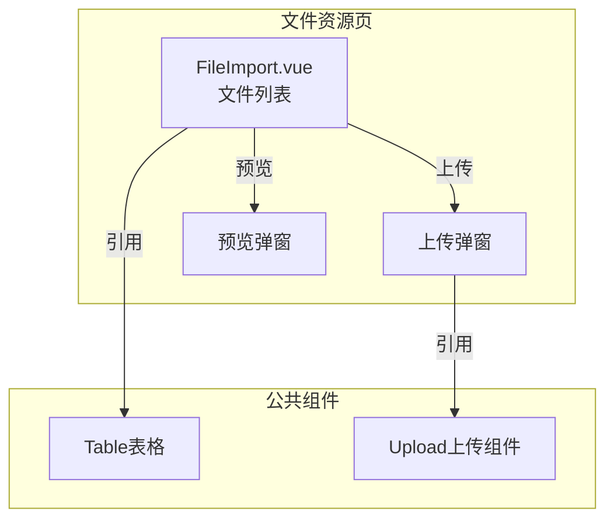
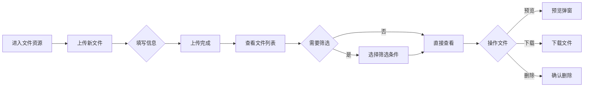

---
neo4j:
  feature: "FEAT-DFD-RES-FILE"
feishu:
  wiki: "V8KEfpg1vlkCZld"
doc:
  title: "FEAT-DFD-RES-FILE文件资源-Feature说明文档"
  version: "v1.0"
  type: "Feature说明文档"
  productDomain: "PD-DFD"
  epicKey: "Epic:EPIC-DFD-RESOURCE"
  featureKey: "FEAT-DFD-RES-FILE"
  author: "Tony Stark"
  createdAt: "2026-04-30"
  updatedAt: "2026-04-30"
---

# FEAT-DFD-RES-FILE - 文件资源

> **版本**: v1.0
> **日期**: 2026-04-30
> **作者**: Tony Stark
> **状态**: 已完成

---

## 1. Feature 基本信息

| 字段 | 内容 |
|:---|:---|
| Feature ID | FEAT-DFD-RES-FILE |
| Feature 名称 | 文件资源 |
| 所属 EPIC | EPIC-DFD-RESOURCE 数据资源字典 |
| 所属产品域 | PD-DFD 数据发现 |
| 负责人 | Tony Stark |

---

## 2. Feature 概述

### 2.1 是什么
文件资源是文件类数据数据资源字典功能，支持上传和管理各类数据文件（CSV/Excel/JSON/TXT），帮助用户管理和共享离线数据文件。

### 2.2 解决什么问题
- 缺乏统一的文件上传和管理平台
- 无法预览文件内容，需要下载到本地查看
- 文件管理混乱，难以快速定位特定文件

### 2.3 用户场景

| 场景 | 用户 | 描述 |
|:---|:---|:---|
| 文件上传 | 数据分析师 | 上传数据文件供团队共享 |
| 文件搜索 | 数据开发者 | 按名称和类型搜索文件 |
| 数据预览 | 数据分析师 | 预览文件内容，确认数据质量 |

---

## 3. 系统模块图

### 3.1 页面说明

| 页面 | 路由 | 组件 | 说明 |
|:---|:---|:---|:---|
| 文件资源 | /discovery/data-resources/file-import | FileImport.vue | 文件数据资源字典页 |

### 3.2 组件说明

| 组件 | 类型 | 说明 |
|:---|:---|:---|
| Table | 公共 | 文件列表组件 |
| Upload | 业务 | 文件上传组件 |

---

## 4. 功能说明

### 4.1 功能清单

| 功能点 | 类型 | 描述 |
|:---|:---|:---|
| FP-001 | 页面 | 文件上传，上传新的数据文件。**支持格式**：CSV/Excel/JSON/TXT，**限制**：单个文件最大100MB |
| FP-002 | 页面 | 文件搜索，按名称和类型搜索。**筛选器**：文件名称文本(模糊匹配)、文件类型下拉(CSV/Excel/JSON/TXT)、上传时间日期选择(范围) |
| FP-003 | 页面 | 数据预览，预览文件内容。**交互**：点击"预览"按钮弹出预览弹窗，**规则**：默认展示前100行数据 |
| FP-004 | 页面 | 下载文件，下载原始文件。**交互**：点击"下载"按钮触发下载 |
| FP-005 | 页面 | 删除文件，删除上传的文件。**交互**：点击"删除"按钮，**确认**：需二次确认 |

### 4.2 用户流程

---

## 5. 验收标准

| 验收项 | 标准 |
|:---|:---|
| 功能验收 | 文件上传支持CSV/Excel/JSON/TXT格式，单个文件最大100MB |
| 功能验收 | 文件搜索支持名称模糊匹配和类型筛选 |
| 功能验收 | 数据预览默认展示前100行，支持滚动查看更多 |
| 功能验收 | 下载文件功能正常 |
| 功能验收 | 删除文件需要二次确认，确认后删除 |
| 功能验收 | 列表支持分页 |
| 交互验收 | 上传进度实时显示 |
| 性能验收 | 页面加载时间≤2s，文件预览≤5s |

---

## 6. 依赖关系

| 依赖项 | 类型 | 说明 |
|:---|:---|:---|
| 文件存储服务 | 数据 | 文件存储在HDFS/OSS等分布式存储中 |

---

## 7. 变更记录

| 日期 | 版本 | 变更内容 | 作者 |
|:---|:---:|:---|:---|
| 2026-04-30 | v1.0 | 初始版本，基于功能清单走查重构，符合模板v1.2 | Tony Stark |

---

🦾 *Feature说明文档 v1.0 - 文件资源*