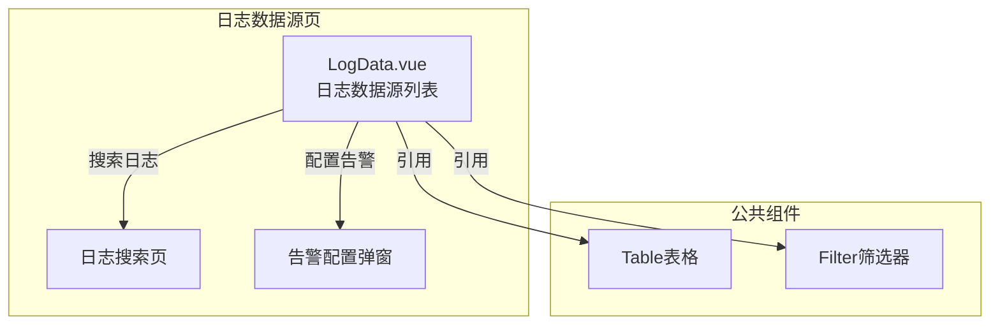
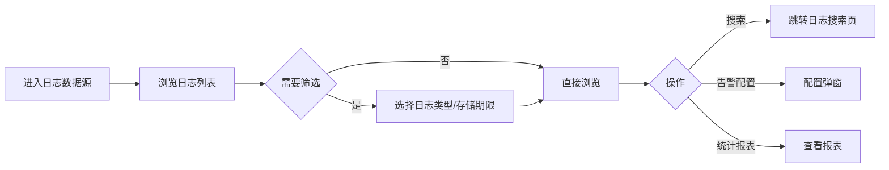

---
neo4j:
  feature: "FEAT-DFD-RES-LOG"
feishu:
  wiki: "V8KEfpg1vlkCZld"
doc:
  title: "FEAT-DFD-RES-LOG日志数据源-Feature说明文档"
  version: "v1.0"
  type: "Feature说明文档"
  productDomain: "PD-DFD"
  epicKey: "Epic:EPIC-DFD-RESOURCE"
  featureKey: "FEAT-DFD-RES-LOG"
  author: "Tony Stark"
  createdAt: "2026-04-30"
  updatedAt: "2026-04-30"
---

# FEAT-DFD-RES-LOG - 日志数据源

> **版本**: v1.0
> **日期**: 2026-04-30
> **作者**: Tony Stark
> **状态**: 已完成

---

## 1. Feature 基本信息

| 字段 | 内容 |
|:---|:---|
| Feature ID | FEAT-DFD-RES-LOG |
| Feature 名称 | 日志数据源 |
| 所属 EPIC | EPIC-DFD-RESOURCE 数据资源字典 |
| 所属产品域 | PD-DFD 数据发现 |
| 负责人 | Tony Stark |

---

## 2. Feature 概述

### 2.1 是什么
日志数据源展示应用日志、行为日志等日志数据配置信息，支持日志搜索、告警配置和统计报表。

### 2.2 解决什么问题
- 缺乏日志资源的统一管理视图
- 无法快速配置日志告警规则
- 缺乏日志统计和分析能力

### 2.3 用户场景

| 场景 | 用户 | 描述 |
|:---|:---|:---|
| 日志检索 | 运维工程师 | 搜索和查看日志数据 |
| 告警配置 | 运维工程师 | 配置日志告警规则 |
| 统计报表 | 数据分析师 | 查看日志统计报表 |

---

## 3. 系统模块图

### 3.1 页面说明

| 页面 | 路由 | 组件 | 说明 |
|:---|:---|:---|:---|
| 日志数据源 | /discovery/data-resources/log-data | LogData.vue | 日志数据资源字典页 |

### 3.2 组件说明

| 组件 | 类型 | 说明 |
|:---|:---|:---|
| Table | 公共 | 列表展示组件 |
| Filter | 业务 | 筛选器组件 |

---

## 4. 功能说明

### 4.1 功能清单

| 功能点 | 类型 | 描述 |
|:---|:---|:---|
| FP-001 | 页面 | 日志搜索，日志检索功能。**交互**：点击"搜索"按钮跳转日志搜索页面，**筛选器**：日志名称文本(模糊匹配)、日志类型下拉(应用日志/行为日志/系统日志)、存储期限下拉(7天/30天/90天/永久) |
| FP-002 | 页面 | 告警配置，配置日志告警规则。**交互**：点击"告警配置"按钮弹出配置弹窗，**规则**：配置告警条件（关键词/阈值）和通知方式 |
| FP-003 | 页面 | 统计报表，查看日志统计报表。**交互**：点击"统计报表"按钮查看报表，**指标**：日志量趋势、错误率分布 |

### 4.2 用户流程

---

## 5. 验收标准

| 验收项 | 标准 |
|:---|:---|
| 功能验收 | 日志搜索跳转正确，筛选器支持日志类型和存储期限 |
| 功能验收 | 告警配置弹窗包含告警条件设置（关键词/阈值）和通知方式 |
| 功能验收 | 统计报表正确展示日志量趋势和错误率分布 |
| 功能验收 | 列表支持分页 |
| 交互验收 | 筛选条件变更后自动刷新列表 |
| 性能验收 | 页面加载时间≤2s |

---

## 6. 依赖关系

| 依赖项 | 类型 | 说明 |
|:---|:---|:---|
| ELK集群 | 数据 | 日志数据来自ELK（Elasticsearch/Logstash/Kibana）集群 |

---

## 7. 变更记录

| 日期 | 版本 | 变更内容 | 作者 |
|:---|:---:|:---|:---|
| 2026-04-30 | v1.0 | 初始版本，基于功能清单走查重构，符合模板v1.2 | Tony Stark |

---

🦾 *Feature说明文档 v1.0 - 日志数据源*