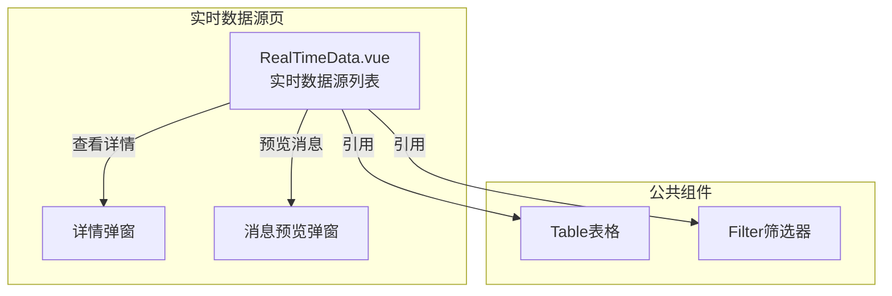
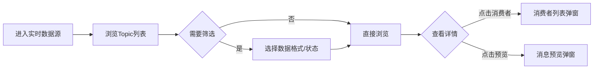

---
neo4j:
  feature: "FEAT-DFD-RES-REALTIME"
feishu:
  wiki: "V8KEfpg1vlkCZld"
doc:
  title: "FEAT-DFD-RES-REALTIME实时数据源-Feature说明文档"
  version: "v1.0"
  type: "Feature说明文档"
  productDomain: "PD-DFD"
  epicKey: "Epic:EPIC-DFD-RESOURCE"
  featureKey: "FEAT-DFD-RES-REALTIME"
  author: "Tony Stark"
  createdAt: "2026-04-30"
  updatedAt: "2026-04-30"
---

# FEAT-DFD-RES-REALTIME - 实时数据源

> **版本**: v1.0
> **日期**: 2026-04-30
> **作者**: Tony Stark
> **状态**: 已完成

---

## 1. Feature 基本信息

| 字段 | 内容 |
|:---|:---|
| Feature ID | FEAT-DFD-RES-REALTIME |
| Feature 名称 | 实时数据源 |
| 所属 EPIC | EPIC-DFD-RESOURCE 数据资源字典 |
| 所属产品域 | PD-DFD 数据发现 |
| 负责人 | Tony Stark |

---

## 2. Feature 概述

### 2.1 是什么
实时数据源展示Kafka、MQ等实时数据流配置信息，支持Topic管理、消费者管理和消息预览。

### 2.2 解决什么问题
- 缺乏实时数据流的统一管理视图
- 不知道Topic的分区数和消息量
- 难以快速定位特定Topic的消息内容

### 2.3 用户场景

| 场景 | 用户 | 描述 |
|:---|:---|:---|
| Topic检索 | 数据开发者 | 搜索和浏览Kafka Topic |
| 消费者管理 | 数据工程师 | 查看消费特定Topic的消费者组 |
| 消息预览 | 数据分析师 | 预览Topic的最新消息内容 |

---

## 3. 系统模块图

### 3.1 页面说明

| 页面 | 路由 | 组件 | 说明 |
|:---|:---|:---|:---|
| 实时数据源 | /discovery/data-resources/real-time-data | RealTimeData.vue | 实时数据流管理页 |

### 3.2 组件说明

| 组件 | 类型 | 说明 |
|:---|:---|:---|
| Table | 公共 | 列表展示组件 |
| Filter | 业务 | 筛选器组件 |

---

## 4. 功能说明

### 4.1 功能清单

| 功能点 | 类型 | 描述 |
|:---|:---|:---|
| FP-001 | 页面 | Topic管理，Kafka Topic列表和配置展示。**数据字段**：Topic名称、数据格式(JSON/Avro/Protobuf)、分区数、副本数、日消息量、状态(运行中/暂停/异常) |
| FP-002 | 页面 | 消费者管理，查看消费该Topic的消费者组。**交互**：点击"消费者"按钮弹出消费者列表弹窗 |
| FP-003 | 页面 | 消息预览，预览最新消息内容。**交互**：点击"预览"按钮弹出消息预览弹窗，**规则**：展示最新一条消息 |

### 4.2 用户流程

---

## 5. 验收标准

| 验收项 | 标准 |
|:---|:---|
| 功能验收 | Topic列表正确展示Topic配置信息（名称、格式、分区数、副本数、日消息量、状态） |
| 功能验收 | 消费者列表弹窗正确展示消费者组 |
| 功能验收 | 消息预览弹窗正确展示最新一条消息内容 |
| 功能验收 | 列表支持分页 |
| 交互验收 | 筛选条件变更后自动刷新列表 |
| 性能验收 | 页面加载时间≤2s |

---

## 6. 依赖关系

| 依赖项 | 类型 | 说明 |
|:---|:---|:---|
| Kafka集群 | 数据 | Topic元数据来自Kafka集群 |

---

## 7. 变更记录

| 日期 | 版本 | 变更内容 | 作者 |
|:---|:---:|:---|:---|
| 2026-04-30 | v1.0 | 初始版本，基于功能清单走查重构，符合模板v1.2 | Tony Stark |

---

🦾 *Feature说明文档 v1.0 - 实时数据源*