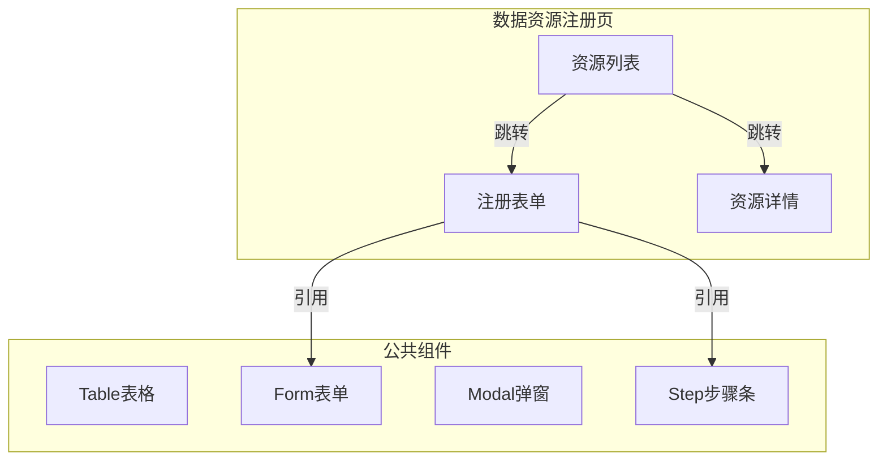

---
neo4j:
  epic: "Epic:EPIC-DFD_DATA_RESOURCE"
  feature: "FEAT-DFD-RES-REG"
feishu:
  wiki: "V8KEfpg1vlkCZld"
doc:
  title: "FEAT-DFD-RES-REG Feature说明文档"
  version: "v3.3"
  type: "Feature说明文档"
  productDomain: "PD-DFD"
  epicKey: "Epic:EPIC-DFD_DATA_RESOURCE"
  author: "Tony Stark"
  createdAt: "2026-04-28"
  updatedAt: "2026-04-29"
---

# FEAT-DFD-RES-REG - Feature说明文档

> **版本**: v1.0
> **日期**: 2026-04-27
> **作者**: Tony Stark
> **状态**: 待开发
> **数据来源**: Neo4j

---

## 1. Feature 基本信息

| 字段 | 内容 |
|:---|:---|
| Feature ID | FEAT-DFD-RES-REG |
| Feature 名称 | 资源注册 |
| 所属 EPIC | EPIC-DFD_DATA_RESOURCE 数据数据资源字典 |
| 优先级 | P0 |
| 状态 | 待开发 |

---

## 2. Feature 概述

### 2.1 是什么
数据资源注册是数据发现平台中用于注册和管理数据资源的核心模块，支持用户对数据资源进行登记、配置和更新操作。

### 2.2 解决什么问题
- 数据资源分散，难以统一管理
- 缺乏统一的资源注册和更新机制
- 资源信息不完整，缺乏统一视图

### 2.3 用户场景

| 场景 | 用户 | 描述 |
|:---|:---|:---|
| 资源注册 | 数据管理员 | 注册新的数据资源到平台 |
| 资源更新 | 数据开发者 | 更新已有资源的信息和配置 |
| 资源查询 | 数据分析师 | 查询和筛选平台上的数据资源 |

---

## 3. 系统模块图（页面/组件结构）

### 3.1 页面说明

| 页面 | 路由 | 组件 | 说明 |
|:---|:---|:---|:---|
| 数据资源注册 | /dfd/res/reg | ResourceRegPage | 资源注册主页面，支持注册向导 |
| 资源详情 | /dfd/res/reg/detail | ResourceDetail | 资源详情查看页面 |

### 3.2 组件说明

| 组件 | 类型 | 说明 |
|:---|:---|:---|
| Table表格 | 公共 | 列表展示组件，支持分页和排序 |
| Form表单 | 公共 | 表单录入组件，支持多步骤 |
| Step步骤条 | 业务 | 注册流程步骤指引 |
| Modal弹窗 | 公共 | 弹窗确认组件 |

---

## 4. 功能说明

### 4.1 功能清单（Feature ID映射）

> **⚠️ 重要**：业务规则（筛选器默认值、计算公式、判定逻辑、状态流转）直接写在 FP 描述里，不要单独建章节。

| 功能点 | 类型 | 描述 |
|:---|:---|:---|
| FP-001 | 页面 | 资源注册表单，支持多步骤录入 |
| FP-002 | 页面 | 资源列表展示，支持筛选和搜索 |
| FP-003 | 页面 | 资源详情查看，展示完整信息 |

### 4.2 用户流程

---

## 5. 验收标准

| 验收项 | 标准 |
|:---|:---|
| 功能验收 | 资源注册功能完整，支持全流程操作 |
| 操作验收 | 操作流畅无卡顿，响应时间≤2s |
| 数据验收 | 数据准确无误，资源信息正确存储 |
| 交互验收 | 符合UI设计规范，交互反馈及时 |

---

## 6. 依赖关系

| 依赖项 | 类型 | 说明 |
|:---|:---|:---|
| 后端数据接口 | 接口 | 提供资源注册和管理服务 |
| Neo4j图数据库 | 数据 | 存储资源结构数据 |

---

## 2. 功能描述

数据资源注册功能，注册和管理数据资源。

---

## 3. 验收标准

| 验收项 | 标准 |
|:---|:---|
| 功能验收 | 资源注册功能完整 |
| 操作验收 | 注册流程顺畅 |
| 数据验收 | 资源数据准确 |
| 交互验收 | 符合UI规范 |

---

🦈 *Feature 说明文档 v1.0*
