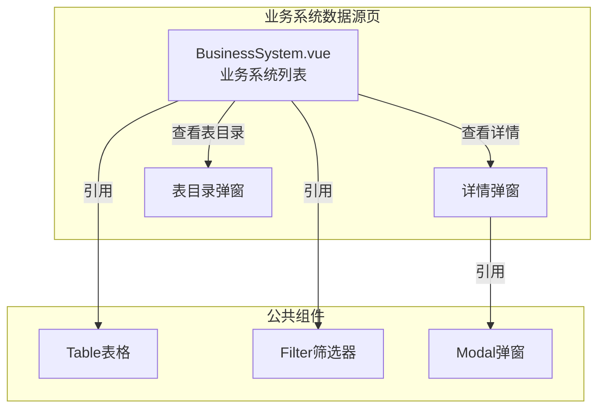

---
neo4j:
  feature: "FEAT-DFD-RES-SYSTEM"
feishu:
  wiki: "V8KEfpg1vlkCZld"
doc:
  title: "FEAT-DFD-RES-SYSTEM业务系统数据源-Feature说明文档"
  version: "v1.0"
  type: "Feature说明文档"
  productDomain: "PD-DFD"
  epicKey: "Epic:EPIC-DFD-RESOURCE"
  featureKey: "FEAT-DFD-RES-SYSTEM"
  author: "Tony Stark"
  createdAt: "2026-04-30"
  updatedAt: "2026-04-30"
---

# FEAT-DFD-RES-SYSTEM - 业务系统数据源

> **版本**: v1.0
> **日期**: 2026-04-30
> **作者**: Tony Stark
> **状态**: 已完成

---

## 1. Feature 基本信息

| 字段 | 内容 |
|:---|:---|
| Feature ID | FEAT-DFD-RES-SYSTEM |
| Feature 名称 | 业务系统数据源 |
| 所属 EPIC | EPIC-DFD-RESOURCE 数据资源字典 |
| 所属产品域 | PD-DFD 数据发现 |
| 负责人 | Tony Stark |

---

## 2. Feature 概述

### 2.1 是什么
业务系统数据源是业务系统元数据采集与管理中心，支持对核心业务库表的自动发现与血缘追踪，帮助用户了解业务系统的数据资产分布。

### 2.2 解决什么问题
- 缺乏业务系统级别的数据资产视图
- 不知道核心业务系统的数据库类型和数据表数量
- 难以快速定位特定业务系统的数据资产

### 2.3 用户场景

| 场景 | 用户 | 描述 |
|:---|:---|:---|
| 系统检索 | 数据分析师 | 通过关键词搜索目标业务系统 |
| 类型筛选 | 数据开发者 | 按系统类型（核心交易/风控/营销/财务）筛选 |
| 表目录查看 | 数据工程师 | 查看系统下的数据表目录 |

---

## 3. 系统模块图

### 3.1 页面说明

| 页面 | 路由 | 组件 | 说明 |
|:---|:---|:---|:---|
| 业务系统数据源 | /discovery/data-resources/business-system | BusinessSystem.vue | 业务系统元数据管理页 |

### 3.2 组件说明

| 组件 | 类型 | 说明 |
|:---|:---|:---|
| Table | 公共 | 列表展示组件 |
| Filter | 业务 | 筛选器组件 |
| Modal | 公共 | 弹窗组件 |

---

## 4. 功能说明

### 4.1 功能清单

| 功能点 | 类型 | 描述 |
|:---|:---|:---|
| FP-001 | 页面 | 系统搜索，按名称模糊匹配系统名称。**筛选器**：系统名称文本输入(模糊匹配) |
| FP-002 | 页面 | 类型筛选，按系统类型筛选。**筛选规则**：系统类型下拉(核心交易/风控系统/营销系统/财务系统)，**标签颜色**：核心交易(blue)、风控(red)、营销(green)、财务(orange) |
| FP-003 | 页面 | 数据库筛选，按数据库类型筛选。**筛选规则**：数据库类型下拉(MySQL/Oracle/Hive/MongoDB) |
| FP-004 | 页面 | 查看详情，查看系统详细信息。**交互**：点击"详情"按钮弹出详情弹窗，展示系统名称、类型、数据库类型、状态、描述、表数量、接口数量、存储量、负责人、更新时间 |
| FP-005 | 页面 | 表目录，查看系统下的数据表。**交互**：点击"表目录"按钮弹出表目录弹窗 |

### 4.2 用户流程

---

## 5. 验收标准

| 验收项 | 标准 |
|:---|:---|
| 功能验收 | 系统搜索支持名称模糊匹配 |
| 功能验收 | 系统类型筛选正确显示标签颜色（核心交易blue、风控red、营销green、财务orange） |
| 功能验收 | 数据库类型筛选支持MySQL/Oracle/Hive/MongoDB |
| 功能验收 | 详情弹窗正确展示系统信息 |
| 功能验收 | 表目录弹窗正确展示数据表列表 |
| 功能验收 | 列表支持分页 |
| 交互验收 | 筛选条件变更后自动刷新列表 |
| 性能验收 | 页面加载时间≤2s |

---

## 6. 依赖关系

| 依赖项 | 类型 | 说明 |
|:---|:---|:---|
| PD-DMT | 数据依赖 | 业务系统数据源的元数据在 PD-DMT 维护 |

---

## 7. 变更记录

| 日期 | 版本 | 变更内容 | 作者 |
|:---|:---:|:---|:---|
| 2026-04-30 | v1.0 | 初始版本，基于功能清单走查重构，符合模板v1.2 | Tony Stark |

---

🦾 *Feature说明文档 v1.0 - 业务系统数据源*