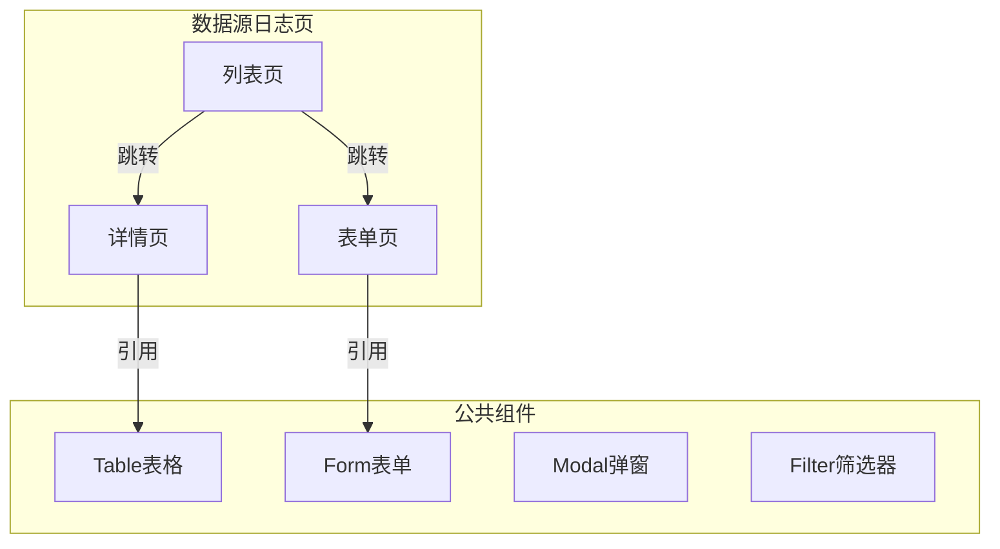
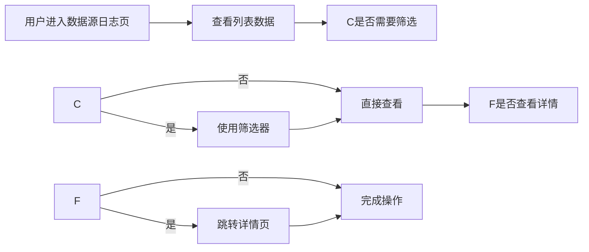

---
neo4j:
  epic: "Epic:EPIC-DFD_DATA_RESOURCE"
  feature: "FEAT-DFD-SOURCE-LOG"
feishu:
  wiki: "V8KEfpg1vlkCZld"
doc:
  title: "FEAT-DFD-SOURCE-LOG Feature说明文档"
  version: "v3.3"
  type: "Feature说明文档"
  productDomain: "PD-DFD"
  epicKey: "Epic:EPIC-DFD_DATA_RESOURCE"
  author: "Tony Stark"
  createdAt: "2026-04-28"
  updatedAt: "2026-04-29"
---

# FEAT-DFD-SOURCE-LOG - Feature说明文档

> **版本**: v1.0
> **日期**: 2026-04-27
> **作者**: Tony Stark
> **状态**: 待开发
> **数据来源**: 钟离理想整改菜单结构

---

## 1. Feature 基本信息

| 字段 | 内容 |
|:---|:---|
| Feature ID | FEAT-DFD-SOURCE-LOG |
| Feature 名称 | 日志数据源 |
| 所属 EPIC | EPIC-DFD_DATA_RESOURCE 数据数据资源字典 |
| 优先级 | P1 |
| 状态 | 待开发 |

---

---

## 2. Feature 概述

### 2.1 是什么
数据源日志 是数据发现平台中用于管理 数据源日志 的功能模块，支持用户对数据进行检索、筛选和管理操作。

### 2.2 解决什么问题
- 数据分散，难以快速找到所需数据资产
- 缺乏统一的数据检索和筛选能力
- 数据资产信息不完整，缺乏可视化展示

### 2.3 用户场景

| 场景 | 用户 | 描述 |
|:---|:---|:---|
| 数据检索 | 数据分析师 | 通过关键词快速搜索目标数据 |
| 资产查看 | 数据开发者 | 查看数据资产的详细信息和结构 |
| 数据管理 | 数据管理员 | 管理和维护数据资产信息 |

---

## 3. 系统模块图（页面/组件结构）

### 3.1 页面说明

| 页面 | 路由 | 组件 | 说明 |
|:---|:---|:---|:---|
| 数据源日志页 | /dfd/source/log | 列表/详情/表单组件 | 数据源日志主页面 |

### 3.2 组件说明

| 组件 | 类型 | 说明 |
|:---|:---|:---|
| Table表格 | 公共 | 列表展示组件，支持分页和排序 |
| Form表单 | 公共 | 表单录入组件 |
| Modal弹窗 | 公共 | 弹窗确认组件 |
| Filter筛选器 | 业务 | 筛选条件组件 |

---

## 4. 功能说明

### 4.1 功能清单（Feature ID映射）

> **⚠️ 重要**：业务规则（筛选器默认值、计算公式、判定逻辑、状态流转）直接写在 FP 描述里，不要单独建章节。

| 功能点 | 类型 | 描述 |
|:---|:---|:---|
| FP-001 | 页面 | 数据源日志核心功能，用于完成主要业务操作 |
| FP-002 | 页面 | 数据源日志辅助功能，支持扩展操作 |
| FP-003 | 接口 | 数据源日志数据接口，提供后端数据服务 |

### 4.2 用户流程

---

## 5. 验收标准

| 验收项 | 标准 |
|:---|:---|
| 功能验收 | 数据源日志各功能正常运行，满足业务需求 |
| 操作验收 | 操作流畅无卡顿，响应时间≤2s |
| 数据验收 | 数据准确无误，与数据源保持一致 |
| 交互验收 | 符合UI设计规范，交互反馈及时 |

---

## 6. 依赖关系

| 依赖项 | 类型 | 说明 |
|:---|:---|:---|
| 后端数据接口 | 接口 | 提供数据查询和管理服务 |
| Neo4j图数据库 | 数据 | 存储产品层级结构数据 |
| 飞书多维表格 | 外部 | 需求状态同步 |

## 2. FP 清单

### FP-DFD-SOURCE-LOG-001 日志数据源列表

| 字段 | 内容 |
|:---|:---|
| FP ID | FP-DFD-SOURCE-LOG-001 |
| 功能点名称 | 日志数据源列表 |
| 类型 | 功能点 |
| 优先级 | P1 |
| 状态 | 待开发 |

**功能描述**：管理日志数据源，包括查看、搜索、新增、编辑、删除日志数据源配置，支持数据源状态管理。

**验收标准**：

| 验收项 | 标准 |
|:---|:---|
| 功能验收 | 日志数据源列表展示正常，支持查看/搜索/新增/编辑/删除 |
| 操作验收 | 操作流畅，列表加载<2s |
| 数据验收 | 数据源数据准确，与实际配置一致 |
| 交互验收 | 符合UI规范，删除操作有二次确认 |

---

## 3. 变更记录

| 日期 | 版本 | 变更内容 | 作者 |
|:---|:---:|:---|:---|
| 2026-04-27 | v1.0 | 新建 Feature，基于钟离菜单结构 | Tony Stark |

🦈 *Feature 说明文档 v1.0*
